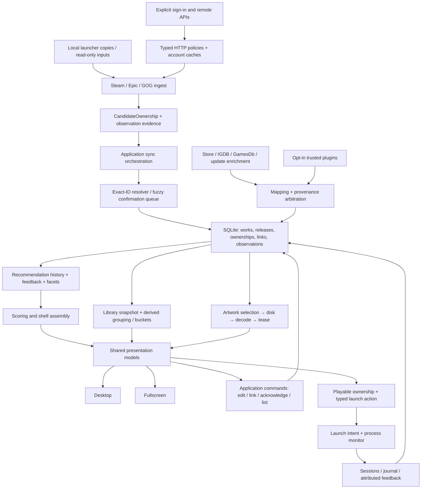

# Winnow architecture and code review — 2026-09-10

The correction work is documented in [the resolution record](architecture-review-resolution-2026-09-11.md)
and [verification evidence](spikes/architecture-fixes-2026-09-10.md). This report retains the
findings and limits of the original baseline review.

## Assessment

Winnow has a sound module skeleton and substantial automated coverage. Core is independent of infrastructure; ingest emits candidates instead of writing identities; exact identity resolution and fuzzy confirmation are distinct; derived buckets are queries; external integrations are designed to fail softly; desktop and fullscreen have separate presentation paths.

The most serious weaknesses are **invariants that cross otherwise reasonable module boundaries**. Undo can restore an invalid identity graph. Metadata values, field ownership and pin history can commit independently. Manual editing bypasses those authorities. Cache entries do not always identify the account or mapping generation that produced them. Presentation entry points reconstruct application behavior and occasionally omit a capability altogether.

These are foundations to strengthen before adding more providers or recommendation signals. A large rewrite is not warranted. Put complete operations behind reliable contracts, migrate callers incrementally, and add tests through production construction and failure paths.

This review records **38 new actionable findings: 10 High, 22 Medium and 6 Low**, with one Backlog task per finding. Existing tasks cover three related areas and remain open. High means a priority integrity, account-isolation or core-product failure; Medium means a functional defect or consequential reliability gap; Low means bounded maintenance, parity or measurement work. No critical exploit or observed production-library corruption is claimed.

## Snapshot, scope and evidence

- Baseline: branch `codex/titlebar-fetch-progress`, commit `ae2af9aab4a9cc31da92b73980ad46ccd536e5fa`.
- Reviewed the current working tree, including the pre-existing `ApplicationSettingsView.axaml` edit. Existing local settings, the Yaak Backlog task and `docs/api/` were preserved.
- Inventory: 29 solution projects: 20 product/infrastructure projects under `src/`, one bundled plugin, seven test assemblies and one plugin fixture project. The database has 32 migrations.
- Coverage combines module/dependency inspection, source review of principal contracts and data paths, targeted test inspection, isolated reproductions and the full Windows Release test suite. It is not a claim that every source line received equal manual inspection.
- **Reproduced** means an executed isolated experiment; **source verified** means a traced code path, not an observed production incident. R06 reproduces the SQLite copy algorithm with a synthetic database, not the C# wrapper against Galaxy. R17/R24/R28/R34/R37 identify concrete mechanisms whose stress, timing or performance impact was not measured.
- Detailed commands, inputs, outputs and limits are in [the measurement record](spikes/architecture-review-2026-09-10.md). Review delivery is tracked in [TASK-188](<../backlog/tasks/task-188 - Review-architecture-and-code-across-Winnow-domains.md>). This report proposes work; it does not change product behavior or supersede the governing documents.

## Module and boundary review

| Module or area | Responsibility and strengths to preserve | Principal concerns / coverage |
| --- | --- | --- |
| `Winnow.Core` | BCL-only domain records, repository/ingest contracts, identity and grouping rules. | Contracts need stronger distinctions between identity and visibility, positive evidence and complete inventory, and a fact's value versus its provenance. R01–R03, R10, R19–R21. |
| `Winnow.Data` | SQLite/Dapper, connection leases, unit of work/savepoints, migrations, backup/checking, observations and bulk library snapshots. Foreign keys and idempotent observation keys are valuable. | Standalone multi-record atomicity, alternate manual writers, account evidence, acknowledgement semantics and forward-schema safety. R01–R03, R09–R12. |
| `Winnow.Resolve` | Exact external IDs auto-join; fuzzy matches stay in a confirmation queue. Distinct same-game/expansion/variant relationships preserve meaning. | Link undo and proposal admission must use compatible invariant checks. Historical IDs from manual correction can poison hard joins. R01, R03. |
| `Winnow.Ingest.Steam` | ValveKeyValue parsing, local manifest/account evidence, containment and conservative scan handling. | Steam collection reading required by the active spec has no implementation found; decide its scope explicitly. Account-page parser DTOs still cross into presentation through an allowed infrastructure namespace. R13, R35. |
| `Winnow.Ingest.Epic` | Local manifest/catalog merge, authenticated ownership client, partial remote pagination rejection. | Global account cache and missing candidate account identity; local scan completeness inferred from directory existence. R05, R07. |
| `Winnow.Ingest.Gog` | Galaxy snapshot reader plus registry installation fallback. | Structurally valid mixed-generation snapshots and missing registry-only uninstall reconciliation. R06, R14. |
| `Winnow.Enrich.SteamWeb` | Authenticated Steam ownership/playtime/history clients, credential providers and durable caches. | Cache/disclosure provenance, current credential generation, account targeting and shared transport mechanics. R04, R16, R17. |
| `Winnow.Auth.WebView` | Isolated sign-in surface behind Core contracts; origin restrictions, fixed scripts and ephemeral profiles reduce exposure. | Captured account identity must survive downstream boundaries. No live sign-in/provider compatibility was tested. R04, R05, R13. |
| `Winnow.Enrich.Igdb` | Rate-limited/cached metadata, identity lookups, maturity and typed observations. | Mapping transitions need downstream invalidation and expected-identity fencing; stale fallback and transport contracts need alignment. R08, R17, R18. |
| `Winnow.Enrich.GamesDb` | Cross-store identity/metadata lookup with versioned caching. | Malformed warm-cache recovery and documented cache version drift. R18, R35. Cross-store automation already has [TASK-37](<../backlog/tasks/task-37 - Automate-cross-store-dedup-via-gamesdb-hard-ids.md>). |
| `Winnow.Enrich.Steam` | Store metadata and lifecycle evidence. | Requested-ID completeness, excessive raw review cache retention and copied HTTP mechanics. R15, R17, R18. |
| `Winnow.Enrich.Stores` | Small storefront metadata and link lookup client/cache with explicit response/time bounds. | Its bounds provide a useful pattern for the other clients; avoid duplicating infrastructure while retaining provider policy. R17. |
| `Winnow.Enrich.Updates` | Update signals, announcements and cache-backed polling; evidence timestamps generally remain observation times. | Counts/acknowledgements must agree with last-play and group semantics; transport conformance and temporal replay. R09, R17; [TASK-135](<../backlog/tasks/task-135 - Build-a-feed-replay-harness-that-scores-tuning-changes-against-recorded-outcomes.md>). |
| `Winnow.Covers` | Bounded decoded LRU, typed keys, disk cache, decode pipeline and reference-held artwork leases. Provider-independent renderer. | Negative/transient failure lifetimes and queued/in-flight shutdown ownership. R22, R37. The LRU budget is not a hard cap on art retained by active leases. |
| `Winnow.Covers.Igdb` | Provider bridge keeps IGDB knowledge outside the generic cover pipeline. | Preserve this separation; mapping correction and source invalidation must reach the pipeline. R08, R22. |
| `Winnow.Monitor` | Process watching, launch attribution, handoff/relaunch grace, retryable pending writes; Linux native/Proton checks are isolated. | Durable session identity across restarts is missing. R25. Linux process behavior was not executed on this Windows host. |
| `Winnow.Recommend` | Core-only references, pure scoring pieces, explainable signals, shelves and explicit feedback. | Resolved-game evidence grain, production cold start, complete feedback identity, and temporal query consistency. R19–R21; [TASK-135](<../backlog/tasks/task-135 - Build-a-feed-replay-harness-that-scores-tuning-changes-against-recorded-outcomes.md>). |
| `Winnow.PluginSdk` | Narrow extensibility contracts for capabilities and host services. | Plugins are trusted in-process code, not sandboxed. Keep SDK contracts small and validate observations at host boundaries. R02, R19, R24. |
| `Winnow.Plugins` | Manifest discovery, opt-in loading, separate load contexts and scoped host services. | Per-provider timeout/soft failure does not isolate feed publication latency. R24. A managed gate cannot stop a malicious or uncooperative DLL. |
| Bundled `Winnow.Plugin.SteamGridDb` | Small plugin adapter using host-provided services; source and manifest ship with the app. | Library/merge cover selection differs for plugin art; plugin-only package inputs are omitted from release path filters. R23, R36. |
| `Winnow.App` | Generic-host composition; shared application services; desktop/fullscreen shell, library, details, feed, lists, filters, activity, metadata and merge flows. Virtualized cover wall and explicit fullscreen focus are useful. | Application orchestration is concentrated in large view models and Program. Missing production injection, divergent UI commands and inconsistent invalidation show the cost. R09, R16, R23, R26–R34, R38. |
| Themes, rendering and accessibility | Shared tokens/theme model, dormancy rendering, headless real-font input tests and enforcement. | Active mock/spec contradictions, duplicated brightness authority and AXAML-only enforcement over a partly code-built UI. R35, R38; [TASK-27](<../backlog/tasks/task-27 - Resolve-dormancy-brightness-to-a-single-authority.md>) and [TASK-4](<../backlog/tasks/task-4 - Build-full-screen-gamepad-mode.md>). |
| Tests and fixture project | Seven test assemblies, isolated SQLite fixtures, plugin fixtures, architecture checks and dedicated headless UI tests. | Passing direct-constructor tests miss production assembly of capabilities. Add failure, delayed-operation, account-switch and real composition regressions to the specific corrective tasks. |
| Build, packaging, migration scripts | Warnings as errors, NuGet auditing, baseline migration hashes, Windows/Linux gates, installer smoke scripts and tag release checks. | Duplicate checksum registry, future schema guard, bootstrap boundary and plugin-only packaging coverage. R11, R12, R26, R36. |
| Update, data location and diagnostics | Reviewed restart/download/helper paths, exact asset/digest checks, bounded logs, data relocation/backup and compatibility shims. | Preserve the legacy data/journal/theme shims. Runtime future-schema refusal is absent. Portable/Linux updater recovery remains [TASK-159](<../backlog/tasks/task-159 - Extend-Winnow-updating-to-portable-Windows-and-Linux-with-recovery.md>); no installer was run on this machine. |
| `website/`, assets and documentation | Separate promotional surface and build/deploy inputs reviewed statically. | Website build, deployment, accessibility and browser rendering were not executed. [TASK-170](<../backlog/tasks/task-170 - Deploy-the-promo-site-to-GitHub-Pages.md>) already owns deployment work. No website security or performance conclusion is inferred from desktop tests. |

### Principal data paths

The diagram summarizes responsibilities, not a guarantee that every current path already follows one coordinator. R16 and R30 explicitly address parallel implementations of application workflows.

| Boundary | Current contract / invariant | What needs to be made explicit |
| --- | --- | --- |
| Launcher → ingest | Read-only launcher access; candidates describe observations. | Enumeration completeness and source/account authority are separate from individual positive rows. R06, R07, R10, R14. |
| Candidate → resolver → database | Hard IDs auto-join atomically; fuzzy proposals require user confirmation. | Corrections retract assertions deliberately; undo cannot recreate a graph the resolver/readers cannot interpret. R01, R03. |
| Metadata → persistence | Values carry source ownership; user edits/pins outrank automatic providers. | Value + source + mapping history form one operation; in-flight writes must name their expected mapping. R02, R08. |
| Cache → account or provider consumer | Cached payloads preserve evidence and can support offline use. | Account, credential disclosure, mapping, schema version, freshness and authoritative absence are distinct dimensions. R04, R05, R15, R18, R22. |
| Database → library/read models | Main library bulk read has a coherent deferred read transaction; buckets are derived. | Supplemental details/refresh operations and recommendation repository reads do not automatically share that snapshot or as-of time. R19, R27, R28; [TASK-135](<../backlog/tasks/task-135 - Build-a-feed-replay-harness-that-scores-tuning-changes-against-recorded-outcomes.md>). |
| Resolved game → recommendations/actions | One user-facing game may contain multiple releases/ownerships. | Display header, eligibility, evidence source, actionable ownership and feedback subject are different identities. R19, R21. |
| User command → persisted result → UI | Commands express application intent. | Lists, note editing and metadata changes need one commit/publication contract independent of their visual entry point. R27, R30, R33. |
| Host lifetime → async work | Cancellation and resource disposal are present throughout. | Queued work, publication generation, optional-provider deadlines and persisted session lifecycle need end-to-end ownership. R24–R26, R28, R37. |

## Ranked findings and Backlog index

The following index links every new finding to its task. Tasks are **To Do**, not fixes delivered by this audit.

| Finding | Priority | Task | Evidence |
| --- | --- | --- | --- |
| [R01 — Preserve identity invariants when undoing interleaved link history](#r01) | High | [TASK-189](<../backlog/tasks/task-189 - Preserve-identity-invariants-when-undoing-interleaved-link-history.md>) | Reproduced |
| [R02 — Commit metadata values provenance and pin changes atomically](#r02) | High | [TASK-190](<../backlog/tasks/task-190 - Commit-metadata-values-provenance-and-pin-changes-atomically.md>) | Reproduced |
| [R03 — Route manual entry corrections through authoritative metadata and identity operations](#r03) | High | [TASK-191](<../backlog/tasks/task-191 - Route-manual-entry-corrections-through-authoritative-metadata-and-identity-operations.md>) | Reproduced |
| [R04 — Bind Steam history caches and account confirmation to captured credentials](#r04) | High | [TASK-192](<../backlog/tasks/task-192 - Bind-Steam-history-caches-and-account-confirmation-to-captured-credentials.md>) | Source verified |
| [R05 — Partition Epic ownership cache by account and fence credential changes](#r05) | High | [TASK-193](<../backlog/tasks/task-193 - Partition-Epic-ownership-cache-by-account-and-fence-credential-changes.md>) | Source verified |
| [R06 — Read a coherent GOG Galaxy snapshot across WAL checkpoints](#r06) | High | [TASK-194](<../backlog/tasks/task-194 - Read-a-coherent-GOG-Galaxy-snapshot-across-WAL-checkpoints.md>) | Executed synthetic copy-order reproduction |
| [R07 — Preserve Epic install state when local manifest scans are incomplete](#r07) | High | [TASK-195](<../backlog/tasks/task-195 - Preserve-Epic-install-state-when-local-manifest-scans-are-incomplete.md>) | Source verified |
| [R08 — Fence metadata observations when an IGDB mapping changes](#r08) | High | [TASK-196](<../backlog/tasks/task-196 - Fence-metadata-observations-when-an-IGDB-mapping-changes.md>) | Source verified |
| [R09 — Connect update acknowledgement and define unread counts for grouped games](#r09) | High | [TASK-197](<../backlog/tasks/task-197 - Connect-update-acknowledgement-and-define-unread-counts-for-grouped-games.md>) | Reproduced count; source-verified missing production wiring |
| [R10 — Distinguish complete account inventories from positive local play evidence](#r10) | Medium | [TASK-198](<../backlog/tasks/task-198 - Distinguish-complete-account-inventories-from-positive-local-play-evidence.md>) | Reproduced |
| [R11 — Refuse unsupported future database histories before startup writes](#r11) | Medium | [TASK-199](<../backlog/tasks/task-199 - Refuse-unsupported-future-database-histories-before-startup-writes.md>) | Reproduced |
| [R12 — Use one migration checksum manifest in tests and CI](#r12) | Low | [TASK-200](<../backlog/tasks/task-200 - Use-one-migration-checksum-manifest-in-tests-and-CI.md>) | Source verified |
| [R13 — Preserve account identity through Steam account-page imports](#r13) | Medium | [TASK-201](<../backlog/tasks/task-201 - Preserve-account-identity-through-Steam-account-page-imports.md>) | Source verified |
| [R14 — Reconcile removed GOG registry installations conservatively](#r14) | Medium | [TASK-202](<../backlog/tasks/task-202 - Reconcile-removed-GOG-registry-installations-conservatively.md>) | Source verified |
| [R15 — Cache only the minimal Steam lifecycle review projection](#r15) | Medium | [TASK-203](<../backlog/tasks/task-203 - Cache-only-the-minimal-Steam-lifecycle-review-projection.md>) | Source verified |
| [R16 — Coordinate every remote ownership sync with downstream refresh and account targets](#r16) | Medium | [TASK-204](<../backlog/tasks/task-204 - Coordinate-every-remote-ownership-sync-with-downstream-refresh-and-account-targets.md>) | Source verified |
| [R17 — Unify bounded HTTP transport mechanics without erasing provider policies](#r17) | Medium | [TASK-205](<../backlog/tasks/task-205 - Unify-bounded-HTTP-transport-mechanics-without-erasing-provider-policies.md>) | Source-verified divergence; stress impact unmeasured |
| [R18 — Make provider caches reject corrupt and incomplete payloads consistently](#r18) | Medium | [TASK-206](<../backlog/tasks/task-206 - Make-provider-caches-reject-corrupt-and-incomplete-payloads-consistently.md>) | Source verified |
| [R19 — Score resolved games from consistent evidence across their owned releases](#r19) | Medium | [TASK-207](<../backlog/tasks/task-207 - Score-resolved-games-from-consistent-evidence-across-their-owned-releases.md>) | Reproduced installed-sibling failure; other grain conflicts source verified |
| [R20 — Provide an honest cold-start shelf for eligible uninstalled games](#r20) | High | [TASK-208](<../backlog/tasks/task-208 - Provide-an-honest-cold-start-shelf-for-eligible-uninstalled-games.md>) | Reproduced |
| [R21 — Resolve recommendation feedback identity independently of visible candidates](#r21) | Medium | [TASK-209](<../backlog/tasks/task-209 - Resolve-recommendation-feedback-identity-independently-of-visible-candidates.md>) | Reproduced |
| [R22 — Expire missing artwork state and retry transient lease failures](#r22) | Medium | [TASK-210](<../backlog/tasks/task-210 - Expire-missing-artwork-state-and-retry-transient-lease-failures.md>) | Reproduced |
| [R23 — Share cover selection policy across library merge and preview surfaces](#r23) | Medium | [TASK-211](<../backlog/tasks/task-211 - Share-cover-selection-policy-across-library-merge-and-preview-surfaces.md>) | Source verified |
| [R24 — Publish built-in recommendations without waiting for optional plugins](#r24) | Medium | [TASK-212](<../backlog/tasks/task-212 - Publish-built-in-recommendations-without-waiting-for-optional-plugins.md>) | Source-verified blocking path; latency not measured |
| [R25 — Reconcile process sessions across Winnow restarts without duplicate history](#r25) | Medium | [TASK-213](<../backlog/tasks/task-213 - Reconcile-process-sessions-across-Winnow-restarts-without-duplicate-history.md>) | Source verified |
| [R26 — Cover configuration and host construction with the startup error boundary](#r26) | Medium | [TASK-214](<../backlog/tasks/task-214 - Cover-configuration-and-host-construction-with-the-startup-error-boundary.md>) | Reproduced |
| [R27 — Refresh details and metadata projections as one coherent committed snapshot](#r27) | Medium | [TASK-215](<../backlog/tasks/task-215 - Refresh-details-and-metadata-projections-as-one-coherent-committed-snapshot.md>) | Source verified |
| [R28 — Prevent older library reloads from publishing stale settings](#r28) | Medium | [TASK-216](<../backlog/tasks/task-216 - Prevent-older-library-reloads-from-publishing-stale-settings.md>) | Source-verified race; not runtime reproduced |
| [R29 — Preserve live-list filter rules when matching options disappear](#r29) | Medium | [TASK-217](<../backlog/tasks/task-217 - Preserve-live-list-filter-rules-when-matching-options-disappear.md>) | Source verified |
| [R30 — Make list commands atomic and publish only committed state](#r30) | Medium | [TASK-218](<../backlog/tasks/task-218 - Make-list-commands-atomic-and-publish-only-committed-state.md>) | Source verified |
| [R31 — Support combined choices and confirmation in fullscreen prompts](#r31) | Medium | [TASK-219](<../backlog/tasks/task-219 - Support-combined-choices-and-confirmation-in-fullscreen-prompts.md>) | Source verified |
| [R32 — Share year-filter validation between desktop and fullscreen](#r32) | Low | [TASK-220](<../backlog/tasks/task-220 - Share-year-filter-validation-between-desktop-and-fullscreen.md>) | Source verified |
| [R33 — Reuse session-note validation and save behavior across Activity and Details](#r33) | Medium | [TASK-221](<../backlog/tasks/task-221 - Reuse-session-note-validation-and-save-behavior-across-Activity-and-Details.md>) | Source verified |
| [R34 — Measure and bound large-library details and activity reads](#r34) | Low | [TASK-222](<../backlog/tasks/task-222 - Measure-and-bound-large-library-details-and-activity-reads.md>) | Source-verified scaling risk; performance unmeasured |
| [R35 — Reconcile active architecture visual and provenance documentation with current behavior](#r35) | Low | [TASK-223](<../backlog/tasks/task-223 - Reconcile-active-architecture-visual-and-provenance-documentation-with-current-behavior.md>) | Source verified |
| [R36 — Run packaging verification for bundled plugin-only changes](#r36) | Low | [TASK-224](<../backlog/tasks/task-224 - Run-packaging-verification-for-bundled-plugin-only-changes.md>) | Source verified |
| [R37 — Bound and drain artwork work across consumer release and shutdown](#r37) | Low | [TASK-225](<../backlog/tasks/task-225 - Bound-and-drain-artwork-work-across-consumer-release-and-shutdown.md>) | Source-verified lifecycle risk; stress impact unmeasured |
| [R38 — Validate accessibility of code-built fullscreen pages at runtime](#r38) | Medium | [TASK-226](<../backlog/tasks/task-226 - Validate-accessibility-of-code-built-fullscreen-pages-at-runtime.md>) | Source-verified enforcement gap |

## Identity and persistence

### R01 — Preserve identity invariants when undoing interleaved link history

**High · Reproduced · [TASK-189](<../backlog/tasks/task-189 - Preserve-identity-invariants-when-undoing-interleaved-link-history.md>)**

Creating A→B and then B→C correctly flattens A→C. Retracting only A's link restores A→B while B→C remains live: the resulting depth-two graph violates the one-hop resolution contract. A second history, X,Y→P; X,Y→Q; X→R; retract the middle act, fails the unique live-parent constraint. Undo restores displaced rows without checking later acts or the same admission rules as link creation. Expansion scanning also emits a proposal under a base that is itself an expansion child; the repository rejects that proposal.

Identity groups, aggregate playtime, counts and list membership can become inconsistent. Undo must respect later user decisions and preserve the depth-one relationship contract.

Source: [src/Winnow.Data/Repositories/IdentityLinkRepository.cs:224](../src/Winnow.Data/Repositories/IdentityLinkRepository.cs#L224); [src/Winnow.Data/Repositories/IdentityLinkRepository.cs:299](../src/Winnow.Data/Repositories/IdentityLinkRepository.cs#L299); [src/Winnow.Data/Repositories/LibraryQueryRepository.cs:463](../src/Winnow.Data/Repositories/LibraryQueryRepository.cs#L463); [src/Winnow.Resolve/LibraryExpansionScan.cs:224](../src/Winnow.Resolve/LibraryExpansionScan.cs#L224).

Required verification: Single-link and whole-act undo preserve all relationship invariants and explicitly handle later superseding acts without overwriting them or failing midway. Interleaved reparenting, partial undo and later membership changes are covered for each supported relationship kind; failure leaves the prior state intact. Expansion/variant proposals use compatible admission rules so every offered operation is acceptable to the repository; grouped results agree on desktop and fullscreen.

### R02 — Commit metadata values provenance and pin changes atomically

**High · Reproduced · [TASK-190](<../backlog/tasks/task-190 - Commit-metadata-values-provenance-and-pin-changes-atomically.md>)**

WorkFieldSourceRepository writes a field and its provenance in separate statements without a local transaction. Rejecting the provenance INSERT leaves the new value committed without user ownership. WorkIgdbPinRepository clears/inserts pins before updating works; rejecting the works UPDATE leaves live pin222 while works still maps to111. WorkRepository enrichment also depends on caller transaction coverage, while PluginSyncService calls it directly.

A failed edit can leave requested user ownership unrecorded or leave contradictory IGDB identity authorities. RepositoryWriteBatch already supplies a suitable local transaction/savepoint pattern.

Source: [src/Winnow.Data/Repositories/WorkFieldSourceRepository.cs:132](../src/Winnow.Data/Repositories/WorkFieldSourceRepository.cs#L132); [src/Winnow.Data/Repositories/WorkIgdbPinRepository.cs:32](../src/Winnow.Data/Repositories/WorkIgdbPinRepository.cs#L32); [src/Winnow.Data/Repositories/WorkRepository.cs](../src/Winnow.Data/Repositories/WorkRepository.cs); [src/Winnow.App/Services/WorkMetadataEditService.cs:69](../src/Winnow.App/Services/WorkMetadataEditService.cs#L69); [src/Winnow.App/Services/PluginSyncService.cs](../src/Winnow.App/Services/PluginSyncService.cs).

Required verification: Public field set/reset, pin and enrichment operations atomically persist values, provenance and history when called alone or inside an ambient unit of work. Fault injection at each dependent write and cancellation cannot leave partial changes, including when an ambient caller catches the error and commits other work. Built-in enrichment, plugin enrichment and metadata editing on both surfaces use the same atomic contract and preserve user-owned fields.

### R03 — Route manual entry corrections through authoritative metadata and identity operations

**High · Reproduced · [TASK-191](<../backlog/tasks/task-191 - Route-manual-entry-corrections-through-authoritative-metadata-and-identity-operations.md>)**

ManualEntryRepository.UpdateAsync directly changes works metadata/igdb_id and appends external IDs without coordinating live pins or field sources. Editing a manual entry from IGDB333/Steam123 to IGDB444/Steam456 after pinning333 leaves live pin333, works444, both pairs of hard external IDs, and an IGDB source stamp on the user-entered year.

Correcting an ID preserves the mistaken ID as an automatic hard-join assertion. Later storefront discovery can attach the wrong game, while provenance misrepresents ownership of edited fields.

Source: [src/Winnow.Data/Repositories/ManualEntryRepository.cs:185](../src/Winnow.Data/Repositories/ManualEntryRepository.cs#L185); [src/Winnow.Data/Repositories/ManualEntryRepository.cs:286](../src/Winnow.Data/Repositories/ManualEntryRepository.cs#L286); [src/Winnow.App/ViewModels/LibrarySettingsViewModel.cs:817](../src/Winnow.App/ViewModels/LibrarySettingsViewModel.cs#L817).

Required verification: Manual creation and edits use authoritative metadata/identity contracts with correct user provenance and consistent work, pin and external-ID state. A documented correction policy can retract or replace erroneous user-entered IDs without deleting genuine independent storefront observations. Regressions cover edits after pinning/enrichment and correcting IDs after storefront attachment, including both desktop and fullscreen entry points.

### R10 — Distinguish complete account inventories from positive local play evidence

**Medium · Reproduced · [TASK-198](<../backlog/tasks/task-198 - Distinguish-complete-account-inventories-from-positive-local-play-evidence.md>)**

With a confirmed account identity but no completed owned-library inventory, the owned_account_attested query treats any non-legacy membership for that account as sufficient evidence, including steam_local play observations. With Mine playing A and a housemate playing B, selecting Mine hides B even if Mine owns B but has never played it. Sign-in can confirm the account independently of inventory completion. Existing tests call a local observation an attested owned-account pass.

Unknown ownership is treated as proven absence, contradicting the conservative intent of account scoping. The documented non-seed test itself needs correction, not merely another condition in the UI.

Source: [src/Winnow.Data/Repositories/LibraryQueryRepository.cs:317](../src/Winnow.Data/Repositories/LibraryQueryRepository.cs#L317); [src/Winnow.Data/Repositories/LibraryQueryRepository.cs:352](../src/Winnow.Data/Repositories/LibraryQueryRepository.cs#L352); [tests/Winnow.Tests/AccountScopeTests.cs:398](../tests/Winnow.Tests/AccountScopeTests.cs#L398); [game-library-design.md](../game-library-design.md).

Required verification: Successful inventory completion and completeness are represented by source/account independently from individual positive observations. Own-account filtering infers absence only from suitable complete inventory evidence; local-only, failed, partial and unknown results remain conservative. Tests and the governing account-scoping specification distinguish these evidence classes and verify library/feed behavior on both surfaces.

## Ingest, accounts and enrichment

### R04 — Bind Steam history caches and account confirmation to captured credentials

**High · Source verified · [TASK-192](<../backlog/tasks/task-192 - Bind-Steam-history-caches-and-account-confirmation-to-captured-credentials.md>)**

SteamHistoryClient reads the global steam-web/lastplayed cache before credentials, and Replay cache entries are keyed by account/year without credential provenance. Credential changes invalidate memoized credentials and confirmation but not these payloads. Backfill can combine cached data from account A with account B's credential generation, treat cached Replay as newly disclosed, and confirm A against B's fingerprint.

Play history, first-play anchoring and account confirmation can cross account boundaries after credential replacement or restart. Partitioning data and validating which credentials actually disclosed it are separate requirements.

Source: [src/Winnow.Enrich.SteamWeb/SteamHistoryClient.cs:45](../src/Winnow.Enrich.SteamWeb/SteamHistoryClient.cs#L45); [src/Winnow.Enrich.SteamWeb/SteamHistoryClient.cs:146](../src/Winnow.Enrich.SteamWeb/SteamHistoryClient.cs#L146); [src/Winnow.App/Services/SteamPlaytimeBackfillService.cs:443](../src/Winnow.App/Services/SteamPlaytimeBackfillService.cs#L443); [src/Winnow.App/Services/SteamPlaytimeBackfillService.cs:713](../src/Winnow.App/Services/SteamPlaytimeBackfillService.cs#L713); [src/Winnow.App/Services/StoreConnections.cs:119](../src/Winnow.App/Services/StoreConnections.cs#L119).

Required verification: Each cached history payload is tied to its captured account and credential/disclosure provenance; unscoped legacy data cannot attest a newly selected account. Account confirmation requires suitable evidence from the current credential generation; stale or cached responses cannot manufacture fresh disclosure. Tests cover credential replacement, restart with warm caches, differing API-key/session accounts and delayed responses during sign-out/sign-in; both surfaces display consistent account state.

### R05 — Partition Epic ownership cache by account and fence credential changes

**High · Source verified · [TASK-193](<../backlog/tasks/task-193 - Partition-Epic-ownership-cache-by-account-and-fence-credential-changes.md>)**

EpicAccountClient reads the global epic:library entry before resolving the access token/account. Changing sign-in can return the previous account's library for six hours, or longer through stale fallback. The API knows accountId, but emitted ownership candidates have no AccountRef.

Ownership from one Epic account can be presented or ingested under another session. This contradicts the build specification's account-keyed cache requirement.

Source: [src/Winnow.Ingest.Epic/Web/EpicAccountClient.cs:26](../src/Winnow.Ingest.Epic/Web/EpicAccountClient.cs#L26); [src/Winnow.Ingest.Epic/Web/EpicAccountClient.cs:97](../src/Winnow.Ingest.Epic/Web/EpicAccountClient.cs#L97); [src/Winnow.App/Services/SqliteEpicLibraryCache.cs:22](../src/Winnow.App/Services/SqliteEpicLibraryCache.cs#L22); [src/Winnow.Ingest.Epic/Web/Model/EpicOwnedLibrary.cs:77](../src/Winnow.Ingest.Epic/Web/Model/EpicOwnedLibrary.cs#L77).

Required verification: Epic library caches are account-scoped and every emitted candidate retains the account identity captured for that fetch. A credential change during cache lookup or pagination cannot publish the old account's result as current; stale fallback remains within the same account. Tests cover A-to-B switching, restart, expired/offline caches, legacy unscoped entries and delayed pages; desktop/fullscreen connection and library state agree.

### R06 — Read a coherent GOG Galaxy snapshot across WAL checkpoints

**High · Executed synthetic copy-order reproduction · [TASK-194](<../backlog/tasks/task-194 - Read-a-coherent-GOG-Galaxy-snapshot-across-WAL-checkpoints.md>)**

GalaxyDatabaseSnapshot copies the main database and then WAL/SHM files independently. A checkpoint between those copies can combine generations. A synthetic two-table database produced snapshot (newest, old) while live data was (newest, committed); that tuple never existed in the source. PRAGMA quick_check still returned ok because structural validity does not establish a consistent snapshot.

A valid-looking copy can invent a mixture of ownership or play observations. The current comment and validation imply stronger consistency than the copy algorithm provides.

Source: [src/Winnow.Ingest.Gog/GalaxyDatabaseSnapshot.cs:140](../src/Winnow.Ingest.Gog/GalaxyDatabaseSnapshot.cs#L140); [src/Winnow.Ingest.Gog/GalaxyDatabaseSnapshot.cs:169](../src/Winnow.Ingest.Gog/GalaxyDatabaseSnapshot.cs#L169).

Required verification: Galaxy ingest reads one consistent committed source state while honoring the rule against writing any launcher files. A deterministic test interleaves main-file copy, checkpoint/reset and WAL writes and proves that impossible mixed-generation rows are never ingested. Unreadable/busy or unverifiable snapshots fail conservatively, and comments/specification accurately describe the consistency guarantee and any platform limits.

### R07 — Preserve Epic install state when local manifest scans are incomplete

**High · Source verified · [TASK-195](<../backlog/tasks/task-195 - Preserve-Epic-install-state-when-local-manifest-scans-are-incomplete.md>)**

EpicLibrarySource treats Directory.Exists as evidence that install scanning is complete. EpicManifestReader skips locked, malformed and oversized manifests; the source then emits known catalog entries as not installed. Startup/scheduled/direct sync can therefore clear a valid install after a partial scan. Lazy file enumeration exceptions are not wholly covered by the surrounding enumeration setup catch.

Transient launcher writes or unreadable files become durable false uninstall observations. Steam already has a more explicit scan-completeness boundary.

Source: [src/Winnow.Ingest.Epic/EpicLibrarySource.cs:91](../src/Winnow.Ingest.Epic/EpicLibrarySource.cs#L91); [src/Winnow.Ingest.Epic/EpicLibrarySource.cs:315](../src/Winnow.Ingest.Epic/EpicLibrarySource.cs#L315); [src/Winnow.Ingest.Epic/EpicManifestReader.cs:63](../src/Winnow.Ingest.Epic/EpicManifestReader.cs#L63); [src/Winnow.App/Services/LibrarySyncService.cs:178](../src/Winnow.App/Services/LibrarySyncService.cs#L178).

Required verification: Manifest enumeration/parsing returns explicit completeness and absence clears install facts only after a complete authoritative scan. Locked, malformed, oversized, disappearing and enumeration-failing inputs preserve prior install state while reporting the incomplete scan. Startup, watcher, scheduled and remote reconciliation paths consume the same completeness contract; actions remain consistent on desktop and fullscreen.

### R08 — Fence metadata observations when an IGDB mapping changes

**High · Source verified · [TASK-196](<../backlog/tasks/task-196 - Fence-metadata-observations-when-an-IGDB-mapping-changes.md>)**

Changing a pin updates scalar work fields without coherently retiring IGDB-derived facets, maturity, artwork, reception and lifecycle observations. Independent sync passes capture a work/IGDB pair and later write against the captured work/release without validating its current IGDB mapping. An old in-flight response can overwrite a corrected mapping's projections, and an empty maturity result can preserve old ratings.

A user correction can leave the game classified, filtered or illustrated as the old game. Maturity classification is especially sensitive to stale mapping data. Atomic pin persistence alone does not solve asynchronous observation races.

Source: [src/Winnow.Data/Repositories/WorkIgdbPinRepository.cs:88](../src/Winnow.Data/Repositories/WorkIgdbPinRepository.cs#L88); [src/Winnow.App/Services/FacetSyncService.cs:43](../src/Winnow.App/Services/FacetSyncService.cs#L43); [src/Winnow.App/Services/ReceptionSyncService.cs:68](../src/Winnow.App/Services/ReceptionSyncService.cs#L68); [src/Winnow.App/Services/GameRefetchService.cs:192](../src/Winnow.App/Services/GameRefetchService.cs#L192); [src/Winnow.Enrich.Igdb/IgdbMaturitySync.cs:103](../src/Winnow.Enrich.Igdb/IgdbMaturitySync.cs#L103); [src/Winnow.App/Services/LifecycleSyncService.cs:24](../src/Winnow.App/Services/LifecycleSyncService.cs#L24).

Required verification: A mapping transition retires or versions all affected IGDB-derived projections without discarding independent user/store/plugin observations. Every in-flight IGDB-derived write validates its expected mapping generation; late responses from the previous mapping are ignored. Delayed-response and empty-result regressions cover facets, maturity, art, ratings and lifecycle, with coherent refresh and filter behavior on desktop and fullscreen.

### R13 — Preserve account identity through Steam account-page imports

**Medium · Source verified · [TASK-201](<../backlog/tasks/task-201 - Preserve-account-identity-through-Steam-account-page-imports.md>)**

The Steam account-page capture contract carries HTML, time and route but no account identity. Imports resolve against a global Steam title index and store source=steam facts without account scope. Embedded sign-in knows the captured account but discards it at this boundary. Two accounts' purchases/licenses can mix or deduplicate identical transactions.

Account statistics and acquisition evidence can be attributed or collapsed incorrectly. Saved files may have genuinely unknown identity and need an explicit representation rather than a guessed account.

Source: [src/Winnow.Core/Ingest/SteamAccountPages.cs:50](../src/Winnow.Core/Ingest/SteamAccountPages.cs#L50); [src/Winnow.App/Services/SteamAccountPageImportService.cs:226](../src/Winnow.App/Services/SteamAccountPageImportService.cs#L226); [src/Winnow.App/Services/SteamAccountPageImportService.cs:472](../src/Winnow.App/Services/SteamAccountPageImportService.cs#L472); [src/Winnow.App/Services/SteamAccountPageImportService.cs:559](../src/Winnow.App/Services/SteamAccountPageImportService.cs#L559).

Required verification: Known account identity survives capture, parsing, resolution and persistence, including observation deduplication keys. Unknown saved-file/legacy identity is represented explicitly with a documented compatibility policy; no current account is guessed. Tests import the same game and identical transaction facts under two accounts and verify account statistics/acquisition provenance on both surfaces.

### R14 — Reconcile removed GOG registry installations conservatively

**Medium · Source verified · [TASK-202](<../backlog/tasks/task-202 - Reconcile-removed-GOG-registry-installations-conservatively.md>)**

GOG registry-only installations emit candidates while present. Removing a registry entry emits no candidate, and LibrarySyncService has no corresponding complete-inventory absence reconciliation for that source. The ownership can remain installed indefinitely. The registry interface also cannot distinguish a complete empty scan from an unreadable registry.

Launch actions and Ready to play eligibility can remain stale after uninstall on machines without usable Galaxy data.

Source: [src/Winnow.Ingest.Gog/GogLibrarySource.cs:147](../src/Winnow.Ingest.Gog/GogLibrarySource.cs#L147); [src/Winnow.Ingest.Gog/GogInstalledGameRegistry.cs:51](../src/Winnow.Ingest.Gog/GogInstalledGameRegistry.cs#L51); [src/Winnow.App/Services/LibrarySyncService.cs:202](../src/Winnow.App/Services/LibrarySyncService.cs#L202).

Required verification: A complete registry inventory reconciles missing installations by clearing only install-specific facts while preserving ownership and history. Unreadable or partial registry scans cannot produce false uninstalls. Tests cover registry-only install/uninstall, restart, absent Galaxy data and inaccessible registry state; desktop/fullscreen actions refresh consistently.

### R15 — Cache only the minimal Steam lifecycle review projection

**Medium · Source verified · [TASK-203](<../backlog/tasks/task-203 - Cache-only-the-minimal-Steam-lifecycle-review-projection.md>)**

SteamLifecycleClient stores the original review response in its cache before stripping authors and review prose from EvidenceJson. The test described as verifying minimal persistence checks only returned RawJson rather than the backing cache.

Unneeded third-party review text and account data remain in the local database despite the deliberately minimal evidence contract.

Source: [src/Winnow.Enrich.Steam/SteamLifecycleClient.cs:78](../src/Winnow.Enrich.Steam/SteamLifecycleClient.cs#L78); [tests/Winnow.Tests/SteamStore/SteamLifecycleClientTests.cs:91](../tests/Winnow.Tests/SteamStore/SteamLifecycleClientTests.cs#L91).

Required verification: Persisted lifecycle cache entries contain only a versioned minimal projection required by the feature, excluding author identifiers and review prose. Previously stored raw cache entries are expired or migrated without breaking offline behavior. Cold/warm-cache integration tests inspect actual SQLite cache payloads as well as returned evidence.

### R16 — Coordinate every remote ownership sync with downstream refresh and account targets

**Medium · Source verified · [TASK-204](<../backlog/tasks/task-204 - Coordinate-every-remote-ownership-sync-with-downstream-refresh-and-account-targets.md>)**

The six-hour RemoteOwnershipSchedulerService resolves ownership and logs completion but does not run the library reload/enrichment chain used at startup. New acquisitions can stay invisible until an unrelated reload and incompletely enriched until another trigger. Steam targets are also drawn from local candidate account refs, so a known signed-in account with no local candidates may receive no remote ownership fetch.

Background ownership sync does not fulfill its end-to-end application contract. The copied startup pipeline and scheduler have drifted.

Source: [src/Winnow.App/Services/RemoteOwnershipSchedulerService.cs:118](../src/Winnow.App/Services/RemoteOwnershipSchedulerService.cs#L118); [src/Winnow.App/Program.cs:305](../src/Winnow.App/Program.cs#L305); [src/Winnow.App/Program.cs:517](../src/Winnow.App/Program.cs#L517); [src/Winnow.App/Services/LibrarySyncService.cs:489](../src/Winnow.App/Services/LibrarySyncService.cs#L489).

Required verification: Startup, scheduled and explicit ownership sync use one application coordinator that schedules dependent metadata work and publishes committed library changes. Authorized known account identities remain eligible sync targets even without local installations; account changes and cancellation are handled conservatively. Tests add a remote acquisition while the app remains open and cover remote-only Steam startup, partial failures and both presentation surfaces without calling UI from ingest modules.

### R17 — Unify bounded HTTP transport mechanics without erasing provider policies

**Medium · Source-verified divergence; stress impact unmeasured · [TASK-205](<../backlog/tasks/task-205 - Unify-bounded-HTTP-transport-mechanics-without-erasing-provider-policies.md>)**

Six resilience handlers repeat cloning, retry and limiter mechanics; timeout handling is inconsistent. Some request clones are disposed and others are not. Stores explicitly bounds response buffers/time while most clients rely on broad HttpClient defaults. Timeout predicates include TimeoutException without a consistent explicit per-attempt timeout model, although HttpClient timeouts use cancellation exceptions.

Copied infrastructure makes resource, cancellation and retry behavior inconsistent. A shared mechanism should retain provider-specific rate budgets, safe retry rules and interpretation of statuses rather than forcing one vendor policy.

Source: [src/Winnow.Enrich.Igdb/Http/IgdbResilienceHandler.cs:30](../src/Winnow.Enrich.Igdb/Http/IgdbResilienceHandler.cs#L30); [src/Winnow.Enrich.Igdb/ServiceCollectionExtensions.cs:88](../src/Winnow.Enrich.Igdb/ServiceCollectionExtensions.cs#L88); [src/Winnow.Enrich.Stores/ServiceCollectionExtensions.cs:23](../src/Winnow.Enrich.Stores/ServiceCollectionExtensions.cs#L23); [src/Winnow.Enrich.SteamWeb/Http](../src/Winnow.Enrich.SteamWeb/Http); [src/Winnow.Enrich.Updates/Http](../src/Winnow.Enrich.Updates/Http).

Required verification: Provider clients share bounded transport mechanics or a common conformance contract for response limits, per-attempt/overall timeouts, cloning and disposal. Provider-specific rate budgets, Retry-After behavior and safe retry semantics remain explicit, with each attempted send acquiring its required permit. Tests distinguish caller cancellation from timeout and cover oversized responses, retry exhaustion and request/response disposal across the registered clients.

### R18 — Make provider caches reject corrupt and incomplete payloads consistently

**Medium · Source verified · [TASK-206](<../backlog/tasks/task-206 - Make-provider-caches-reject-corrupt-and-incomplete-payloads-consistently.md>)**

GamesDbClient deserializes warm cache data without handling JsonException, allowing a corrupt entry to poison a long TTL. SteamStoreClient checks batch completeness by returned count rather than requested IDs, so unrelated response entries can hide an omitted requested ID and turn it into a confirmed miss. IGDB retains compatible older-version payloads for failed-refetch fallback only while their age remains within the TTL; expired entries are excluded.

Cache corruption or imperfect provider responses can become unsupported cached absence or repeated failure. Empty, unavailable, malformed, stale and authoritative missing results need explicit contracts.

Source: [src/Winnow.Enrich.GamesDb/GamesDbClient.cs:72](../src/Winnow.Enrich.GamesDb/GamesDbClient.cs#L72); [src/Winnow.Enrich.GamesDb/GamesDbClient.cs:164](../src/Winnow.Enrich.GamesDb/GamesDbClient.cs#L164); [src/Winnow.Enrich.Steam/SteamStoreClient.cs:168](../src/Winnow.Enrich.Steam/SteamStoreClient.cs#L168); [src/Winnow.Enrich.Igdb/IgdbClient.cs:278](../src/Winnow.Enrich.Igdb/IgdbClient.cs#L278).

Required verification: Corrupt or incompatible cache payloads are evicted/ignored safely and cannot poison subsequent valid fetches for the cache TTL. Batch response completeness is evaluated against requested identifiers; missing or unrelated results cannot create unsupported cached misses. Cold/warm/offline tests distinguish empty, malformed, partial and stale results for affected clients, and the documented fallback contract matches the implementation.

## Library and presentation

### R09 — Connect update acknowledgement and define unread counts for grouped games

**High · Reproduced count; source-verified missing production wiring · [TASK-197](<../backlog/tasks/task-197 - Connect-update-acknowledgement-and-define-unread-counts-for-grouped-games.md>)**

Program registers IUpdateFlagService, but the sole production GameDetailsViewModel construction omits it, raw update events, acknowledgement state and the reload callback. Both surfaces hide mark-read/restore controls. Direct-constructor tests supply the missing dependencies and pass. Separately, library update_count includes pre-play pushes: last play in 2025 with correlated pushes in 2024 and 2026 returns 2. Details unions grouped releases while existing acknowledgement commands target only Tile.ReleaseId.

The core unread-mail interaction is unavailable, its displayed count disagrees with 'updates since you played', and simply wiring a single watermark would mishandle grouped releases.

Source: [src/Winnow.App/Program.cs:1089](../src/Winnow.App/Program.cs#L1089); [src/Winnow.App/ViewModels/LibraryViewModel.cs:1367](../src/Winnow.App/ViewModels/LibraryViewModel.cs#L1367); [src/Winnow.App/ViewModels/LibraryViewModel.cs:1398](../src/Winnow.App/ViewModels/LibraryViewModel.cs#L1398); [src/Winnow.App/ViewModels/GameDetailsViewModel.cs:504](../src/Winnow.App/ViewModels/GameDetailsViewModel.cs#L504); [src/Winnow.App/ViewModels/GameDetailsViewModel.cs:545](../src/Winnow.App/ViewModels/GameDetailsViewModel.cs#L545); [src/Winnow.Data/Repositories/LibraryQueryRepository.cs:265](../src/Winnow.Data/Repositories/LibraryQueryRepository.cs#L265).

Required verification: Production library-to-details composition provides working mark-read/restore behavior on desktop and fullscreen, with regression tests through that construction path. One documented unread definition uses effective last play and contributing release watermarks consistently for badges, counts, details and derived buckets. Tests cover pre-play/post-play updates, acknowledgement boundaries, never-played games and multiple grouped releases; grouped actions acknowledge exactly their intended observations.

### R27 — Refresh details and metadata projections as one coherent committed snapshot

**Medium · Source verified · [TASK-215](<../backlog/tasks/task-215 - Refresh-details-and-metadata-projections-as-one-coherent-committed-snapshot.md>)**

After metadata save, LibraryViewModel propagates only Name. Summary, publisher and year remain stale in cached tiles, details and year-based filters/lists until reload. Background reload replaces a details Tile and action links but leaves updates, tracker/history, ratings, images and journal captured when details opened. A new patch can update the badge while the Updates section still omits it.

The UI combines facts from different data generations and can immediately contradict a successful edit. The code/spec justification that other edited fields are not displayed elsewhere is false.

Source: [src/Winnow.App/ViewModels/LibraryViewModel.cs:1550](../src/Winnow.App/ViewModels/LibraryViewModel.cs#L1550); [src/Winnow.App/ViewModels/LibraryViewModel.cs:1269](../src/Winnow.App/ViewModels/LibraryViewModel.cs#L1269); [src/Winnow.App/ViewModels/GameDetailsViewModel.cs:203](../src/Winnow.App/ViewModels/GameDetailsViewModel.cs#L203); [src/Winnow.App/ViewModels/GameDetailsViewModel.cs:298](../src/Winnow.App/ViewModels/GameDetailsViewModel.cs#L298); [design-system.md:1737](../design-system.md#L1737).

Required verification: Successful metadata changes invalidate every affected visible detail, sort/filter fact and list count, including summary, publisher and year. Open details refresh dependent update/history/art/rating projections coherently after background changes while preserving navigation, focus and active drafts. Desktop/fullscreen regressions cover non-name edits and new patches/sessions during open details; misleading governing text is corrected with its previous wording recorded in decisions.

### R28 — Prevent older library reloads from publishing stale settings

**Medium · Source-verified race; not runtime reproduced · [TASK-216](<../backlog/tasks/task-216 - Prevent-older-library-reloads-from-publishing-stale-settings.md>)**

LoadLibraryAsync captures preferences and reads on Task.Run, then publishes without serialization or a generation check. Display preference changes, background refresh and internal operations can initiate overlapping loads. A slower earlier permissive load can replace a newer restrictive result, including maturity/non-game visibility.

The displayed library and counts can disagree with current preferences. Disabling one generated command does not cover direct internal calls.

Source: [src/Winnow.App/ViewModels/LibraryViewModel.cs:822](../src/Winnow.App/ViewModels/LibraryViewModel.cs#L822); [src/Winnow.App/ViewModels/LibraryViewModel.cs:1231](../src/Winnow.App/ViewModels/LibraryViewModel.cs#L1231); [src/Winnow.App/ViewModels/DisplaySettingsViewModel.cs:239](../src/Winnow.App/ViewModels/DisplaySettingsViewModel.cs#L239); [src/Winnow.App/ViewModels/MainWindowViewModel.cs:112](../src/Winnow.App/ViewModels/MainWindowViewModel.cs#L112).

Required verification: All library refresh triggers use one coordinated publication policy that prevents superseded requests from publishing older settings or data. Controlled reverse-completion tests cover maturity/account/non-game preferences and background/manual reload overlap, including cancellation/disposal. Desktop/fullscreen tiles, counts and open context agree with the winning snapshot, with focus/selection preserved where valid.

### R29 — Preserve live-list filter rules when matching options disappear

**Medium · Source verified · [TASK-217](<../backlog/tasks/task-217 - Preserve-live-list-filter-rules-when-matching-options-disappear.md>)**

FilterGroupViewModel retains selections only when their keys occur in the current option inventory, which is derived from visible tiles. A saved Steam-only live list opened when only GOG tiles are visible loses the steam criterion. Its rail count still uses the original saved filter and can show zero while its grid shows GOG games. Saving can persist that accidental broadening.

Filter definitions are incorrectly derived from available UI choices. Missing stores and facets must remain restrictive selections even when their current count is zero.

Source: [src/Winnow.App/ViewModels/Filters/FilterGroupViewModel.cs:83](../src/Winnow.App/ViewModels/Filters/FilterGroupViewModel.cs#L83); [src/Winnow.App/ViewModels/Filters/FilterPanelViewModel.cs:122](../src/Winnow.App/ViewModels/Filters/FilterPanelViewModel.cs#L122); [src/Winnow.App/ViewModels/LibraryViewModel.cs:2044](../src/Winnow.App/ViewModels/LibraryViewModel.cs#L2044); [src/Winnow.App/ViewModels/LibraryViewModel.cs:2663](../src/Winnow.App/ViewModels/LibraryViewModel.cs#L2663).

Required verification: Saved/current filter criteria survive absent option rows and retain restrictive semantics, with unavailable selected values represented clearly. Rail counts, grid results and edited-state detection use equivalent filter semantics; opening/saving an unchanged list cannot broaden it. Tests cover absent stores/facets after account scope, hide/remove and reload operations on desktop and fullscreen.

### R30 — Make list commands atomic and publish only committed state

**Medium · Source verified · [TASK-218](<../backlog/tasks/task-218 - Make-list-commands-atomic-and-publish-only-committed-state.md>)**

ListsViewModel creates a list and adds selected releases through separate writes; bulk membership changes can partially commit. Rename, move, rule update and delete mutate UI state before persistence without rollback in this layer. GameListsViewModel ignores checkbox changes while a write is pending, allowing delayed checked→unchecked input to leave unchecked UI with checked membership. The checkbox race requires an asynchronously delayed write and was not reproduced; current synchronous SQLite behavior reduces its ordinary trigger.

Failures and overlapping input produce partial lists or phantom UI changes. Shared application commands should own persistence and latest user intent for both surfaces.

Source: [src/Winnow.App/ViewModels/Lists/ListsViewModel.cs:159](../src/Winnow.App/ViewModels/Lists/ListsViewModel.cs#L159); [src/Winnow.App/ViewModels/Lists/ListsViewModel.cs:205](../src/Winnow.App/ViewModels/Lists/ListsViewModel.cs#L205); [src/Winnow.App/ViewModels/Lists/ListsViewModel.cs:263](../src/Winnow.App/ViewModels/Lists/ListsViewModel.cs#L263); [src/Winnow.App/ViewModels/Lists/GameListsViewModel.cs](../src/Winnow.App/ViewModels/Lists/GameListsViewModel.cs).

Required verification: Create-with-members and bulk membership commands commit atomically; rename/reorder/filter/delete publish committed state or restore it on failure. Pending membership changes either prevent conflicting input or reliably persist the latest desired checkbox state, with visible busy/error behavior. Fault-injection and delayed-repository tests cover partial batches and failed/overlapping edits through desktop/fullscreen entry points.

### R31 — Support combined choices and confirmation in fullscreen prompts

**Medium · Source verified · [TASK-219](<../backlog/tasks/task-219 - Support-combined-choices-and-confirmation-in-fullscreen-prompts.md>)**

Add-to-list prompts expose existing list choices plus a new-list input/confirm action. FullscreenContext renders Confirm only when HasChoices is false. Once a list exists, fullscreen shows the input but no submit action. It also navigates Back unconditionally after callbacks, even when a callback retains the prompt after failure.

Fullscreen cannot create another list from library/details/feed Add to list, and failed operations can lose their correction context.

Source: [src/Winnow.App/Views/Fullscreen/FullscreenContext.cs:258](../src/Winnow.App/Views/Fullscreen/FullscreenContext.cs#L258); [src/Winnow.App/ViewModels/LibraryViewModel.cs:2128](../src/Winnow.App/ViewModels/LibraryViewModel.cs#L2128).

Required verification: Fullscreen renders every applicable prompt action, including choices together with editable input and confirmation. Busy, validation, error and success state determine dismissal and focus restoration; a failed save retains actionable context. Headless pointer/controller tests cover existing-list plus new-list creation from library/details/feed and a failed save; desktop behavior remains consistent.

### R32 — Share year-filter validation between desktop and fullscreen

**Low · Source verified · [TASK-220](<../backlog/tasks/task-220 - Share-year-filter-validation-between-desktop-and-fullscreen.md>)**

FullscreenBrowsePage accepts years 1..9999, whereas FilterPanelViewModel accepts only four-digit years 1000..9999. Fullscreen accepts 999 and applies it, but the shared parser turns it into no bound.

An accepted filter silently has no effect. The same filter semantics should not have separate parsers in presentation code.

Source: [src/Winnow.App/Views/Fullscreen/FullscreenBrowsePage.cs:990](../src/Winnow.App/Views/Fullscreen/FullscreenBrowsePage.cs#L990); [src/Winnow.App/ViewModels/Filters/FilterPanelViewModel.cs:465](../src/Winnow.App/ViewModels/Filters/FilterPanelViewModel.cs#L465).

Required verification: One validation/parser contract governs year filters on desktop and fullscreen, including the accepted range and reversed bounds. Invalid input cannot be silently accepted as an absent bound; each surface provides consistent actionable feedback. Tests cover 999, 1000, 9999, invalid text, empty bounds and reversed ranges through both application paths.

### R34 — Measure and bound large-library details and activity reads

**Low · Source-verified scaling risk; performance unmeasured · [TASK-222](<../backlog/tasks/task-222 - Measure-and-bound-large-library-details-and-activity-reads.md>)**

The main library query uses a worker and bulk snapshot, but details serially reads per-release/per-ownership histories on the UI continuation. Fullscreen Activity already uses Task.Run, but loads ownership histories and per-session notes despite displaying a bounded period; its concern is query count and loading latency. Account summaries also invoke repository loads directly.

Large libraries and years of session history may cause visible stalls. Query shape is a justified measurement target, but this review did not measure a freeze and does not justify a speculative wholesale rewrite.

Source: [src/Winnow.App/ViewModels/LibraryViewModel.cs:1367](../src/Winnow.App/ViewModels/LibraryViewModel.cs#L1367); [src/Winnow.App/Views/Fullscreen/FullscreenActivityPage.cs:84](../src/Winnow.App/Views/Fullscreen/FullscreenActivityPage.cs#L84); [src/Winnow.App/ViewModels/AccountStatsViewModel.cs](../src/Winnow.App/ViewModels/AccountStatsViewModel.cs).

Required verification: A reproducible fixture measures latency, query count and UI-thread work for representative large libraries and long histories on both surfaces. Date-scoped bulk projections/paging or background reads address measured unbounded paths against an explicitly recorded responsiveness budget. The evidence record includes before/after measurements, navigation/cancellation behavior and remaining platform limits without treating source inspection as measured performance.

### R38 — Validate accessibility of code-built fullscreen pages at runtime

**Medium · Source-verified enforcement gap · [TASK-226](<../backlog/tasks/task-226 - Validate-accessibility-of-code-built-fullscreen-pages-at-runtime.md>)**

InteractiveControlNameTests and AutomationNameReachabilityTests inspect AXAML, while much of fullscreen is built in C#. These checks cannot cover that surface's unnamed controls or dynamic focus paths; the Activity note editor is one omission visible in source.

Strong desktop enforcement can give a false sense of full-surface accessibility. Headless runtime coverage complements, but cannot replace, physical-controller and ten-foot checks in [TASK-4](<../backlog/tasks/task-4 - Build-full-screen-gamepad-mode.md>).

Source: [tests/Winnow.Tests/Enforcement/InteractiveControlNameTests.cs:39](../tests/Winnow.Tests/Enforcement/InteractiveControlNameTests.cs#L39); [tests/Winnow.Tests/Enforcement/AutomationNameReachabilityTests.cs:71](../tests/Winnow.Tests/Enforcement/AutomationNameReachabilityTests.cs#L71); [src/Winnow.App/Views/Fullscreen/FullscreenActivityPage.cs](../src/Winnow.App/Views/Fullscreen/FullscreenActivityPage.cs).

Required verification: Runtime accessibility checks traverse representative code-built fullscreen pages and verify interactive names, focus reachability and back/modal restoration. Coverage includes dynamic prompts, note editors, settings and disabled/error states, with failures tied to actual rendered controls. Desktop enforcement remains intact and the documented validation distinguishes automated coverage from [TASK-4](<../backlog/tasks/task-4 - Build-full-screen-gamepad-mode.md>) physical-controller/readability verification.

## Runtime, packaging and engineering

### R11 — Refuse unsupported future database histories before startup writes

**Medium · Reproduced · [TASK-199](<../backlog/tasks/task-199 - Refuse-unsupported-future-database-histories-before-startup-writes.md>)**

DatabaseInitializer considers pending embedded migrations but does not reject unknown applied journal entries. A current32-migration database with an added Winnow.Data.Migrations.9999_future_schema.sql entry is accepted. The release guide says an older binary must not reopen a database a newer build may have migrated.

Downgrade safety depends on the user. This is a missing compatibility guard, not evidence of current schema corruption.

Source: [src/Winnow.Data/DatabaseInitializer.cs:80](../src/Winnow.Data/DatabaseInitializer.cs#L80); [src/Winnow.Data/DatabaseInitializer.cs:108](../src/Winnow.Data/DatabaseInitializer.cs#L108); [docs/releases.md:85](../docs/releases.md#L85).

Required verification: Startup validates supported schema history before migration or service writes and refuses an unsupported future/incompatible history with an actionable diagnostic. Legacy journal renaming, supported old/current histories and valid interrupted upgrades continue to work. Isolated startup tests verify refusal without modifying the incompatible database and consistent failure behavior for desktop/fullscreen startup.

### R12 — Use one migration checksum manifest in tests and CI

**Low · Source verified · [TASK-200](<../backlog/tasks/task-200 - Use-one-migration-checksum-manifest-in-tests-and-CI.md>)**

The documented workflow and PowerShell integrity verifier use Migrations/hashes.json, while SchemaDisciplineTests independently require checksums.txt with separate parsing. Adding a migration exactly as AGENTS describes can fail tests because an undocumented second registry also needs updating.

Two authorities and duplicate canonicalization invite drift. This is distinct from existing [TASK-65](<../backlog/tasks/task-65 - Derive-the-migration-list-in-DatabaseBackupTests.Rewind-instead-of-hand-maintaining-it.md>), which concerns a handwritten migration list in backup rewind tests.

Source: [src/Winnow.Data/Migrations/hashes.json](../src/Winnow.Data/Migrations/hashes.json); [src/Winnow.Data/Migrations/checksums.txt](../src/Winnow.Data/Migrations/checksums.txt); [tests/Winnow.Tests/Enforcement/SchemaDisciplineTests.cs:30](../tests/Winnow.Tests/Enforcement/SchemaDisciplineTests.cs#L30); [scripts/Verify-Migrations.ps1](../scripts/Verify-Migrations.ps1).

Required verification: xUnit and CI consume the same authoritative append-only hashes.json manifest; the redundant registry is removed or mechanically derived. Baseline immutability, manifest membership and canonical UTF-8/newline behavior remain enforced. Existing mutation scenarios still fail for altered, missing and unrecorded SQL; the documented migration workflow is sufficient to pass all checks.

### R26 — Cover configuration and host construction with the startup error boundary

**Medium · Reproduced · [TASK-214](<../backlog/tasks/task-214 - Cover-configuration-and-host-construction-with-the-startup-error-boundary.md>)**

Program calls Host.CreateApplicationBuilder, adds JSON configuration, configures services and builds the host before entering its startup try/catch. An isolated launch from a directory containing malformed appsettings.json produced an unhandled JSON configuration exception ending at Program.Main:69, before data-directory selection or the documented failure presenter.

Real bootstrap failures bypass the promised logged/displayed startup failure and exit-code3 contract. The reproduction used throwaway data and was terminated after crash reporting; no graceful exit code was observed.

Source: [src/Winnow.App/Program.cs:69](../src/Winnow.App/Program.cs#L69); [src/Winnow.App/Program.cs:155](../src/Winnow.App/Program.cs#L155); [src/Winnow.App/Program.cs:170](../src/Winnow.App/Program.cs#L170); [AGENTS.md](../AGENTS.md).

Required verification: Configuration, service registration, host construction and framework/startup failures all reach an appropriate outer error boundary and safe cleanup. Bad data-dir refusal remains exit2; other startup failures use exit3 with an actionable console/message presentation and no secret leakage. Process-level tests use throwaway directories and cover malformed configuration and host-construction failure for both normal and fullscreen startup paths.

### R35 — Reconcile active architecture visual and provenance documentation with current behavior

**Low · Source verified · [TASK-223](<../backlog/tasks/task-223 - Reconcile-active-architecture-visual-and-provenance-documentation-with-current-behavior.md>)**

The active mock/charter target still uses rejected purple, top-right unread badges and a 0.60 floor. design-system says the merge queue has no dormancy ramp despite the active implementation and another spec section. Facet provenance describes IGDB cache payload v4 while code uses v5 and invalidation. ROADMAP retains obsolete merge-execution debt, and the build spec requires Steam collections although no reader exists. Recommendation text describing best-copy collapse also needs alignment with the actual preselected grouped candidate path.

New work can follow conflicting authorities or recreate retired behavior. Scope decisions must be explicit; stale requirements should not automatically become new features.

Source: [mock-library.html:11](../mock-library.html#L11); [design-system.md:2442](../design-system.md#L2442); [docs/facet-provenance.md:101](../docs/facet-provenance.md#L101); [ROADMAP.md](../ROADMAP.md); [game-library-design.md](../game-library-design.md); [docs/recommendation-engine.md](../docs/recommendation-engine.md).

Required verification: Each cited active statement is checked against source and corrected in its owning document, or its still-required implementation/deferment is explicitly tracked. The obsolete mock is updated or clearly retired as a fidelity target; paired Codex/Claude charters remain equivalent when changed. Replaced historical wording is recorded in docs/decisions.md, delivery status stays in ROADMAP/Backlog, and both presentation paths are described accurately; [TASK-27](<../backlog/tasks/task-27 - Resolve-dormancy-brightness-to-a-single-authority.md>) remains the brightness implementation owner.

### R36 — Run packaging verification for bundled plugin-only changes

**Low · Source verified · [TASK-224](<../backlog/tasks/task-224 - Run-packaging-verification-for-bundled-plugin-only-changes.md>)**

The application build/publish targets copy the SteamGridDb assembly and plugin.json from plugins/. The release workflow's push and pull-request path filters include src/ and packaging/ but omit plugins/. A plugin-only code/manifest change therefore does not trigger the normal packaging workflow.

Ordinary CI can pass while the package layout or plugin manifest change is not exercised until a tag/manual release. Tagged releases still run their required gates; this is a pull-request coverage gap.

Source: [.github/workflows/release.yml:7](../.github/workflows/release.yml#L7); [src/Winnow.App/Winnow.App.csproj:117](../src/Winnow.App/Winnow.App.csproj#L117); [plugins/Winnow.Plugin.SteamGridDb/plugin.json](../plugins/Winnow.Plugin.SteamGridDb/plugin.json).

Required verification: Bundled plugin code and manifest changes trigger the appropriate package build/verification on pull requests. Packaged Windows/Linux artifacts contain a discoverable matching plugin assembly and manifest, with a regression check for the supported bundled layout. The change preserves tag release gates and avoids unnecessary duplicate CI runs.

## Recommendation and feedback

### R19 — Score resolved games from consistent evidence across their owned releases

**Medium · Reproduced installed-sibling failure; other grain conflicts source verified · [TASK-207](<../backlog/tasks/task-207 - Score-resolved-games-from-consistent-evidence-across-their-owned-releases.md>)**

RecommendationEngine chooses one primary row before scoring, then derives Installed, sessions and updates chiefly from that ownership/release while grouped playtime/buckets include siblings. A never-played Steam parent with an installed Epic sibling is a candidate but gets no Ready to play card. PluginFeedService uses group.Any(Installed), so built-in and plugin eligibility differ. Taste/prevalence inputs also retain ownership/facet-row grain rather than a clearly defined resolved-game population.

The chosen header can change recommendation eligibility despite an equivalent playable game. Explanation, scoring, launch and feedback need a shared identity/evidence contract, including which release supplied each fact.

Source: [src/Winnow.Recommend/RecommendationEngine.cs:275](../src/Winnow.Recommend/RecommendationEngine.cs#L275); [src/Winnow.Recommend/RecommendationEngine.cs:486](../src/Winnow.Recommend/RecommendationEngine.cs#L486); [src/Winnow.Recommend/RecommendationEngine.cs:514](../src/Winnow.Recommend/RecommendationEngine.cs#L514); [src/Winnow.App/Services/PluginFeedService.cs:80](../src/Winnow.App/Services/PluginFeedService.cs#L80); [src/Winnow.App/ViewModels/FeedViewModel.cs:350](../src/Winnow.App/ViewModels/FeedViewModel.cs#L350).

Required verification: A shared resolved-game candidate projection supplies consistent installation, play/session/update evidence and eligible population semantics to built-in and plugin recommendations. Tests cover installed/history-bearing siblings, derelict copies, duplicate storefront observations, hidden/account-scoped copies and stable scoring under header changes without double-counting equivalent facts. Reasons, launch targets, impressions and feedback preserve explicit release provenance while presenting the same game consistently on desktop and fullscreen.

### R20 — Provide an honest cold-start shelf for eligible uninstalled games

**High · Reproduced · [TASK-208](<../backlog/tasks/task-208 - Provide-an-honest-cold-start-shelf-for-eligible-uninstalled-games.md>)**

ShelfBuilder's five fixed shelf predicates omit a library containing only never-played, uninstalled games without a taste profile. The flat GetFeed API returns a candidate, but GetShelves returns no shelves; production FeedService uses the latter. Existing cold-start tests exercise the flat path.

A valid imported library can show an empty For you page on day one, contrary to the recommendation model's explicit cold-start intent.

Source: [src/Winnow.Recommend/ShelfBuilder.cs:30](../src/Winnow.Recommend/ShelfBuilder.cs#L30); [src/Winnow.App/Services/FeedService.cs:341](../src/Winnow.App/Services/FeedService.cs#L341); [tests/Winnow.Recommend.Tests/ColdStartFeedTests.cs](../tests/Winnow.Recommend.Tests/ColdStartFeedTests.cs).

Required verification: The production shelf path surfaces suitable eligible owned games without installation, play history or a taste profile, using an honest cold-start reason. Existing maturity/non-game/account filters, dismissals, feedback suppression and deduplication still apply; genuinely ineligible libraries retain truthful empty states. Integration regressions use GetShelves through the production feed contract and verify usable desktop/fullscreen output for cold and partially enriched libraries.

### R21 — Resolve recommendation feedback identity independently of visible candidates

**Medium · Reproduced · [TASK-209](<../backlog/tasks/task-209 - Resolve-recommendation-feedback-identity-independently-of-visible-candidates.md>)**

RecommendationEngine builds its work-resolution map from eligible bucket rows only, then resolves feedback for absent works as themselves. If a dismissed Steam child is hidden by own-account scope while its linked Epic parent remains visible, the parent is recommended again. PluginFeedService repeats the same mapping approach.

Changing account visibility can undo a dismissal without changing the identity relationship. Eligibility is not a complete source of identity truth.

Source: [src/Winnow.Recommend/RecommendationEngine.cs:275](../src/Winnow.Recommend/RecommendationEngine.cs#L275); [src/Winnow.App/Services/PluginFeedService.cs:32](../src/Winnow.App/Services/PluginFeedService.cs#L32); [src/Winnow.Data/Repositories/IdentityLinkRepository.cs](../src/Winnow.Data/Repositories/IdentityLinkRepository.cs).

Required verification: Feedback resolution uses complete relevant identity state independent of candidate visibility and account filtering in built-in and plugin feed paths. Dismissals and other work-level feedback remain effective when their originating sibling is filtered, hidden or otherwise ineligible. Tests cover all-account/own-account transitions, link creation/retraction and grouped release changes; undo and impressions remain coherent on both surfaces.

## Artwork and plugins

### R22 — Expire missing artwork state and retry transient lease failures

**Medium · Reproduced · [TASK-210](<../backlog/tasks/task-210 - Expire-missing-artwork-state-and-retry-transient-lease-failures.md>)**

CoverPipeline remembers missing keys by source-set identity without an expiry. After the disk negative marker expires, the same running pipeline still reports the key missing. CoverLeasePool also retains a completed null load while a lease remains held: two requests after a transient null call the underlying cache only once.

Artwork can remain a placeholder for the process or lease lifetime after the configured negative TTL or a recoverable failure. Disk, pipeline and lease caches disagree about retry eligibility.

Source: [src/Winnow.Covers/CoverPipeline.cs:72](../src/Winnow.Covers/CoverPipeline.cs#L72); [src/Winnow.Covers/CoverLease.cs:125](../src/Winnow.Covers/CoverLease.cs#L125); [src/Winnow.Covers/CoverLease.cs:142](../src/Winnow.Covers/CoverLease.cs#L142).

Required verification: Negative cache lifetime is consistent across disk and memory, respects provider identity changes and expires without requiring app restart. A transient null/cancelled load can be retried while a consumer retains its lease, without duplicate concurrent fetches or broken bitmap ownership. Tests cover time advancement, warm caches, provider changes and a null-then-success cache; both desktop and fullscreen artwork consumers recover.

### R23 — Share cover selection policy across library merge and preview surfaces

**Medium · Source verified · [TASK-211](<../backlog/tasks/task-211 - Share-cover-selection-policy-across-library-merge-and-preview-surfaces.md>)**

LibraryViewModel handles PluginArtRef and source availability in its cover ladder. MergeQueueViewModel duplicates the policy but only understands user art, pinned IGDB, Steam and ordinary IGDB; its fallback work preview is narrower still. PluginSyncService already stores plugin art observations.

The same work can have a cover in the library and a placeholder in the merge queue. Repeated provider precedence logic has already diverged.

Source: [src/Winnow.App/ViewModels/LibraryViewModel.cs:961](../src/Winnow.App/ViewModels/LibraryViewModel.cs#L961); [src/Winnow.App/ViewModels/MergeQueueViewModel.cs:1888](../src/Winnow.App/ViewModels/MergeQueueViewModel.cs#L1888); [src/Winnow.App/ViewModels/MergeQueueViewModel.cs:2059](../src/Winnow.App/ViewModels/MergeQueueViewModel.cs#L2059); [src/Winnow.App/Services/PluginSyncService.cs:165](../src/Winnow.App/Services/PluginSyncService.cs#L165).

Required verification: One cover-selection policy defines provider availability, precedence and typed artwork references for library, merge groups and fallback previews. Plugin artwork receives the same supported behavior as other sources while preserving user override and pin precedence. Parity regressions cover plugin/user/IGDB/Steam combinations and unavailable sources across desktop and fullscreen consumers.

### R24 — Publish built-in recommendations without waiting for optional plugins

**Medium · Source-verified blocking path; latency not measured · [TASK-212](<../backlog/tasks/task-212 - Publish-built-in-recommendations-without-waiting-for-optional-plugins.md>)**

FeedService computes the built-in feed and then awaits all plugin shelves before returning it. PluginFeedService invokes providers sequentially. PluginCatalog's per-invocation deadline starts after its gate is acquired, so queue time is additional. A slow optional provider can delay the whole feed for its timeout, and multiple providers add delay.

Soft-failing plugins can still block the core product's useful output. Cancellation cannot forcibly terminate uncooperative in-process plugin code, so host publication must be isolated from that limitation.

Source: [src/Winnow.App/Services/FeedService.cs:88](../src/Winnow.App/Services/FeedService.cs#L88); [src/Winnow.App/Services/PluginFeedService.cs](../src/Winnow.App/Services/PluginFeedService.cs); [src/Winnow.Plugins/PluginCatalog.cs](../src/Winnow.Plugins/PluginCatalog.cs); [docs/plugins.md](../docs/plugins.md).

Required verification: Built-in shelves become usable independently of optional provider completion, with coherent incremental or otherwise bounded plugin publication. An explicit aggregate latency/cancellation budget includes queued work and prevents stale provider results from replacing a newer feed generation. Tests use slow, failing and cancellation-ignoring providers to verify baseline availability, bounded host waiting and stable desktop/fullscreen focus/impression behavior.

### R37 — Bound and drain artwork work across consumer release and shutdown

**Low · Source-verified lifecycle risk; stress impact unmeasured · [TASK-225](<../backlog/tasks/task-225 - Bound-and-drain-artwork-work-across-consumer-release-and-shutdown.md>)**

Cover leases deliberately pass CancellationToken.None for shared loads. Releasing the last lease does not cancel pending work; the decode semaphore bounds active decodes but not queued requests. CoverCache.Dispose clears memory and disposes the gate/pipeline without draining loads that can still admit art. ConcurrentDictionary.GetOrAdd also permits duplicate task factories.

Fast navigation or shutdown can perform abandoned work, create duplicate loads or race disposal. Preserve shared bitmap ownership while establishing an explicit host lifetime and bounded admission policy.

Source: [src/Winnow.Covers/CoverLease.cs:125](../src/Winnow.Covers/CoverLease.cs#L125); [src/Winnow.Covers/CoverCache.cs:113](../src/Winnow.Covers/CoverCache.cs#L113); [src/Winnow.Covers/CoverCache.cs:212](../src/Winnow.Covers/CoverCache.cs#L212).

Required verification: Artwork loading has an explicit host lifetime and bounded pending admission; loads no longer needed by any consumer are cancelled or deprioritized safely. Shutdown prevents new admissions and drains/cancels existing work before disposing shared resources; same-slot requests have reliable single-flight behavior. Controlled stress tests cover rapid scroll/release, concurrent same-slot requests and disposal during fetch/decode with no bitmap leaks or publication after disposal on either surface.

## Sessions and history

### R25 — Reconcile process sessions across Winnow restarts without duplicate history

**Medium · Source verified · [TASK-213](<../backlog/tasks/task-213 - Reconcile-process-sessions-across-Winnow-restarts-without-duplicate-history.md>)**

SessionWatcher keeps live sessions in memory, inserts a null-ended session at shutdown, and starts a fresh in-memory session from the process's original start time when reattached after restart. SessionRepository inserts a new row when that process later exits; there is no persisted session identity/reconciliation path. History readers count session rows, including open rows. A crash before shutdown can lose the observation unless the game is rediscovered.

Restarting Winnow during one game sitting can produce an open and a completed row for the same sitting, affecting session counts and engagement signals. This is not a claim that play duration is necessarily doubled.

Source: [src/Winnow.Monitor/SessionWatcher.cs:531](../src/Winnow.Monitor/SessionWatcher.cs#L531); [src/Winnow.Monitor/SessionWatcher.cs:718](../src/Winnow.Monitor/SessionWatcher.cs#L718); [src/Winnow.Data/Repositories/SessionRepository.cs:27](../src/Winnow.Data/Repositories/SessionRepository.cs#L27); [src/Winnow.Recommend/RecommendationEngine.cs:690](../src/Winnow.Recommend/RecommendationEngine.cs#L690).

Required verification: A monitored sitting has a durable idempotent lifecycle that can reconcile shutdown/restart and rediscovery without duplicate logical sessions. Unknown exits remain explicit; recovery does not invent duration or join a reused PID to the wrong session, and notes/launch attribution retain their identity. Tests cover restart while the game runs, crash/recovery, PID reuse and persistence retry; Activity, journal and recommendation history agree on both surfaces.

### R33 — Reuse session-note validation and save behavior across Activity and Details

**Medium · Source verified · [TASK-221](<../backlog/tasks/task-221 - Reuse-session-note-validation-and-save-behavior-across-Activity-and-Details.md>)**

FullscreenActivityPage writes notes directly to the repository, permits empty text/no rating, preserves whitespace and lacks the details editor's save-busy guard. GameJournalViewModel trims and rejects an empty edit. The Activity note textbox also has no explicit automation name, and the Activity editor does not display the selected rating consistently.

The same journal operation behaves differently by entry point and can race or create empty content. Sharing application behavior does not require merging the separate layouts.

Source: [src/Winnow.App/Views/Fullscreen/FullscreenActivityPage.cs:251](../src/Winnow.App/Views/Fullscreen/FullscreenActivityPage.cs#L251); [src/Winnow.App/ViewModels/GameJournalViewModel.cs:173](../src/Winnow.App/ViewModels/GameJournalViewModel.cs#L173); [tests/Winnow.Ui.Tests/FullscreenActivityTests.cs:93](../tests/Winnow.Ui.Tests/FullscreenActivityTests.cs#L93).

Required verification: Activity and Details use shared note validation/persistence semantics for trimming, empty text/rating and saving state. Delayed or failed saves retain the draft and give consistent error/busy behavior without duplicate writes. Applicable desktop/fullscreen tests cover empty/whitespace edits, selected ratings and delayed failures; the Activity editor has an accessible name and reachable save/back actions.

## Sources of truth and deduplication

The most valuable DRY work is to deduplicate **decisions and invariants**, not repeated syntax.

| Repeated or conflicting decision | Recommended ownership | Tracked correction |
| --- | --- | --- |
| Link admission versus historical restoration | One identity-domain rule, enforced by every write/proposal path | R01 |
| Metadata value/source/pin writes versus manual/plugin paths | Atomic domain/repository operations, with expected mapping versions for asynchronous observations | R02, R03, R08 |
| Positive account observations versus completed inventory | Explicit inventory evidence in the ingest/data contract | R07, R10, R14 |
| Startup versus periodic remote-sync work | An application coordinator with committed-change publication | R16 |
| Six HTTP handlers and inconsistent cache outcomes | Shared transport mechanics plus provider-specific semantics and conformance tests | R17, R18 |
| Header ownership versus resolved-game candidate facts | Shared candidate/read-model projection retaining contributing release identities | R19, R21 |
| Library versus merge cover ladders | Typed artwork-selection policy outside presentation assembly code paths | R23 |
| Metadata save versus background details refresh | Coherent details read-model invalidation/publication contract | R27, R28 |
| Desktop versus fullscreen list/note/year commands | Shared application behavior and validation with separate presentation | R30–R33 |
| Migration manifests, active mocks and written cache versions | One owned manifest/spec per domain, with historical rationale moved to decisions | R12, R35; [TASK-27](<../backlog/tasks/task-27 - Resolve-dormancy-brightness-to-a-single-authority.md>) |

An application-services layer is the natural home for sync, list commands and details projections. That can first be an explicit boundary within `Winnow.App`; a new assembly is useful only if it enforces the desired references. Splitting large classes into partial files would not address missing dependencies or divergent policies. Avoid making every capability optional in production constructors: the acknowledgement gap is a concrete example of silent degradation that tests did not see.

Architecture enforcement already checks dependency shape. Its two allowed presentation dependencies—`Winnow.Ingest.Steam.AccountPages` DTOs and `Winnow.Enrich.SteamWeb.Credentials` contracts—remain an incremental cleanup opportunity. Move a contract to Core or an application contract boundary when the corresponding workflow is changed; do not undertake a broad namespace migration solely to satisfy aesthetics.

## Existing work reused and deferred scope

| Existing task | Review disposition |
| --- | --- |
| [TASK-135](<../backlog/tasks/task-135 - Build-a-feed-replay-harness-that-scores-tuning-changes-against-recorded-outcomes.md>) — Build a feed replay harness that scores tuning changes against recorded outcomes | Reuse for temporal correctness. `LibraryQueryRepository.cs:630,921` uses wall-clock UTC for lifecycle reads/classification; `RecommendationEngine.cs:690` history reads are not uniformly bounded by request AsOf; `FeedFeedbackRepository.cs:131` endorsement-window queries have no replay instant. A replay date passed to scoring alone cannot prevent future leakage. Its existing no-leakage criteria cover this work. |
| [TASK-27](<../backlog/tasks/task-27 - Resolve-dormancy-brightness-to-a-single-authority.md>) — Resolve dormancy brightness to a single authority | Reuse for implementation authority. Current rendering has converged in several places, but literals and the obsolete mock remain independent. Do not duplicate this as a new brightness task. R35 handles the broader active-document contradictions. |
| [TASK-4](<../backlog/tasks/task-4 - Build-full-screen-gamepad-mode.md>) — Build full-screen gamepad mode | Retain incomplete physical/controller/ten-foot verification. R31–R33 isolate concrete behavior defects; R38 adds runtime accessibility enforcement. A passing desktop fix or headless test does not establish hardware coverage. |
| [TASK-13](<../backlog/tasks/task-13 - Store-per-edition-release-year-instead-of-Work-level-year.md>) / [TASK-15](<../backlog/tasks/task-15 - Build-achievement-support-past-schema-creation.md>) / [TASK-37](<../backlog/tasks/task-37 - Automate-cross-store-dedup-via-gamesdb-hard-ids.md>) | Per-edition years, achievements beyond schema, and automated cross-store hard IDs are already tracked. Their absence is not a newly discovered regression. |
| [TASK-108](<../backlog/tasks/task-108 - Deliver-the-post-session-journal-prompt-as-a-Windows-notification.md>) / [TASK-109](<../backlog/tasks/task-109 - Set-the-preferred-store-for-a-group-header-in-the-Merges-view.md>) / [TASK-114](<../backlog/tasks/task-114 - Let-the-user-choose-where-links-open-in-app-in-the-browser-or-in-the-store-client.md>) | Post-session notifications, existing-group preferred store and configurable link destinations remain separately scoped. [TASK-178](<../backlog/tasks/task-178 - Apply-a-preferred-platform-to-pending-merge-headers.md>)'s completed pending-header behavior does not finish [TASK-109](<../backlog/tasks/task-109 - Set-the-preferred-store-for-a-group-header-in-the-Merges-view.md>). |
| [TASK-136](<../backlog/tasks/task-136 - Give-the-recommender-the-acquisition-price-signal-it-is-currently-blind-to.md>) / [TASK-137](<../backlog/tasks/task-137 - Use-achievement-progress-as-commitment-shape-not-just-playtime-minutes.md>) / [TASK-138](<../backlog/tasks/task-138 - Resolve-the-expected-commitment-data-source-that-blocks-three-deferred-signals.md>) | Acquisition price, achievement-shaped commitment and expected-commitment sources are known recommendation gaps. Correct candidate/evidence foundations before adding signals. |
| [TASK-40](<../backlog/tasks/task-40 - Decide-whether-to-store-or-omit-0.00-purchase-rows.md>) / [TASK-41](<../backlog/tasks/task-41 - Support-multi-file-merge-for-saved-licenses-pages.md>) / [TASK-44](<../backlog/tasks/task-44 - Resolve-day-resolution-transaction-collapse.md>) / [TASK-46](<../backlog/tasks/task-46 - Verify-Steam-support-ticket-data-export-turnaround-and-format.md>) / [TASK-49](<../backlog/tasks/task-49 - Decide-on-GOG-sign-in-scope-based-on-session-history-endpoint.md>) | Existing account-import and GOG sign-in decisions remain distinct from newly found account provenance defects. |
| [TASK-65](<../backlog/tasks/task-65 - Derive-the-migration-list-in-DatabaseBackupTests.Rewind-instead-of-hand-maintaining-it.md>) | Existing backup rewind migration-list cleanup remains separate from the two checksum authorities in R12. |
| [TASK-159](<../backlog/tasks/task-159 - Extend-Winnow-updating-to-portable-Windows-and-Linux-with-recovery.md>) / [TASK-170](<../backlog/tasks/task-170 - Deploy-the-promo-site-to-GitHub-Pages.md>) | Portable/Linux updater recovery and website deployment remain with their existing tasks. |

These existing items were not marked complete or absorbed into a catch-all refactor. R35 requires an explicit scope decision for Steam collections rather than silently implementing a possibly stale specification.

## Verification and limits

The Windows Release build passed with **zero warnings and zero errors**. All **4,635 executed tests passed**; the two real-process Linux tests explicitly skipped on Windows. A fresh restore with NuGet auditing/warnings as errors passed. All 32 migrations passed baseline integrity verification, and both migration-hash mutation checks and test-result-summary checks passed. Commands and per-assembly counts are in [the measurement record](spikes/architecture-review-2026-09-10.md).

Targeted experiments additionally demonstrated invalid identity undo, non-atomic metadata/pin writes, conflicting manual corrections, premature account exclusion, unread count inflation, acceptance of a future migration journal, empty production cold-start shelves, installed-sibling omission, account-filtered dismissal loss, artwork negative-cache lifetime defects and an unhandled configuration bootstrap failure. The synthetic GOG copy experiment demonstrated a structurally valid but transactionally incoherent snapshot.

No real Steam/Epic/GOG files were modified or used for these experiments. No production library was opened for interaction. No live provider/sign-in flows, real controller checks, Linux process checks, installer smoke runs, visual screenshot review or website build/deployment were performed. Passing tests establish current covered behavior; they do not invalidate the source-verified gaps or substitute for those omitted environments.

Lower-confidence observations deliberately not promoted to standalone defect claims:

- Several supplemental facet/account-stat reads lack the library snapshot's explicit multi-statement transaction; no failing current path was reproduced. Address coherent projection needs where R19/R27/R34 show a concrete consumer.
- Ambient database units of work assume callers do not concurrently share an inherited connection. Keep that constraint explicit when adding parallel work; no current concurrent misuse was established.
- `SqliteDatabaseCheck.TryCheckpoint` does not inspect the busy row returned by `wal_checkpoint`. Its current relocation caller ignores the Boolean and handles database/sidecars separately; this review does **not** claim resulting data loss.
- Managed plugins are trusted code. Host HTTP/settings/secret scopes are useful conventions, not a security sandbox. Do not expand the threat-model claim beyond the implementation.
- Current update download/helper checks are useful foundations. No claim is made that installer signing, rollback or all platform update recovery is solved; existing release documentation and [TASK-159](<../backlog/tasks/task-159 - Extend-Winnow-updating-to-portable-Windows-and-Linux-with-recovery.md>) describe those limits.

## Suggested delivery order

1. **Protect stored truth:** R01–R08 and R10–R11. Start with identity undo, metadata atomicity/manual corrections, account-scoped caches and coherent launcher snapshots. Coordinate R02/R03/R08 because they meet at mapping ownership.
2. **Restore core user promises:** R09, R19–R22. Read/acknowledge must work through production composition; the feed must handle cold libraries, playable siblings and persistent feedback.
3. **Make application workflows consistent:** R13–R18 and R25–R33. Use shared commands/coordinators and explicit snapshot publication while keeping the two visual surfaces separate.
4. **Bound extension and presentation costs:** R23–R24, R34, R37–R38. Measure where appropriate and test delayed/error paths rather than assuming small local databases or responsive plugins.
5. **Remove maintenance traps:** R12, R35–R36 plus existing [TASK-27](<../backlog/tasks/task-27 - Resolve-dormancy-brightness-to-a-single-authority.md>). Keep documentation corrections with the implementation that establishes the new truth, preserving old wording in decisions.

These are sequencing suggestions, not artificial task dependencies or a commitment to a particular release. Each created task has a concrete outcome and verification criteria; implementation plans belong to the task when work starts.
