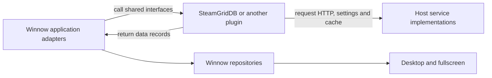
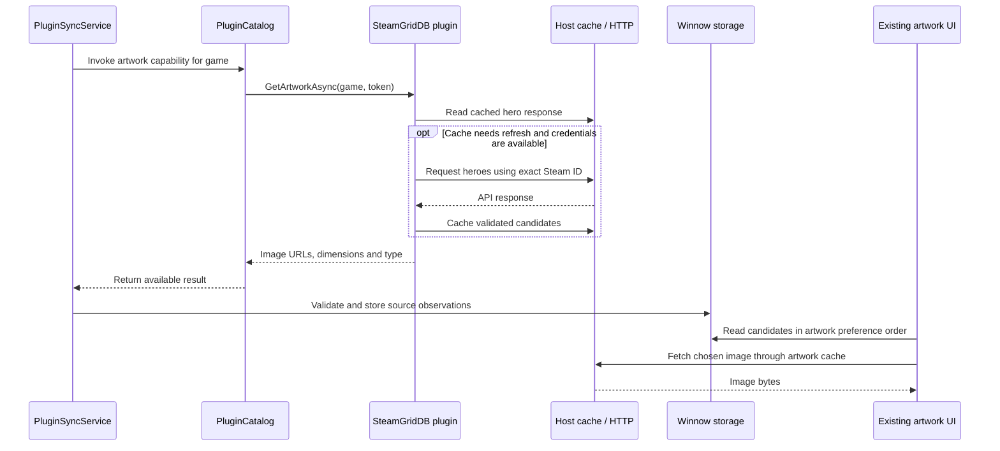

# Building Winnow's plugin system, from the inside out

Winnow's plugin system lets a separately compiled piece of code contribute game data through
interfaces that Winnow already understands. The plugin knows its service or data source;
Winnow knows its library, storage rules and presentation. The public SDK is the agreement
between them.

This walkthrough explains the implementation introduced in commit `7b10b88`. It assumes some
familiarity with C# classes and methods, but no experience building plugins. The existing
[plugin guide](plugins.md) is the shorter installation and API reference. This document explains
how the parts connect and how to build something similar.

**1. Start with the boundary you want to extend**

Originally, SteamGridDB was an ordinary application dependency. Winnow registered its client
and synchronization service explicitly, and settings had a SteamGridDB-specific editor. Adding
another provider meant changing the application in several places.

The extraction gave those responsibilities three homes:

| Piece | Responsibility | Winnow implementation |
|---|---|---|
| Public SDK | Defines what plugins can receive and return | `Winnow.PluginSdk` |
| Runtime | Discovers packages, loads their code and manages calls | `Winnow.Plugins` |
| Application adapters | Validate results and apply Winnow's database and presentation rules | App services such as `PluginSyncService` |

SteamGridDB becomes a fourth, replaceable piece: an implementation of the artwork interface.
It references the SDK alone. It does not need to reference Avalonia, Winnow's database or the
application assembly.



Every crossing between the plugin and host uses SDK types. A plugin returns an artwork URL
and its dimensions; Winnow chooses where to store that observation, whether to select it,
and how to crop it. This separation is what makes one provider usable on both presentation
surfaces without asking its author to build two interfaces.

**2. Turn the agreement into a small assembly**

A .NET assembly is compiled code, usually a DLL. Both the host and plugin compile against
`Winnow.PluginSdk.dll`, which contains interfaces and data records. It uses the .NET base
class library and has no application or third-party package dependencies.

Here is the artwork contract from [PluginContracts.cs](../src/Winnow.PluginSdk/PluginContracts.cs),
with its declaration shown on fewer lines:

```csharp
public interface IArtworkProviderPlugin : IPlugin
{
    Task<IReadOnlyList<PluginArtwork>?> GetArtworkAsync(
        PluginGame game,
        CancellationToken cancellationToken = default);
}
```

An interface promises that a method exists. The application can call that method without
knowing which class implements it. `Task` lets the provider perform asynchronous work;
`CancellationToken` lets the host ask it to stop; the nullable list lets it report that
artwork is currently unavailable.

There are four independent capabilities:

| Capability | Question Winnow asks | Result |
|---|---|---|
| Library | What games does this source report? | Source IDs, ownership observations, install state and playtime |
| Metadata | What do you know about this game? | Summary, release date, genres and tags |
| Artwork | Which images could represent this game? | Backgrounds, covers and screenshots |
| Recommendations | Which of these eligible games would you suggest? | Supplied game handles, scores and explanations |

A class can implement several capabilities. An artwork author only needs to implement artwork.
This avoids making every plugin implement meaningless methods for features it does not provide.

`PluginGame` and `PluginArtwork` are data-transfer records: small values designed to cross the
boundary. The game handle is opaque to the plugin. Authors should use the supplied external
IDs for service lookups and return handles unchanged when making recommendations.

We deliberately did not pass a database connection, a window, or the application's dependency
injection container. Dependency injection means supplying an object's dependencies from outside
it. A whole container would let plugins request arbitrary internal services and quietly turn
those internals into an API we would have to support.

**3. Describe a plugin before running its code**

Each installed plugin occupies its own directory. SteamGridDB's bundled package contains:

```text
plugins/
  steamgriddb/
    plugin.json
    Winnow.Plugin.SteamGridDb.dll
```

Plugins with private dependencies also include the dependency DLLs and their `.deps.json`
dependency description. SteamGridDB only needs the SDK and .NET's built-in libraries.

The [manifest](../plugins/Winnow.Plugin.SteamGridDb/plugin.json) is a JSON description. These
are its central fields, excerpted from the full file:

```json
{
  "id": "steamgriddb",
  "name": "SteamGridDB",
  "version": "1.0.0",
  "apiVersion": 1,
  "entryAssembly": "Winnow.Plugin.SteamGridDb.dll",
  "entryType": "Winnow.Plugin.SteamGridDb.SteamGridDbPlugin",
  "capabilities": ["artwork"]
}
```

`entryAssembly` identifies the file to load. `entryType` identifies the class to instantiate.
`id` is the durable identity used for settings, cached data and source attribution. Changing
that ID is effectively introducing a different plugin.

The full manifest also declares settings and network hosts. Winnow can therefore show a
plugin's name, requested configuration and load errors without executing its DLL. User packages
start disabled; the bundled SteamGridDB package defaults to enabled. An existing saved choice
takes precedence over either default.

[PluginManifestReader](../src/Winnow.Plugins/PluginManifestReader.cs) checks the API version,
identifiers, entry filename, recognized capabilities and bounded configuration. The catalog
discovers bundled packages first, so an installed package cannot replace a bundled one by
claiming its ID. Invalid packages appear as diagnostics in settings.

**4. Load the class and give it its dependencies**

[PluginCatalog](../src/Winnow.Plugins/PluginCatalog.cs) manages this lifecycle:

1. Read manifests from immediate package subdirectories in the bundled and user plugin roots.
2. Validate each manifest and look up the saved enablement choice.
3. For an enabled package, load its DLL in a `PluginLoadContext`.
4. Find the named public, concrete class and construct it with a parameterless constructor.
5. Verify that it implements `IPlugin` and every capability it declares.
6. Call `InitializeAsync` with its host context.
7. Make the successfully initialized instance available to the appropriate adapters.

Reflection is the .NET feature that lets step 4 find and create a type using its name at runtime.
After that, calls use ordinary C# interfaces. We do not use reflection for every artwork request.

`Enabled` and `Loaded` answer different questions. Enabled is the user's desired state for the
next launch. Loaded says the instance is active in this session. Changing enablement records
the choice and marks a restart as required; it does not immediately start or stop the code.

`InitializeAsync` receives [IPluginContext](../src/Winnow.PluginSdk/PluginContext.cs). SteamGridDB
saves that context in a field and uses it later. Its constructor does not need to know where
the database lives or how HTTP clients are configured.

**5. Share the SDK while keeping plugin dependencies separate**

Two plugins might need different versions of the same helper library. An `AssemblyLoadContext`
provides a separate assembly-loading scope. Winnow's
[PluginLoadContext](../src/Winnow.Plugins/PluginLoadContext.cs) uses `AssemblyDependencyResolver`
to find private dependencies and checks that resolved paths remain in that package directory.
Microsoft explains this mechanism in its [plugin tutorial](https://learn.microsoft.com/en-us/dotnet/core/tutorials/creating-app-with-plugin-support).

The SDK is a deliberate exception: the loader returns the SDK assembly already loaded by
Winnow. Type identity includes the assembly instance. Loading independent copies of an interface
can leave two types with the same printed name that .NET treats as different. Sharing the SDK
allows the host to recognize the plugin as an `IArtworkProviderPlugin`.
[Microsoft's assembly-loading explanation](https://learn.microsoft.com/en-us/dotnet/core/dependency-loading/understanding-assemblyloadcontext)
describes this distinction.

We also separate three kinds of version:

| Version | Meaning |
|---|---|
| Winnow application version | Which application build the user installed |
| Manifest `version` | Which release of this particular plugin they installed |
| Manifest `apiVersion` and SDK assembly major | Which host/plugin contract the plugin expects |

API 1 requires `apiVersion: 1`; the loader also checks the SDK assembly major. The
[SDK project](../src/Winnow.PluginSdk/Winnow.PluginSdk.csproj) keeps assembly version `1.0.0.0`
independent of application release overrides. These checks reject obvious incompatibility;
they do not automatically make a changed interface compatible. Adding required methods or
changing existing signatures would require deliberate API evolution and compatibility testing.

**6. Supply useful host services without exposing the host's internals**

The context gives each plugin four services:

| Service | Example use | Host responsibility |
|---|---|---|
| `Settings` | Read a declared text option | Keep settings under this plugin's identity |
| `Secrets` | Read its declared API key | Separate secret access from ordinary settings |
| `Cache` | Keep a response with an expiry | Persist bounded payloads in a provider namespace |
| `Http` | Call its external API | Enforce declared hosts, request budgets and response limits |

[PluginStorage](../src/Winnow.App/Services/PluginStorage.cs) implements these storage boundaries
using Winnow's existing stores. It includes the plugin ID in storage keys, with length-delimited
segments so dots in IDs cannot accidentally create a collision. Providers can both use the key
`apikey` without overwriting each other's value.

On Windows, saved secrets use current-user DPAPI encryption. The settings editor receives a
boolean saying a secret is saved, never the saved secret itself. Plugins can read their declared
secret when they need to authenticate. Other operating systems currently refuse persisted secret
writes; configuration can supply credentials there.

[PluginHttpClient](../src/Winnow.Plugins/PluginHttpClient.cs) supplies an HTTP client through
Winnow's existing client factory and Polly policies. SDK requests use declared HTTPS hosts,
disabled redirects, bounded response bodies, rate limits and limited retries for eligible
failures. SteamGridDB declares one request per second and a 2 MiB API response limit. Artwork
downloads use the same provider budget with a separate 32 MiB response limit.

This arrangement also makes tests simple. A fake `IPluginHttp` returns a canned response,
and a fake cache stores values in memory. The plugin can be tested without starting Winnow,
opening a database or making a live request.

**7. Follow one SteamGridDB image from discovery to display**

Assume the plugin is loaded and an owned game has a Steam app ID.



[Program.cs](../src/Winnow.App/Program.cs) schedules the plugin refresh after startup
synchronization and plugin discovery. The refresh runs in the background, imports library
providers first, and then asks metadata and artwork providers about owned games.

Inside [SteamGridDbPlugin](../plugins/Winnow.Plugin.SteamGridDb/SteamGridDbPlugin.cs), the request
uses the supplied Steam ID. It does not search the game's title. A fresh cached response is
usable for 30 days and does not require reading the API key. When a refresh is needed, the
plugin reads its declared secret and requests static heroes through the host HTTP service.

The plugin checks the service response: IDs, dimensions, image formats, unwanted flags and the
expected hero CDN URL. It translates accepted rows into generic `PluginArtwork` records.
A failed refresh can return older cached candidates. A confirmed absence is cached too, so
games without artwork do not cause a request on every pass.

[PluginSyncService](../src/Winnow.App/Services/PluginSyncService.cs) validates the returned data
again using host rules. It records backgrounds and screenshots on the original work with source
`plugin:steamgriddb`. For artwork, it queries each owned release's identifiers; if any result
is unavailable, the previous combined observation stays in place.

The host creates image keys from the plugin identity and a SHA-256 hash of the URL. It records
the URL mapping separately. [PluginArtworkSource](../src/Winnow.App/Services/PluginArtworkSource.cs)
uses that mapping and the active provider's HTTP scope when the cover cache needs image bytes.
Finding candidates and downloading pixels are separate operations.

Existing artwork selection then considers the user's preferred source order and the available
candidates. User-selected backgrounds stay first. Existing desktop and fullscreen code handles
the final presentation and crop. SteamGridDB supplies the image facts throughout this flow;
it never receives an Avalonia image control.

**8. Keep the application in charge of what returned data means**

The adapter layer does more than copy records. This is where extension support meets the
application's existing correctness rules.

For library imports, a plugin's source ID is namespaced as `plugin:<id>`. A hard Steam/Epic/GOG
ID can attach an observation to an existing release when all found matches agree. Matching
titles never establish that join. Migration 0032 extends the external-ID provider constraint
to admit these namespaces. Missing inventory does not remove ownership.

Library support here means importing inventory, installation observations and playtime. A new
launcher's custom launch, install and sign-in workflows need additional contracts; API 1 does
not expose them. Existing store actions can use established Steam/Epic/GOG links.

Metadata observations retain source attribution. Summary and release year fill eligible missing
automatic values through the existing repository; a plugin cannot overwrite the user's edits
through this API. Migration 0031 adds separate genre/tag assignments for each plugin. A refresh
replaces that provider's assignments while retaining other providers' assignments. Currently,
metadata gets the first owned release's identifiers for a work; artwork checks every owned release.

For recommendations, [PluginFeedService](../src/Winnow.App/Services/PluginFeedService.cs) supplies
eligible owned games after grouping and suppression. A plugin returns handles from that input,
finite scores between zero and one, and short explanations. Winnow rejects unknown handles and
invalid scores, then creates a named shelf with up to six cards and four reserves. Existing
dismissal and snooze behavior still applies. Plugin scores rank that shelf; they do not replace
the built-in recommendation model.

Return values need capability-specific meaning:

| Result | Library | Metadata | Artwork | Recommendation feed |
|---|---|---|---|---|
| `null` | Skip import | Keep previous observations | Keep previous observations | Omit this provider's shelf for this refresh |
| Empty collection | Import nothing; retain ownership | Empty genre/tag lists clear this provider's assignments when a metadata object is returned | Clear this provider's backgrounds/screenshots; do not clear an assigned cover | Produce no shelf |

The host does not persist the last successful recommendation result for offline fallback.
Providers can cache their own inputs or results. This differs from the stored artwork path.

**9. Generate settings from the same declaration**

SteamGridDB's manifest declares an `apikey` field with `secret: true`, a label and a setup link.
The host turns that description into an editor. A future provider can declare its own fields
without adding provider-specific XAML.

[PluginSettingsBackend](../src/Winnow.App/Services/PluginSettingsBackend.cs) translates the
catalog and stored values into application settings snapshots. The shared view models expose
commands and field state. Desktop renders plugin cards; fullscreen renders separate plugin
pages with its own navigation and focus handling.

Saving settings queues the background refresh worker. An already loaded plugin can read the
new values on its next call; changing whether code is loaded still requires a restart. Active
artwork providers also become entries in the shared source-order settings.

This gives authors a useful amount of presentation through data declarations. Supporting
arbitrary screens would require a larger contract for navigation, lifecycle, input and UI
compatibility. API 1 deliberately stops at generated settings and existing shelves/galleries.

**10. Try a small provider before adding an external API**

This teaching example adds a configurable tag to games that have a Steam ID. It has no network
dependency. Use a disposable data directory if you install it: it intentionally tags every
matching game supplied by the host. It is an exercise, not a source of real metadata.

Create an `Example.Metadata` directory outside the repository. Save this as `Example.Metadata.csproj`:

```xml
<Project Sdk="Microsoft.NET.Sdk">
  <PropertyGroup>
    <TargetFramework>net10.0</TargetFramework>
    <ImplicitUsings>enable</ImplicitUsings>
    <Nullable>enable</Nullable>
    <EnableDynamicLoading>true</EnableDynamicLoading>
  </PropertyGroup>
  <ItemGroup>
    <PackageReference Include="Winnow.PluginSdk" Version="1.0.0" ExcludeAssets="runtime" />
    <None Update="plugin.json" CopyToOutputDirectory="PreserveNewest" />
  </ItemGroup>
</Project>
```

The package reference provides SDK types at compile time. Excluding its runtime assets leaves
the host responsible for supplying the shared SDK when the plugin loads.

Save the implementation as `Provider.cs`:

```csharp
using Winnow.PluginSdk;

namespace Example.Metadata;

public sealed class Provider : IMetadataProviderPlugin
{
    private IPluginContext? _context;

    public ValueTask InitializeAsync(
        IPluginContext context, CancellationToken cancellationToken = default)
    {
        cancellationToken.ThrowIfCancellationRequested();
        _context = context;
        return ValueTask.CompletedTask;
    }

    public async Task<PluginMetadata?> GetMetadataAsync(
        PluginGame game, CancellationToken cancellationToken = default)
    {
        cancellationToken.ThrowIfCancellationRequested();
        if (!game.ExternalIds.ContainsKey("steam")) return null;

        var context = _context
            ?? throw new InvalidOperationException("Plugin is not initialized.");
        var tag = await context.Settings.GetAsync("tag", cancellationToken);
        return new PluginMetadata
        {
            Tags = [string.IsNullOrWhiteSpace(tag) ? "SDK example" : tag.Trim()]
        };
    }
}
```

Save the manifest as `plugin.json`:

```json
{
  "id": "example-metadata",
  "name": "Example metadata",
  "version": "1.0.0",
  "apiVersion": 1,
  "entryAssembly": "Example.Metadata.dll",
  "entryType": "Example.Metadata.Provider",
  "capabilities": ["metadata"],
  "settings": [
    { "key": "tag", "label": "Example tag", "help": "A tag for this learning exercise." }
  ]
}
```

No network hosts are declared because this provider makes no requests. To build it, first pack
Winnow's SDK into a local package directory. The following PowerShell example assumes your
sample project is at `C:\Temp\winnow-plugin-example\Example.Metadata`; adjust that path if needed:

```powershell
$winnowRepo = 'C:\Users\safwyl\source\winnow'
$sampleRoot = 'C:\Temp\winnow-plugin-example'
dotnet pack "$winnowRepo\src\Winnow.PluginSdk\Winnow.PluginSdk.csproj" -c Release -o "$sampleRoot\packages" "-p:BaseOutputPath=$sampleRoot\sdk-build\"
dotnet restore "$sampleRoot\Example.Metadata\Example.Metadata.csproj" --source "$sampleRoot\packages"
dotnet build "$sampleRoot\Example.Metadata\Example.Metadata.csproj" -c Release --no-restore
```

The package is the contents of the sample's `bin\Release\net10.0` output directory. To try it
inside Winnow, copy that directory's contents under
`C:\Temp\winnow-plugin-example\data\plugins\example-metadata`, then launch against disposable data:

```powershell
dotnet run --project "$winnowRepo\src\Winnow.App" -- --data-dir "$sampleRoot\data" --seed-sample
```

Find the plugin in Metadata & artwork settings, enable it, and restart with the same arguments.
The generated tag field should be available. Tag observations require an owned game with a
Steam external ID in that disposable library; discovery and loading work even without one.
Changing the field and saving requests another enrichment pass.

The exact project, class and manifest above were extracted from this document and verified in
a temporary harness using Winnow's real loader. The checks covered discovery while disabled,
activation after a simulated restart, SDK sharing, default and changed tag settings, and a
`null` response for a game without a Steam ID. This did not start the production application.

To extend the exercise, replace the tag-producing body with a lookup through `context.Http`,
declare that service's exact hosts, and translate its response into `PluginMetadata`. Keep
identity, storage and presentation in Winnow. Add caching once the basic call works.

**11. Design for failures and be precise about trust**

The catalog runs constructors/initialization and provider calls on worker threads. It serializes
calls to each plugin, gives initialization 30 seconds and operations 120 seconds, and passes a
cancellation token. Ordinary exceptions produce a fixed diagnostic and an unavailable result;
a later call can succeed. An operation timeout disables further calls for that session.

A deadline limits how long Winnow waits. It cannot forcibly terminate code that ignores
cancellation. A plugin that starts its own threads must manage those too. Even ordinary slow
feed calls can delay publication of the feed until they finish or reach the deadline.

Plugins are trusted code inside Winnow's process. The manifest's HTTP hosts and scoped storage
govern use of SDK services. A DLL can still call .NET filesystem and network APIs directly.
DPAPI protects saved credentials at rest; it does not make a malicious plugin in this process
safe. Microsoft explicitly cautions against loading untrusted code into a trusted process in
its [plugin tutorial](https://learn.microsoft.com/en-us/dotnet/core/tutorials/creating-app-with-plugin-support).

Stronger isolation would need a different design: a separate process with messages across the
boundary, plus operating-system restrictions if the aim is to limit permissions. Separate
processes alone do not define those restrictions. That would add serialization, process
lifecycle and permission design to the work. Winnow v1 uses explicit trust and local installation.

**12. Prove the boundary with a real plugin**

Moving SteamGridDB out was valuable because it already needed credentials, HTTP, cache, artwork
selection and settings. If it had still needed an App reference, that would have exposed a gap
in the contract immediately.

The App's [project file](../src/Winnow.App/Winnow.App.csproj) retains a build dependency on the
bundled plugin with `ReferenceOutputAssembly="false"`. That builds and packages it without
making its types an application compile-time dependency. Build/publish targets copy the DLL
and manifest into the plugin directory.

Existing installs also needed continuity. The
[legacy migration adapter](../src/Winnow.App/Services/LegacySteamGridDbPluginMigration.cs)
preserves old credentials, cached responses, artwork observations and downloaded images. This
is intentionally SteamGridDB-specific compatibility work around an otherwise generic pipeline.

The verification covers several different boundaries:

- [Standalone SteamGridDB tests](../tests/Winnow.Plugin.SteamGridDb.Tests/SteamGridDbPluginTests.cs)
  exercise requests, filtering, expiry, stale fallback and cancellation with fake host services.
- [Runtime tests](../tests/Winnow.Plugins.Tests/PluginCatalogTests.cs) load an actual separate DLL
  and exercise manifests, activation, capabilities, failures and deadlines. Mocking the interface
  alone would miss assembly identity and package-loading mistakes.
- [Application integration tests](../tests/Winnow.Tests/PluginSyncIntegrationTests.cs) use
  temporary databases to check persistence, source attribution and the shipped plugin package.
- [UI interaction tests](../tests/Winnow.Ui.Tests/PluginSettingsInteractionTests.cs) exercise
  generated settings separately on desktop and fullscreen.

The implementation's verification run passed 4,635 tests, with two Linux-only tests skipped on
Windows. Release publishing, loading the published SteamGridDB DLL and local SDK packaging
also passed. Those checks establish the tested behavior; they do not claim an authenticated
live SteamGridDB call or arbitrary third-party compatibility.

If building your own plugin system from scratch, use the same progression: pick one useful
capability, define its small contract, make one independently compiled provider work through
it, and then add discovery, settings, persistence and failure handling around that working
boundary. Add a second provider to expose assumptions specific to the first. Winnow's four
capability families share that infrastructure, while their adapters preserve the different
rules each kind of data needs.
