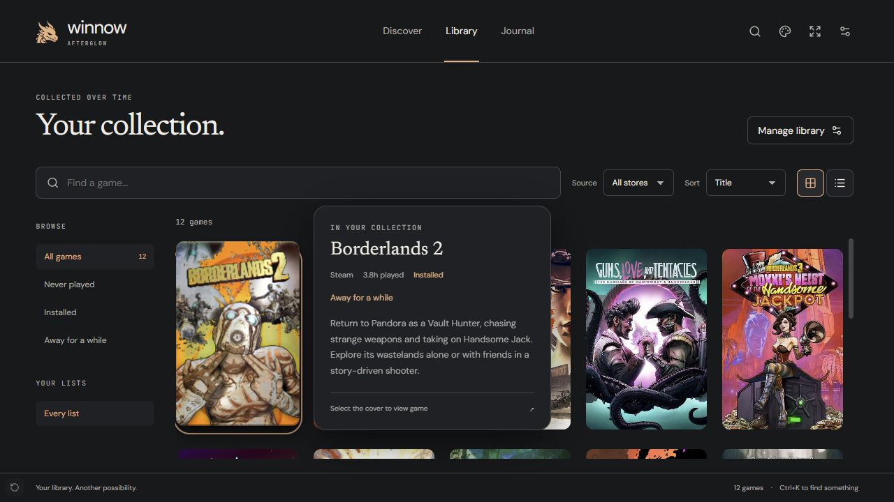
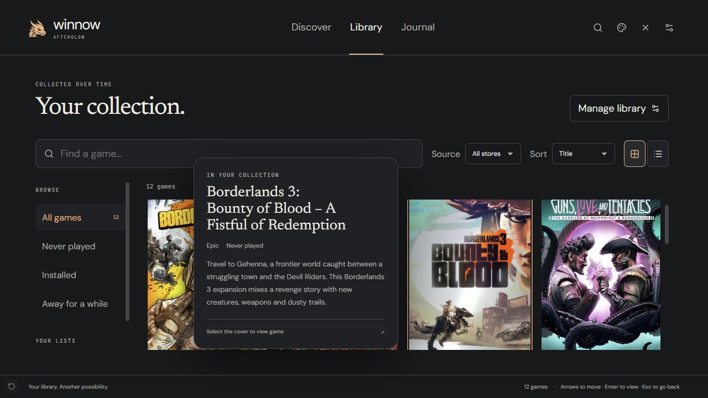

# Afterglow artwork integration verification

Verified on 2026-09-27 for TASK-361. This records the production renderer integration;
the preceding artwork mock remains separate design evidence.

## Reproduce the visual fixture

From `src/Winnow.Electron`:

```powershell
npx vite --config tests/preview/vite.config.ts
```

Open `http://127.0.0.1:8773/`. This runs the real React app against an explicit fixture
bridge and local artwork from the approved mock. It never connects to a backend or launches
a game. Theme Studio changes last for the page session. The fixture starts with Foil for
inspection; the production default is Satin. Details, management and other backend commands
are deliberately outside this fixture. The fixture entry is excluded from the app build.

## Observed behavior

- At 1280×720, desktop Library renders filled 2:3 covers with one side preview. The title,
  store, playtime, installed state, reason and description come from the supplied library
  record. The first card opens its panel to the right; later cards can place it on the left.
- Fullscreen uses the same components with its own navigation and library state. Long names
  wrap in the preview instead of changing cover heights. Footer and header remain visible;
  the library scrolls inside its viewport. Rows taller than a short content pane scroll.
- At 760×560 and 390×700, controls remain within the viewport. At 390px the preview docks
  above the footer with internal scrolling; document width remains 390px. No body scroll
  was present at the default size (document and viewport height both 720px).
- Left navigation keeps previews available. At 130% interface scale, the panel stays inside
  the viewport; placement converts viewport coordinates into the body's zoomed coordinates.
- Keyboard focus opens the preview, Escape consumes dismissal before shell navigation,
  and material effects use a stationary light. Focused cards restore their effects after
  native scrolling. Profile reduced motion gives zero tilt and a stationary light.
- Pixi rendered Foil/Silver and Satin/Holographic under a CSP without `unsafe-eval`.
  Exactly one canvas was attached during interaction; it reached `settled` or `still`.
  Navigating away removed the canvas. Captured browser error/warning logs were empty during
  those interactions. WebGL failure and context lifecycle behavior are additionally exercised
  through the unit-test renderer seam, rather than induced on the user's GPU.
- Changing to Catalogue and opening Library reused the same effects and preview. The
  Reading room package tests verify independent composition from the public primitives,
  both presentation modes and fallback on hosts predating the additive API 1 components.
- Discover retains its featured hero and rotation controls and renders eight returning
  games from the fixture's eight played titles.

The images below show keyboard focus in the renderer, with fixture content:





## Automated checks and limits

`npm test`: 185 passed, eight skipped across two opt-in live-backend suites. No live data
directory was supplied. This includes cache refresh/retry behavior, option/profile validation,
theme compatibility, preview interactions and effect lifecycle tests.

`npm run build`: TypeScript and Electron main, preload and renderer production builds passed.
Rollup reported two non-fatal pure-comment annotation messages in the existing Zod dependency.
`git diff --check` passed. No .NET source changed. Native window controls, physical gamepads,
real-library startup timing and TV-distance readability were not measured by this fixture.

The frontend avoids repeated image transfers during normal snapshot refreshes, with a
two-minute freshness bound and explicit revalidation on artwork changes/resync/reconnect.
Initial images still arrive through the existing cached PNG/base64 backend path. This is
not evidence of a measured startup speedup or of new backend image variants.
