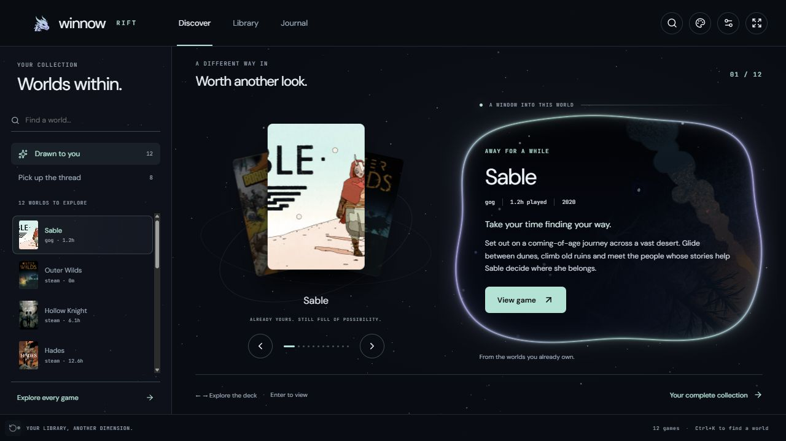
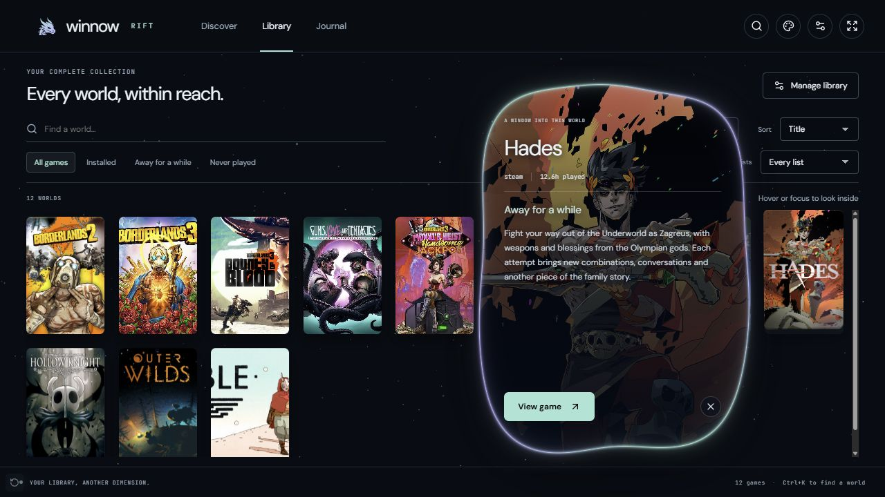
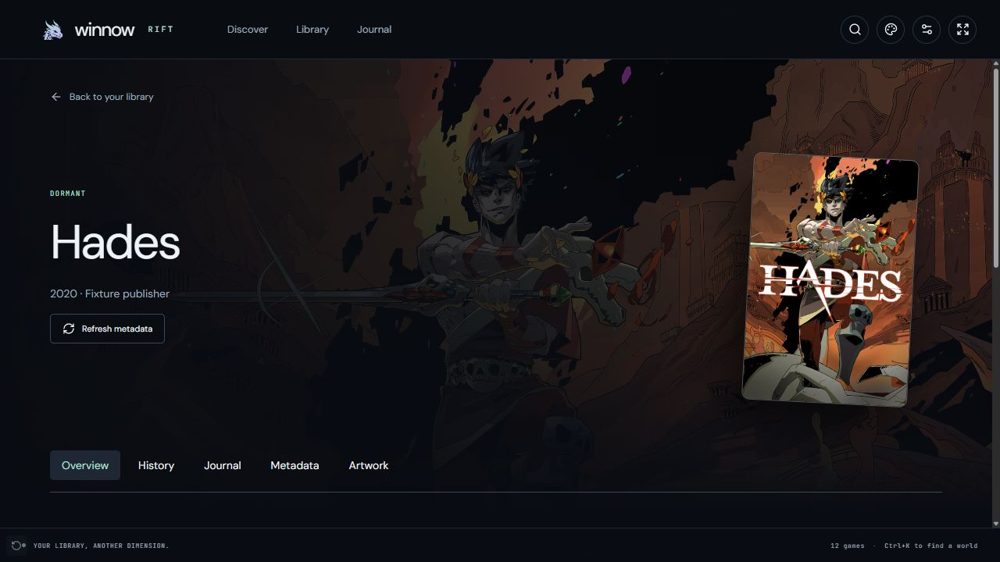
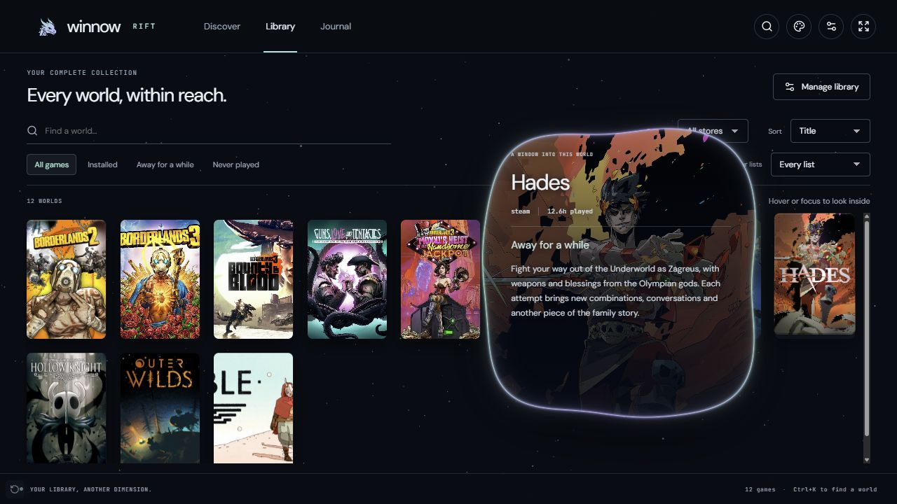
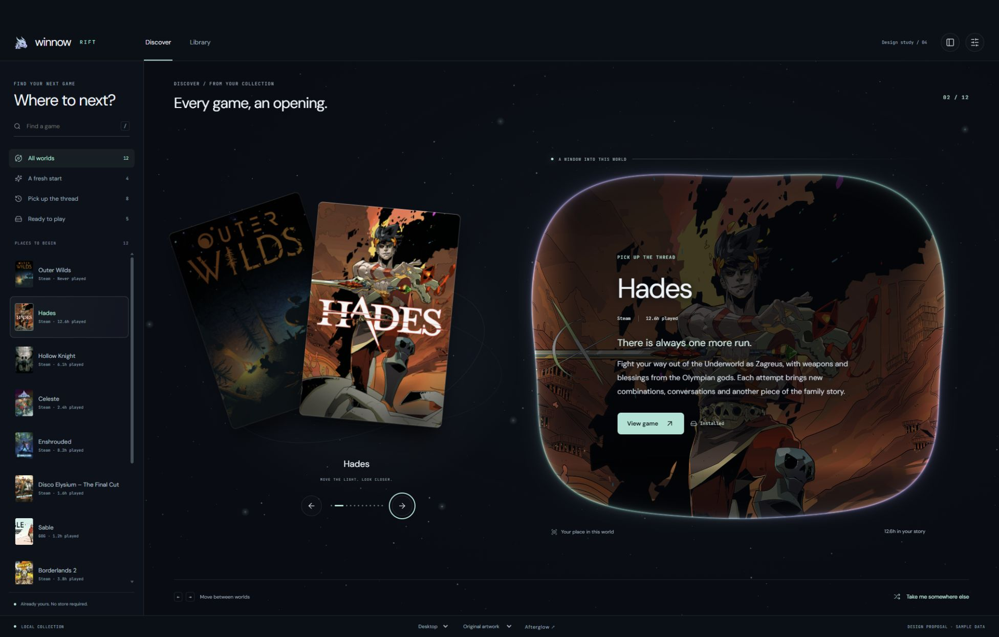
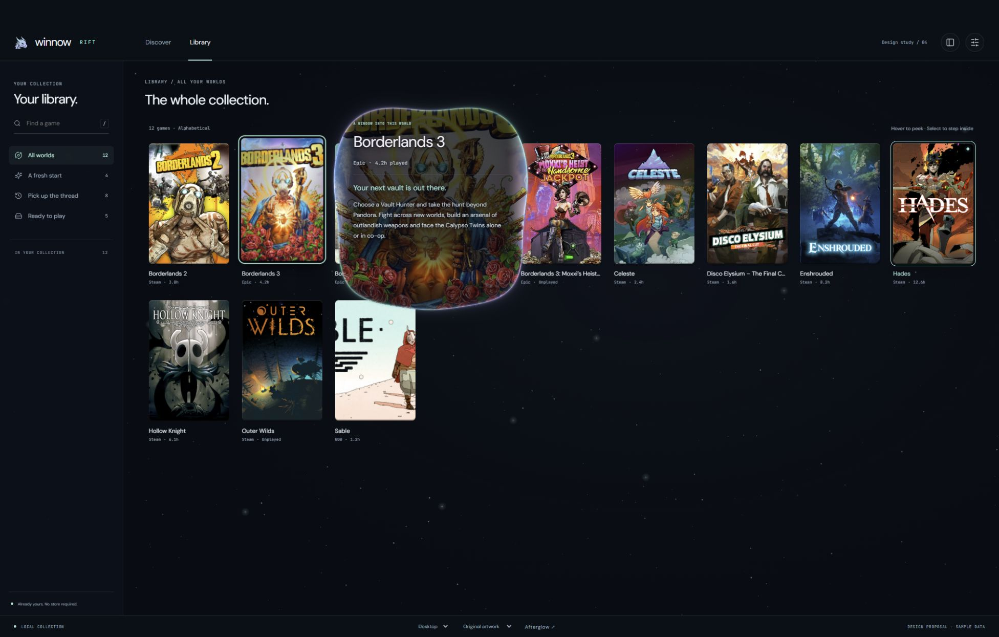
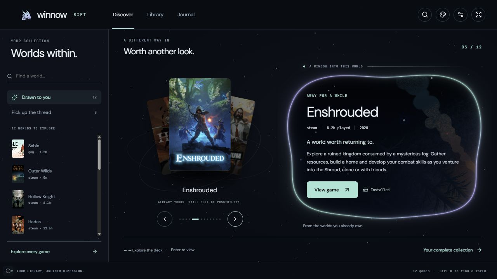
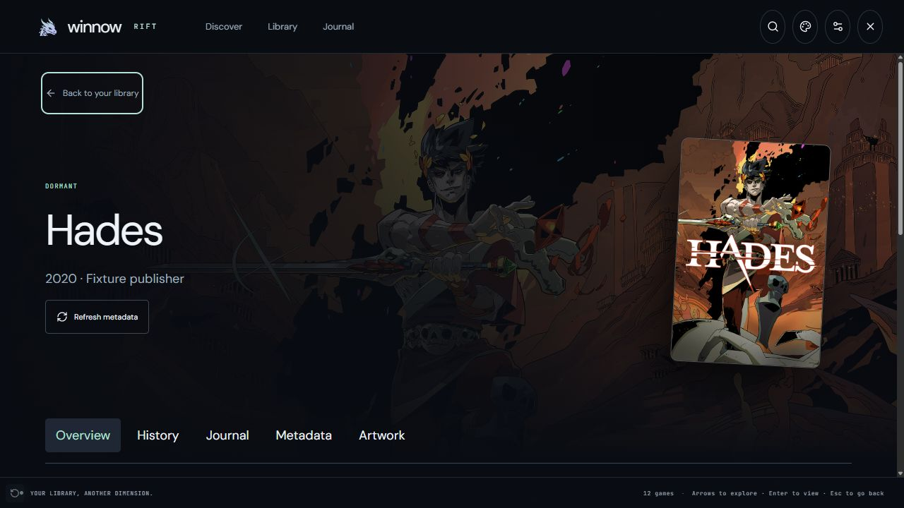

# Rift production integration — 2026-09-28

TASK-372 integrates the approved Rift study as an independent built-in Electron design.
Afterglow remains the default. Theme Studio switches compositions while preserving each
design's appearance and layout; interface scale and reduced motion remain shared.

## Verification

- `npm run build`: passed TypeScript and Electron main, preload and renderer builds.
  Rollup reports two existing Zod comment-annotation warnings; it removes those comments.
- `npm test` with both live-test environment variables pointing to
  `C:/Temp/winnow-electron-rift-20260928`: 26 suites passed, 236 tests passed, two skipped.
  The backend was started with `--data-dir` pointing to that directory, `--seed-sample`
  and `--no-sync`. The skips require a recorded session or credential-dependent metadata
  conditions. No real library or provider files were modified.
- Theme tests cover authored defaults, persisted design snapshots, startup reload,
  compatibility, invalid profiles and edits during external-theme loading. Portal tests
  cover fixed reading bounds, expansion coverage, shape normalization, activity zero,
  reduced motion, color updates, visibility and renderer cleanup. Interaction tests cover
  keyboard entry, dismissal, details focus and both presentation modes.
- Production React screens were exercised in the in-app Chromium browser through the
  explicit fixture bridge in `tests/preview`, at 390×700, 1280×720 and 1920×1080. This
  bridge supplies local artwork and representative library/API records; it has no real
  writes or launcher actions. It is excluded from production builds.

## Observed behavior

Desktop and fullscreen render distinct Rift Discover and Library layouts. The gallery uses
internal scrolling with a pinned header and footer. At 1280×720 its balanced setting shows
nine columns; the 2,000-game fixture at 1920×1080 mounted 50–80 covers as scrolling moved
through the collection. Returning from details restored the distant row and selected cover.
This is a DOM-size observation, not a GPU timing or memory benchmark.

Pointer movement changed both tilt axes after an accent edit. A rightmost cover opened its
portal to the left, and the pointer could cross into its actions. Keyboard users could enter
the preview with Tab, dismiss it with Escape, open details, and return to the same cover.
The narrow layout docked a 354×540 preview within the viewport; its reading plane did not
scroll. Portal expansion ended with focus on Back, removed its temporary GPU canvas, and
left details independently scrollable. Desktop and fullscreen retained separate journeys.

Theme Studio restored Afterglow's original accent and quiet covers, then restored Rift's
custom accent. Its portal sample updated with the controls; activity zero stopped ambient
edge animation. Missing covers retained their game names, empty libraries offered setup,
and unmatched searches offered filter recovery. Shared management, journal and settings
screens remained available. Final hover → preview → details → Back navigation produced
no new browser warnings or errors after correcting shader precision, renderer cleanup and
shared details action keys.

## Captures and limits

These captures show the production renderer with fixture records, not a native packaged
Electron session. The small fixture reuses hero artwork for several titles. Production
uses the normal cached `Artwork` component and authenticated preload bridge.

Physical controller use, TV-distance readability and low-end GPU performance were not
measured. The existing portable executable was not repackaged by this task; use the current
source build or run the documented packaging command to update it.

## Compact preview follow-up — TASK-373

The cover preview now contains information only. Its fixed reading plane is 420 pixels
high on desktop and 440 in fullscreen, bounded by the available viewport. It ignores
pointer events and has no buttons; the cover owns hover, focus and details activation.

The four focused Rift/app suites passed all 12 tests, the production build passed, and
the mock script passed Node's syntax check. Production-renderer browser checks confirmed
zero preview buttons, `pointer-events: none`, matching reading-plane client/scroll heights,
closing when the cursor moves into the former preview area, and opening details from the
cover. Fullscreen Tab moved directly to the next cover and Enter opened that game's details.
The shared mock was checked in both modes with the same heights and keyboard behavior.

## Discover shuffle — TASK-374

Rift's Discover deck now moves its outgoing card aside and brings the next card forward
over 520 ms. The Web Animations controller captures interrupted poses before cancelling
prior motion; selection, focus and details activation do not wait for completion. The
same controller is bundled into the static mock. Artwork materials remain on the inner
surface, independent of the deck's outer transforms.

The deck, app and Rift data suites passed all 12 focused tests. Type checking, the
production Electron build and the mock's Node syntax check passed. Rollup reported the
existing Zod comment-annotation notices; they did not fail the build.

Browser checks in desktop and fullscreen confirmed directional motion from navigation
controls and neighboring covers, rapid keyboard reversals settling on the newest game,
retained keyboard focus, and Enter opening that game's details during the shuffle.
With Reduce motion enabled, selection updated immediately without active deck animation.
The static mock was also checked in both modes; its scripts are versioned to invalidate
the old cached selection code. The screenshot below captures its cards mid-shuffle.

These checks used fixture records and the production React renderer, not a repackaged
native executable. No GPU frame-time benchmark or physical controller test was performed.

## Mock Library foil repair — TASK-375

The mock included Library captions in the initial shader dimensions, then watched only
the artwork for resizing. The first observation therefore removed its new canvas. The
renderer now measures the untransformed cover and normalizes pointer input from the
stable button into that area, matching the production component's separation.

The failure was reproduced with no material canvas while the cover still lifted. After
the repair, the desktop canvas remained 163 × 244 pixels with both essential and taller
context captions. Fullscreen retained a 151 × 227 canvas. Pointer input followed normally;
keyboard focus and Still mode retained a stationary foil highlight. Discover keyboard
cycling retained its material. Node syntax validation and all 20 production artwork-effect
tests passed. No Electron production code changed or native executable was repackaged.

## Shuffle rendering work — TASK-376

The user reports physical monitor flicker on an AW3423DWF with an RX 9070 XT, HDR and
VRR disabled. It occurs in Rift fullscreen but not Afterglow or Avalonia and does not
appear in a ShareX recording. Setting portal activity to zero stops the ongoing flicker;
card animation start/stop still produces brief flicker. Launching with
`--disable-direct-composition` stops the flicker but sometimes makes the shuffle jerky.
These are user observations, not measurements made by the browser fixture.

An integration regression reproduced Discover replacing its portal on each selection.
The production screen now keeps the portal mounted, changing artwork and reading content
without destroying and recreating its GPU renderer or replaying the aperture entrance.
Deck stacking is assigned once per animation and restored afterward; keyframes contain
only transform and opacity. The mock uses the regenerated shared deck controller.

All 20 focused app, deck and portal tests passed. The new lifecycle check failed before
the change and passed afterward on both presentation modes. A portal test separately
confirmed a single renderer creation with no destruction when artwork and text changed.
Completion, interruption and reduced-motion tests verify stacking restoration. The
production build passed with the existing Zod comment-annotation notices.

Browser checks confirmed desktop and fullscreen selection changes leave the WebGL portal
open, rapid right/right/left input retains the latest game's title and keyboard focus,
and Enter opens that game's details. The mock shuffled in both modes and removed its
temporary stacking styles at rest. These checks establish lifecycle behavior, not native
frame pacing or a fix for the display flicker. GPU startup defaults remain unchanged.

A separate unpacked Windows build is available at
`src/Winnow.Electron/release/rift-smooth/win-unpacked/Winnow Afterglow.exe`. Packaging
reused the existing staged backend and notices; no backend code changed. All 52 files in
the frontend output matched the packaged archive byte-for-byte. This package has not
been interactively tested on the affected physical monitor. Repeat the same fullscreen
comparison with `--disable-direct-composition` to assess hitching independently of the
known flicker workaround. The existing `release/win-unpacked` build was not overwritten.

## Full-view reveal rendering work — TASK-377

The user confirmed the shuffle improved in the TASK-376 build, but reported choppy
details expansion with DirectComposition disabled. The suggested `translate3d(0, 0, 0)`
and hidden backface can encourage layer isolation; they do not restore the Windows
DirectComposition presentation path. Browser guidance recommends applying layer hints
only to the affected animation and removing them afterward
([web.dev](https://web.dev/articles/animations-guide)).

Expansion previously assigned the same polygon independently to artwork and content on
every frame. It now clips their common reveal wrapper once and temporarily promotes the
wrapper and reading plane. No text or artwork scales. The rectangular fallback artwork
shadow is disabled during full-view expansion. Previews retain their existing masks and
ambient behavior. A conservative superellipse bound retires the rim only when the whole
pane is inside its maximum ripple and 64-pixel halo margin; small panes can still reach
the normal duration limit before that condition holds.

All 36 focused portal lifecycle, geometry, details, preview and app tests passed. They
cover fixed reading dimensions, perimeter coverage, early rim retirement, resize, blur,
deactivation, unmount and reduced motion. The production build passed with the existing
Zod annotation notices. Browser fixture checks observed one active polygon mask during
desktop and fullscreen expansion, identity transforms on the reading plane, and hidden
scrollbars during the reveal. At a 3440 × 1440 viewport the fullscreen content plane
remained 3440 × 1320. Completion removed the clip, layer hints and canvas, enabled
scrolling and focused Back. The viewport override was reset after verification.

A separate portable directory is available at
`src/Winnow.Electron/release/rift-portal/win-unpacked/Winnow Afterglow.exe`. All 52 output
files matched its packaged archive byte-for-byte. Packaging reused the existing staged
backend and notices; backend code and the previous executable directories were untouched.
The historical static mock was not changed. This verifies structure, lifecycle and visual
continuity, not native GPU timings or monitor flicker. No GPU trace was captured and the
physical AW3423DWF comparison remains for the user, initially using the same
`--disable-direct-composition` flag to isolate this rendering change.

