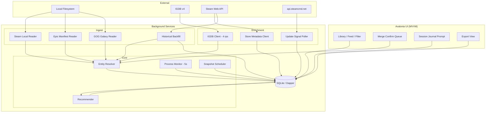

# Winnow — build specification

**Name:** Winnow · root namespace `Winnow`, binary `winnow`
**Target:** Cross-platform desktop application, local-first, no server
**Audience:** Implementing engineer or coding agent

This document owns the architecture, the module boundaries, the behaviour of every external
service, entity resolution, the schema, the derived buckets and session detection. Sequencing
and milestone state are in `ROADMAP.md`; visual values are in `design-system.md`.

---

## 0. How to read this document

This is a build specification, not a proposal. Sections 1 to 3 are context. Section 4 encodes
API and filesystem behaviour that has been verified against live systems, and several of its
constraints contradict what you will find in older blog posts and Stack Overflow answers.
Read section 4 before writing any ingest code.

Items marked **[VERIFY]** have not been confirmed. Confirm them empirically before building
on them; do not treat them as established. Three remain, all in §9.

---

## 1. Problem and scope

Large PC game libraries (1,000+ titles) decay into three piles: games that are old or
otherwise unplayable, games that have been played to completion, and **games the owner
intends to play but has forgotten exist**. The third pile is the target. Existing tools browse
and filter well but cannot surface "I haven't touched this since it got a major update" or
"I bounced off this after 40 minutes two years ago", because the underlying data is either not
exposed by storefront APIs or not retained by anyone.

### Goals

- Unified library across Steam, Epic and GOG with correct deduplication
- Playtime and last-played tracking, including the longitudinal history storefronts discard
- Update-aware staleness detection
- Per-platform achievement tracking with a unified read surface
- User-authored lists and collections
- Local recommendation over the user's own database, with every recommendation explained
- First-class data export

### Out of scope

- PlayStation and Xbox integration (§4.6)
- Any hosted service, user accounts, or multi-user features. Winnow has no accounts; it links
  the user's. Signing in to Epic or Steam authenticates the user to *their* service and stores
  the token locally. That is third-party linking, not account creation.
- Co-op and friend library matching, which would require a server
- A 3D "games on a shelf" browsing view (§10)
- Mobile

---

## 2. Framework: Avalonia

This application is a **background daemon with a UI attached**. It sits in the tray
enumerating processes every few seconds, all day, and the user interacts with it briefly and
occasionally. Avalonia was chosen over Electron on that profile. Do not reopen the choice; the
reasoning and its accepted costs are in `docs/decisions.md`.

---

## 3. Tech stack

| Layer | Choice | Notes |
|---|---|---|
| Runtime | .NET 10 | |
| UI | Avalonia 11+ with XAML | |
| MVVM | `CommunityToolkit.Mvvm` | Source generators; AOT-friendlier than reflection-based MVVM |
| Database | SQLite via `Microsoft.Data.Sqlite` | Local-first |
| Data access | **Dapper**. No EF Core | Keep the SQL legible |
| Migrations | **DbUp** | Embedded resources, checked into the repository |
| VDF / ACF parsing | **ValveKeyValue** (xPaw) | Never hand-roll a parser |
| Steam client protocol | SteamKit2 | Only if the Web API proves insufficient; not needed today |
| HTTP | `HttpClient` + **Polly** | Retry, circuit-breaker and rate-limit policies |
| HTML parsing | AngleSharp | The saved-page importer in §5.4 |
| JSON | `System.Text.Json` | Source-generated contexts |
| Logging | Serilog, rolling file sink | Ingest failures must be diagnosable |
| Scheduling | In-process `PeriodicTimer` | No external queue |
| Metadata | IGDB v4 API | Twitch client-credentials auth |
| Packaging / updates | Velopack **[VERIFY]** | §9 |

**Deliberately excluded:** Postgres, any vector store, any server framework, any LLM
dependency. Do not add them speculatively.

Publish trimmed self-contained. Treat NativeAOT as an optimisation to attempt later, not a
day-one constraint; Avalonia supports it but requires discipline around XAML compilation and
reflection.

---

## 4. Hard constraints

### 4.1 Steam local filesystem

Reading local files is the **primary** playtime source, not the Web API. This eliminates the
`rtime_last_played` restriction described in §4.2 entirely for the signed-in user.

| Data | Path |
|---|---|
| Library root list | `<steam>/steamapps/libraryfolders.vdf` |
| Per-app install metadata | `<steam>/steamapps/appmanifest_<appid>.acf` |
| Playtime and last-played | `<steam>/userdata/<steam3id>/config/localconfig.vdf` |
| Collections | `<steam>/userdata/<steam3id>/config/cloudstorage/cloud-storage-namespace-1.json` |

Steam install roots:

- Windows: `%ProgramFiles(x86)%\Steam`, plus registry `HKCU\Software\Valve\Steam\SteamPath`
- Linux: `~/.steam/steam`, `~/.local/share/Steam`, and Flatpak `~/.var/app/com.valvesoftware.Steam/`
- macOS: `~/Library/Application Support/Steam`

**Parse with ValveKeyValue.** Both text and binary KeyValues appear in Steam's config tree,
and hand-rolled parsers break on the binary variants. Parse keys case-insensitively: the
`appmanifest` field documented as `LastUpdated` is `lastupdated` on disk.

**`localconfig.vdf` per-app keys**, exact casing:

- `Playtime` — minutes, total
- `LastPlayed` — Unix epoch seconds
- `Playtime2wks` — minutes in the trailing fortnight. Not `playtime2wks`, not
  `playtime_two_weeks`

Reading these correctly requires four further behaviours:

- **`LastPlayed` carries a sentinel.** `"86400"` (1970-01-02) appears on many old entries.
  Treat any value below a sanity floor of 315532800 (1980) as unknown, never as a real date.
- **Key order inside an app block is not stable.** Never parse positionally.
- **App blocks may contain no playtime keys at all.** Skip blocks lacking `Playtime`.
- **`UserLocalConfigStore/apptickets` is also a map keyed by appid.** Match the playtime map
  by path, not by shape, or it will false-match.

**Multiple accounts.** `userdata/` may hold several `steam3id` directories. Enumerate all of
them and attribute playtime per account; `CandidateOwnership` carries the `steam3id`.

**Collections JSON.** The path changed in 2025; older guides pointing at `sharedconfig.vdf` or
a Chromium LevelDB store in `htmlcache` are dead. The top level is an **array of
`[key, entry]` pairs**, not an object map. Entries carry tombstones (`is_deleted`) that must
be honoured, and the id alphabet includes `+`, `/` and `*`. Ingest static membership (`added`
minus `removed`); record `filterSpec` without evaluating it.

**Steam is an eventually-consistent writer.** The client does not flush config changes to disk
immediately, and reads may be stale by an unbounded amount.

**Never write to any Steam file.** Steam Cloud may also overwrite local edits with a newer
server-side version. Winnow is read-only against all Steam files.

### 4.2 Steam Web API

Used for enrichment, entitlement backfill and friends data. The key is user-supplied and
stored locally.

- `IPlayerService/GetOwnedGames` — pass `include_appinfo=1`, `include_played_free_games=1` and
  `skip_unvetted_apps=false`. Without the last, apps flagged "Profile Features Limited" are
  silently omitted.
- `rtime_last_played` is returned **only when the API key belongs to the queried account**.
  With a third party's key you get appid and `playtime_forever` only. Do not architect around
  the Web API for the local user's own playtime; that is what §4.1 is for.
- `GetPlayerSummaries` accepts up to 100 SteamIDs per call and returns `gameid` /
  `gameextrainfo` when a user is in-game. Not used: local detection is better.
- `IPlayerService/ClientGetLastPlayedTimes` returns `first_playtime` per app in one call
  against the existing key. It converts every ownership from a point into a span, which is the
  bounced-versus-retired discrimination the feed turns on.
- `ISaleFeatureService/GetUserYearInReview` returns per-game per-month playtime seconds and
  session counts for 2022 onward. Both endpoints accept the stored Web API key.
- Steam throttles profile endpoints, returning HTTP 429 with `Retry-After`. Implement
  exponential backoff and 429 handling from the first commit. Polly policies applied at the
  `HttpClient` level, never per call site.
- Nominal budget is 100,000 calls/day. Cache aggressively.

### 4.3 Steam store metadata

- **User-defined store tags come from `IStoreBrowseService/GetItems`.** Plain `IStoreService`
  has no tag method. `GetItems` is **keyless** and batches 100+ appids per call. Tag *names*
  need a second call, `IStoreService/GetTagList`.
- Store `(tagid, weight, rank)`. Keep the rank: weight is only comparable within one app.
- **Store the Steam tag vocabulary and the IGDB genre/theme vocabulary separately.** Do not
  blend them.
- **Store page HTML scraping is not recommended in any form.**
- `store.steampowered.com/api/appdetails` is limited to roughly **200 requests per 5 minutes
  per IP** and accepts **one appid per request**; batching was removed in 2015. It is a
  background job and must never sit in a user-facing path. Cache its responses for at least
  24 hours and set a descriptive `User-Agent`.
- Valve rate-limits traffic that resembles scraping. If throttled persistently, the documented
  remedy is contacting `webapi@valvesoftware.com`.

### 4.4 IGDB

- Auth is Twitch client-credentials:
  `POST https://id.twitch.tv/oauth2/token?client_id=…&client_secret=…&grant_type=client_credentials`.
  Send `Client-ID` and `Authorization: Bearer <token>` on every request. Tokens are long-lived
  (~60 days); cache and refresh rather than re-minting per request.
- Rate limit is **4 requests/second** per credential. Enforce it with a shared Polly
  rate-limit policy, never an ad-hoc `Task.Delay`.
- Queries use Apicalypse: POST body as `text/plain`, not query parameters.
  `fields name,cover.*; where id = 123;`
- **`external_games` / `external.steam` maps Steam appids directly to IGDB ids.** This is the
  high-precision join and the backbone of entity resolution. It also resolves GOG ids. It does
  **not** resolve Epic catalog ids: IGDB stores Epic *offer* and *page* ids instead, and a
  catalog-id lookup returns nothing.
- **`game_versions` exposes release editions** (Skyrim, Special Edition, Anniversary). This is
  the abstraction the Release layer needs. Do not reinvent it.
- The IGDB response cache has no `payload_version`. Adding a field to the cached shape yields
  empty results for 30 days rather than refetching. Bump a version field before changing the
  shape.

### 4.5 Update detection

Two independent signals, combined.

1. **Build push:** appinfo `depots.branches.public.timeupdated`, a Unix timestamp, from
   `GET https://api.steamcmd.net/v1/info/{appid}` — free, unauthenticated, and verified live.
   Do not bundle local SteamCMD as a fallback: it costs 250 MB and has an open non-TTY output
   bug. *Caveat:* this fires on any depot push, including DRM wrapper bumps, localisation
   files and one-line hotfixes. Alone it is far too noisy to mean "major update".
2. **Announcements:** `ISteamNews/GetNewsForApp` with **`tags=patchnotes`**. On a
   representative app that filter yields 34 items against 527 unfiltered and 74 for the feeds
   filter. `GetNewsForApp` needs no API key. **A 403 means "no feed for this appid", not
   throttling: cache it and do not back off.**

**Only flag a major update when both signals fire within ±7 days of each other.** Store both
raw signals in `update_events` so the heuristic can be retuned without re-fetching, and store
the news item's `url` on the event row; the badge is clickable.

**Never-opened games are ineligible for the badge, so do not poll them.**

### 4.6 Excluded platforms

PSN and Xbox are **out of scope and must not be added**. Neither has a consumer API, PSN
requires the user to extract an `npsso` cookie by hand every two months, and PSNAWP's own
documentation warns that use may result in PSN account bans. Signing in to Epic is not a
precedent for these; the reasoning is in `docs/decisions.md`.

### 4.7 Steam account pages, sign-in, and what may be stored

Steam exposes transaction history at `store.steampowered.com/account/store_transactions` and
a lifetime total at `help.steampowered.com/en/accountdata/AccountSpend`. Neither has an API or
an export.

**Winnow must never hold or exfiltrate the user's browser session, and must never impersonate
their browser.** Within that, two routes to the account pages are permitted and are equal
peers: the user saves the pages from their own browser and Winnow parses local files, or
Winnow opens a sign-in WebView and harvests the rendered HTML while the user is present.
Eight conditions bind, and all eight are binding:

1. **User-present sign-in, ephemeral off-the-record browser.** The user types their password
   into Steam's own page inside an in-memory, off-the-record WebView profile. Winnow never
   sees the password, Steam Guard works normally, and the profile is torn down afterwards.
2. **Exactly two secrets at rest.** The minted access token and the refresh token, and nothing
   else, written as one DPAPI-encrypted blob. No cookie jar, no `steamLoginSecure`, no
   `sessionid`, no persisted browser profile, no page content. **A host that cannot encrypt
   refuses to store rather than degrading to plaintext.** Refusing costs the user a sign-in
   they repeat after a restart; a plaintext fallback fails silently and permanently. The same
   standard is intended for every secret Winnow keeps; the Steam Web API key and the IGDB
   client secret do not meet it yet and are tracked as debt in `ROADMAP.md` §6.
3. **A closed list of three unattended request kinds.** With nobody watching, Winnow may issue
   only the `finalizelogin` call, the `transfer_info` POSTs that call returns, and one token
   mint. No authenticated HTML page is ever fetched without the user present.
4. **Reading is bounded by what, not by how much.** With the user present: the two named
   account pages in full, plus three named fields read from any non-login store document by
   one script fixed at build time. It is not a general query interface.
5. **Purchase history needs its own permission.** Capturing purchase history during a sign-in
   requires an explicit, separate prompt. Declining leaves the sign-in fully functional for
   account identity and playtime backfill.
6. **Peers, on both axes.** The Web API key and the WebView sign-in are peer connection
   methods, neither a fallback for the other. The manual and embedded routes to the account
   pages are likewise peers, presented in the UI as equal options with a transparent
   explanation of what each does.
7. **One parser, one importer, one credential seam.** Sign-in is a credential source, not a
   second Steam integration.
8. **Legibility.** A session that cannot renew must say so before it dies. Silent degradation
   to no-remote-data is a defect, not a graceful fallback. The UI surfaces a failing renewal
   promptly, offers one-click re-sign-in, and explains that adding an API key makes scheduled
   syncs unconditionally reliable.

The minted token lives about a day. The refresh token lasts roughly 207 days when the user
chose remember-me, and is spent against `/jwt/finalizelogin`. A bad token returns a hard 401,
where a bad API key returns a silent 200 with an empty envelope.

**Purchase price is an opt-in, clearly-labelled estimate, not a core feature**, because the
data underdetermines it: bundles appear as a single line item for N games, and third-party
keys from Humble, Fanatical and the rest never appear in Steam's spending data at all, which
is exactly the population with large libraries and unplayed piles.

### 4.8 Epic and GOG local files

**Epic:**

- `%PROGRAMDATA%\Epic\EpicGamesLauncher\Data\Manifests\*.item` is **authoritative for
  installed titles**.
- `catcache.bin` is **authoritative for the owned library**.
- `LauncherInstalled.dat` is **dead. Do not use it.**
- Do not hardcode the manifest path; read `HKCU\SOFTWARE\Epic Games\EOS` →
  `ModSdkMetadataDir`.
- Epic has **no per-game playtime and no last-played on disk**.

**GOG:**

- `galaxy-2.0.db` is a WAL database. `immutable=1` silently returns stale data, and `mode=ro`
  writes `-wal` and `-shm` files into the store's directory. **Copy the file first, then read
  the copy.**
- Galaxy's library contains **other stores' releases marked owned**. Filter
  `substr(releaseKey,1,4)='gog_'` or the Steam library is double-counted.
- GOG **does** carry playtime in minutes and last-played in UTC, including for uninstalled
  games.
- Local GOG titles carry the installer's locale, so a Polish install of GWENT reports a Polish
  title. `GamePieces.title` from Galaxy is canonical.

**Built-in storefront client credentials.** Epic's launcher client id and secret ship with
Winnow, at the lowest priority in the credential chain, so a user-supplied pair always wins.
The reasoning is in `docs/decisions.md`.

---

## 5. Architecture

Background services run as `IHostedService` implementations under the generic host, and the
Avalonia UI resolves view models from the same DI container. **The UI never calls an ingest or
enrichment component directly; it reads the database and raises commands.**



### 5.1 Module boundaries

| Module | Responsibility | Must not |
|---|---|---|
| `Winnow.Core` | Domain records, repository interfaces, the ingest contract | Perform IO, or reference anything outside the BCL |
| `Winnow.Data` | Schema, migrations, repositories, the bucket queries | Store a derived value as a source of truth |
| `Winnow.Ingest.*` | Read one source, emit normalised `CandidateOwnership` | Write to `works` or `releases`; write to any store-owned file |
| `Winnow.Resolve` | Map candidates to Work and Release, enqueue ambiguous merges | Auto-merge on anything but a hard external-id join |
| `Winnow.Enrich.*` | Fetch and cache external metadata | Block any user-facing path |
| `Winnow.Covers[.Igdb]` | Fetch and cache cover art; first source that answers wins | Block first paint |
| `Winnow.Monitor` | Detect game start and stop, emit sessions | Assume any specific launcher is present |
| `Winnow.Recommend` | Score and explain | Perform IO beyond repositories; reference anything but `Winnow.Core`; make identity decisions |
| `Winnow.Auth.WebView` | Host the embedded sign-in | Reference anything but Avalonia and `Winnow.Core` |
| `Winnow.App` | UI and composition root. Assembly name `Winnow` | Reference an ingest, enrichment or cover type outside the composition root |

**Library sync is split by network dependence.** `LocalLibrarySyncService : ILocalLibrarySync`
runs the three local scans and reaches no network; `RemoteOwnershipSyncService :
IRemoteOwnershipSync` handles entitlement backfill on a 6-hour timer. Both live in
`Winnow.App.Services` rather than `Winnow.Core.Ingest`, because `LibrarySyncReport` carries a
`ResolveResult` and Core cannot reference Resolve. **No enrichment or remote client may be
reachable from the first-paint path.**

### 5.2 Session detection

**Process watching** is the shipped mechanism and needs no setup. A launch-option wrapper
(`winnow-wrap %command%`, the mechanism `mangohud` and `gamemoderun` use) is specified below
but not built.

Two tiers. **Polling is for discovery only, never for exit detection.**

*Tier 1 — discovery, polled at 5s.* Enumerate via `Process.GetProcesses()`. Map executables to
releases using `installdir` from `appmanifest_*.acf` cross-referenced with
`libraryfolders.vdf` paths, plus Epic and GOG install locations.

**Filter on `Process.ProcessName` against the known-executables set before resolving any full
path.** Resolving `MainModule.FileName` is substantially more expensive than the enumeration
itself on Windows and throws for processes the app cannot open. Resolving paths for the two or
three name matches is free; resolving them for every running process is where the real cost of
this loop would be.

*Tier 2 — exit, event-driven, no polling.* On discovery, retain the `Process` object, set
`EnableRaisingEvents = true` and subscribe to `Exited`. The OS delivers the callback
immediately, and retaining the handle pins the PID against reuse, closing a race a polling
implementation would have to defend against explicitly. On Linux, `pidfd_open()` plus epoll
gives the same guarantee on kernel 5.3+; otherwise a single `stat()` on `/proc/<pid>` per
*tracked* game is one syscall, not an enumeration.

*Timestamps do not depend on the poll interval.* Read `Process.StartTime` for the true
wall-clock start; on Linux it derives from field 22 of `/proc/<pid>/stat` plus boot time. A
game discovered 5s late is still recorded with its correct start time and duration. The
interval governs when the app notices, not what it records, so **do not drop it below 5s
expecting better data.**

Known noise sources, all of which must be handled:

- Launchers spawn child processes that outlive or precede the game
- Some games relaunch through a second executable; the first exits immediately
- Proton and Wine wrap everything in a process tree. Match on the tree, not a single PID
- Debounce: ignore sessions under 60s by default, configurable

**Session detection is Windows-only in practice.** `GameExecutableIndexBuilder` matches
`*.exe`, so off Windows the index is empty and nothing is recorded; it warns once rather than
failing silently. Widening the glob is not the fix. Under Proton the resolved executable is
the wine loader inside the runtime directory, not a path under the game's install root, so the
install-prefix join cannot work there at all. Attribution would need
`STEAM_COMPAT_DATA_PATH` from `/proc/<pid>/environ`, which is a different design.

**Journal prompt:** on session end, if enabled, show a small unintrusive window offering a
free-text note and optional rating. It must be fully disableable in settings and must default
to a state the user explicitly opted into. An unexpected popup after every game exit is an
uninstall trigger.

### 5.3 Entity resolution

The hardest part of this project. Get it wrong and the dataset is untrustworthy.

**Four layers. Do not collapse them:**

- **Work** — "Skyrim" as a concept
- **Release** — Skyrim, Special Edition, Anniversary. These are genuinely different games with
  different achievement sets and mod ecosystems. Merging them is a bug
- **Ownership** — (release, store, acquired_at, price_paid, license_type)
- **PlayRecord** — (ownership, playtime, last_played, source)

**Matching:**

1. **Hard join, auto-merge.** IGDB `external_games` by Steam appid or GOG id. For Epic, use
   GOG's own cross-store identity graph via `gamesdb.gog.com`, which resolves Epic titles to
   the same `game_id` as their Steam counterparts. Merge without asking.
2. **Soft match, queue, never auto.** Normalised title plus release year within ±1, publisher
   match, cover perceptual hash. Produce a confidence score and write to `merge_candidates`
   with `status='pending'`.
3. **User confirmation** clears the queue in a dedicated UI. Batch it: present all pending
   candidates at once, not one modal at a time.

> **Non-negotiable: never auto-merge on fuzzy title similarity.** Fuzzy matching will
> confidently merge *Prey (2006)* with *Prey (2017)*. A single wrong merge that silently
> absorbs a user's playtime destroys trust in every number the app displays. Precision over
> recall, always, with a human in the loop.

**`Winnow.Enrich.GamesDb` is metadata-only and writes no identity.** It routes Epic titles to
a Steam appid so they can be enriched, and deliberately writes no `external_ids` row and no
merge candidate. `external_ids` is keyed `(provider, provider_id)` globally, so putting a Steam
appid on an Epic release would collide with the Steam release that already owns it. gamesdb
also resolves *games*, not editions, so an Epic "Gold Edition" can land on the base game's
record: right for the Work columns enrichment writes, wrong for a Release.

### 5.4 Historical backfill

Winnow backfills history rather than waiting months for snapshots to accumulate. Three
mechanisms, all in §4.2 and §4.7:

1. `ClientGetLastPlayedTimes` for `first_playtime` per app.
2. `GetUserYearInReview` for 2022 onward, backfilling `playtime_snapshots` with a real
   longitudinal series on install day.
3. A saved-page importer for the account licenses and purchase-history pages only, populating
   `acquired_at`, `license_type` and `price_paid_cents`.

**There is no Steam GDPR export archive.** Valve's Privacy Dashboard is a set of login-gated
live pages; its playtime page carries cumulative totals only, the same shape Winnow already
ingests. Do not build a general importer walking the ~100 dashboard pages.

**A parser written against saved HTML treats markup as hostile and versioned: fail soft
per-page, never abort the import.** Play records and snapshots are idempotent on their full
fact, so a historical backfill can insert out-of-order points safely and re-running an import
is a no-op.

---

## 6. Data model

SQLite. Migrations are embedded resources, checked into the repository, applied on startup by
DbUp, and **append-only: never edit a shipped migration.**

```sql
-- Canonical identity
works(id, igdb_id UNIQUE, name, sort_name, first_release_year, summary, cover_url)
releases(id, work_id FK, igdb_version_id, name, platform, edition_note)
external_ids(release_id FK, provider, provider_id, PRIMARY KEY(provider, provider_id))
  -- provider ∈ {steam, gog, epic, igdb}

-- Ownership and play
ownerships(id, release_id FK, store, account_ref, acquired_at,
           license_type, price_paid_cents, price_source, install_path, installed BOOL)
play_records(ownership_id FK, playtime_minutes, last_played_at, source, observed_at)
playtime_snapshots(id, ownership_id FK, playtime_minutes, observed_at)  -- longitudinal
sessions(id, ownership_id FK, started_at, ended_at, duration_s, detection_method)
session_notes(session_id FK, note TEXT, rating INT)

-- Achievements: per-release, never merged across platforms
achievements(release_id FK, provider_key, name, description, hidden, global_pct)
achievement_unlocks(release_id FK, provider_key, unlocked_at)

-- Update tracking
update_events(id, release_id FK, kind, build_id, occurred_at, title, url, raw_json)
  -- kind ∈ {build_push, announcement}

-- User organisation
lists(id, name, description, is_smart, filter_json)
list_items(list_id FK, release_id FK, position)

-- Resolution
merge_candidates(id, left_release_id, right_release_id, score, signals_json, status)
  -- status ∈ {pending, confirmed, rejected}

-- Caching / config
metadata_cache(provider, provider_id, payload_json, fetched_at, PRIMARY KEY(provider, provider_id))
settings(key, value)
```

### 6.1 Derived buckets

**Computed as queries, never stored columns.** They change as thresholds are tuned.

| Bucket | Rule |
|---|---|
| Never played | Zero minutes AND no last-played date |
| Bounced | `bounced_floor <= playtime_minutes < retired_floor` |
| Stale but patched | `last_played_at < update_event.occurred_at` by > N months, on a game that was actually opened |
| Retired | `playtime_minutes >= retired_floor`; excluded from surfacing |
| Active | Residual: nonzero playtime under `bounced_floor`, or a last-played date beside zero (unknown) minutes |
| Dead | No viable platform, delisted, or launch-failure flagged |

**Never played means never opened.** Zero minutes *and* no last-played date, nothing else. A
game with real playtime under the refund line was opened and played.

`bounced_floor` defaults to **120 minutes**, Steam's refund window. At or above it the user
committed past the point of no return and gave up anyway, which is the fact "Bounced off"
names.

**Precedence**, in the order the query tests: never-played, retired, stale-but-patched,
bounced, active. Retired outranks stale so a 200-hour game is never resurfaced. Stale outranks
bounced, because Bounced spans everything between the refund line and the retired floor and
would otherwise swallow "Stale but patched" whole. `active` is consequently a residue rather
than a rail bucket.

`retired_floor` cannot be a flat number in the long run: 2h in a roguelike is a real trial, 2h
in a CRPG is the tutorial. Both floors are **query parameters, not columns**, so retuning
either never touches stored data. See §9.

**Bucket queries carry tests against seeded fixture data** covering zero playtime, each
boundary threshold, and update-after-last-played windows.

### 6.2 Achievements display rule

Never compute a blended cross-platform completion percentage. 100% on one platform and 30% on
another are **two facts, not one average**. Render per-release rows nested under the Work. The
unified view is a query, not a stored merge.

---

### 6.3 Account scoping

A Steam library may be shared by several accounts on one machine, and the user can narrow the
library to one of them. Two rules govern what that filter does.

**Err visible.** The filter hides a game only when at least one non-seed `ownership_accounts`
row exists and none of them names the selected account. A game with no per-account evidence
stays visible. Hiding a game the user owns is worse than showing one they do not.

**Seed rows are not evidence of absence.** Migration 0015's seed rows are stamped
`source = 'ownerships.account_ref'` and excluded from absence evidence, because they inherit
the single-winner ambiguity the table replaces. The first real sync supplies authoritative
rows and the exclusion stops mattering.

The filter is Steam-scoped: Epic and GOG entries pass it, as do any Steam appids no reader has
attributed. `playtime_snapshots` has no per-account form, so the recommender's episode signal
and the details modal's snapshot history both read the ownership-level series and can diverge
from a filtered tile for a game two accounts play.

## 7. Export

A launch feature, not an afterthought. Every incumbent in this space is a roach motel.

- JSON: full fidelity, versioned schema, round-trippable through an import path
- CSV: flattened, one row per ownership, for spreadsheet users
- No account and no network required
- A schema version in every export; write the importer against the version field from day one

---

## 8. Sources of silence and failure

**A source's silence is not an answer.** A field a source cannot provide arrives `null`, never
`false` or `0`. Feed every reader a fixture with the field absent and assert the candidate
carries `null`.

**Enrichment fails soft.** A metadata client that cannot answer leaves the record as it is and
logs; it never blocks a user-facing path and never writes a placeholder that reads as a fact.

**Coverage is surfaced honestly.** Where Winnow can only partly answer, say how partly, rather
than silently dropping the rest.

---

## 9. Open questions

Three remain. Resolve them empirically; do not proceed on assumptions from training data or
blog posts, because several constraints above exist specifically because the widely-circulated
answers are out of date.

- **The exact Steam 429 figures.** Third-party reports put `Retry-After` at 60 to 120 seconds.
  The backoff rule in §4.2 binds regardless; only the numbers are unconfirmed.
- **A licensable HowLongToBeat data source** (§6.1). If one exists, normalise `retired_floor`
  against main-story time. If not, make the thresholds per-genre-configurable and default
  conservatively.
- **The current recommended auto-update mechanism for cross-platform desktop .NET** (§3).
  Velopack is the provisional choice.

---

## 10. The shelf view

A 3D "games on a shelf" browsing view was specified and then cut. It was the sole argument for
Electron over Avalonia. **If the shelf is ever reinstated, it does not on its own justify
revisiting the framework choice**: Avalonia has no first-class 3D, so a reinstated shelf would
mean Silk.NET/OpenTK by hand, SkiaSharp 2.5D, or an embedded WebView, all of which are worse
than accepting that this is a data tool with a good list view.

Cover thumbnails in the library view remain in scope and come from IGDB covers and Steam's
`library_600x900` portrait capsule.
