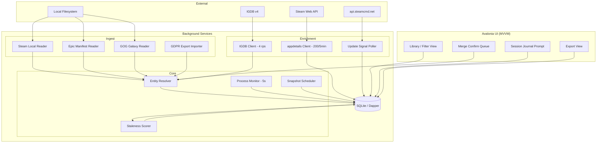

# Winnow — Design Plan (v1)

**Name:** Winnow  ·  root namespace `Winnow`, binary `winnow`
**Renamed:** from Hoard, 2026-08-28. The English word *hoard* is retained where the design system uses it as a common noun — the premise is winnowing one. See `CLAUDE.md`.
**Target:** Cross-platform desktop application, local-first, no server
**Status:** Design approved, ready for implementation
**Audience:** Implementing engineer or coding agent

---

## 0. How to read this document

This is a build specification, not a proposal. Sections 1–3 are context. Section 4 is the
**hard constraints list** — it encodes API and filesystem behaviour that was researched and
verified during design. Violating those constraints is the most likely way this project
fails, and several of them contradict what you will find in older blog posts and Stack
Overflow answers. Read section 4 before writing any ingest code.

Items marked **[VERIFY]** were not confirmed during design. Confirm them empirically before
building on them. Do not treat them as established.

---

## 1. Problem statement

Large PC game libraries (1,000+ titles) decay into three piles:

1. Games that are old or otherwise unplayable
2. Games that have been played to completion
3. **Games the owner intends to play but has forgotten exist**

Pile 3 is the target. Existing tools handle browsing and filtering well but cannot surface
"I haven't touched this since it got a major update" or "I bounced off this after 40 minutes
two years ago," because the underlying data either isn't exposed by storefront APIs or isn't
retained by anyone.

### Goals

- Unified library across Steam, Epic, and GOG with correct deduplication
- Playtime and last-played tracking, including longitudinal history that storefronts discard
- Update-aware staleness detection (the differentiating feature)
- Per-platform achievement tracking with a unified read surface
- User-authored lists and collections
- First-class data export

### Non-goals for v1

- PlayStation and Xbox integration (see §4.6)
- Any hosted service, user accounts, or multi-user features
- Co-op / friend library matching (requires a server; phase 2)
- ~~Recommendation engine (phase 2)~~ — **SUPERSEDED. See `ROADMAP.md` §3.** Promoted to a
  core differentiator, still with no server and no accounts: inference is local, over the
  user's own database.
- 3D "games on a shelf" browsing view (cut; see §11)
- Mobile

---

## 2. Framework decision: Avalonia

Evaluated Electron vs. Avalonia. **Avalonia wins.**

The deciding factor is that this application is a **background daemon with a UI attached**.
It sits in the tray enumerating processes every few seconds, all day, and the user interacts
with it briefly and occasionally. That profile favours a native toolkit decisively.

| Axis | Avalonia | Electron |
|---|---|---|
| Idle memory (tray-resident) | 40–80MB | 150–300MB, ~80–120MB with mitigations |
| Process enumeration | Native `System.Diagnostics.Process` | Shell out to `ps`/`tasklist`, or native module |
| Distributable size | ~20MB trimmed / AOT | ~150MB |
| Startup time | Fast | Slow (Chromium init) |
| Steam-specific library support | ValveKeyValue, SteamKit2 — best in class | Weaker VDF ecosystem |
| 3D rendering | No first-class 3D | three.js / R3F, mature |
| Portability to future web frontend | None | Renderer ports nearly free |

The last two rows were the entire Electron case, and both were tied to the 3D shelf view.
**With the shelf cut, nothing argues for Electron.**

### Accepted cost

If phase 2's hosted service acquires a web portal, Avalonia XAML transfers nothing to it,
where an Electron renderer would have transferred substantially. This is a real cost, but it
is deferred and conditional on a phase that may never happen. Registered, accepted, not
relitigated.

---

## 3. Tech stack

| Layer | Choice | Notes |
|---|---|---|
| Runtime | .NET, latest LTS (.NET 10 at time of writing) | |
| UI | Avalonia 11+ with XAML | |
| MVVM | `CommunityToolkit.Mvvm` | Source generators; AOT-friendlier than reflection-based MVVM |
| Database | SQLite via `Microsoft.Data.Sqlite` | Local-first |
| Data access | **Dapper** | See §3.1 |
| Migrations | FluentMigrator or DbUp | Checked into the repo |
| VDF / ACF parsing | **ValveKeyValue** (xPaw) | Purpose-built for Steam KeyValues; do not hand-roll |
| Steam client protocol | SteamKit2 | Only if the Web API proves insufficient; not needed for v1 |
| HTTP | `HttpClient` + **Polly** | Retry, circuit-breaker, and rate-limit policies |
| HTML parsing | AngleSharp | GDPR export import (§5.4) |
| JSON | `System.Text.Json` | Use source-generated contexts for AOT |
| Logging | Serilog, rolling file sink | Ingest failures must be diagnosable |
| Scheduling | In-process `PeriodicTimer` | No external queue in v1 |
| Metadata | IGDB v4 API | Twitch client-credentials auth |
| Packaging / updates | Velopack **[VERIFY]** | Confirm current recommended auto-update path for desktop .NET |

**Deliberately excluded from v1:** Postgres, any vector store, any server framework, any LLM
dependency. All are phase 2. Do not add them speculatively.

### 3.1 Dapper over EF Core — rationale

**EF Core does not play well with NativeAOT**, and small footprint plus fast startup is a
primary reason Avalonia was chosen. EF Core also carries meaningful startup cost that is
felt on a tray app that launches at login.

Dapper plus an explicit migration runner keeps AOT viable and the schema legible. The schema
in §6 is simple enough that an ORM's object graph management earns nothing.

If the implementer prefers EF Core's migrations story, that is defensible — but then drop
NativeAOT and publish trimmed self-contained instead. Do not attempt both.

**Note on AOT generally:** Avalonia supports NativeAOT but requires discipline around XAML
compilation and reflection. Trimmed self-contained publish is the safe default; treat AOT as
an optimisation to attempt after M2, not a day-one constraint.

---

## 4. Hard constraints

### 4.1 Steam local filesystem

Reading local files is the **primary** playtime source, not the Web API. This is the single
most important architectural decision: it eliminates the `rtime_last_played` restriction
described in §4.2 entirely for the signed-in user.

| Data | Path |
|---|---|
| Library root list | `<steam>/steamapps/libraryfolders.vdf` |
| Per-app install metadata | `<steam>/steamapps/appmanifest_<appid>.acf` |
| Playtime & last-played | `<steam>/userdata/<steam3id>/config/localconfig.vdf` |
| Collections | `<steam>/userdata/<steam3id>/config/cloudstorage/cloud-storage-namespace-1.json` |

Steam install roots:
- Windows: `%ProgramFiles(x86)%\Steam`, plus registry `HKCU\Software\Valve\Steam\SteamPath`
- Linux: `~/.steam/steam`, `~/.local/share/Steam`, and Flatpak `~/.var/app/com.valvesoftware.Steam/`
- macOS: `~/Library/Application Support/Steam`

**Critical behaviours:**

- The collections JSON path changed in 2025. Older guides point at `sharedconfig.vdf` or a
  Chromium LevelDB store in `htmlcache`. Both are **dead**. Do not follow them.
- The Steam client does not flush config changes to disk immediately. Reads may be stale by
  an unbounded amount. Treat a running Steam client as an eventually-consistent writer.
- Never write to these files while Steam is running. Steam Cloud may also overwrite local
  edits with a newer server-side version. v1 is **read-only** against all Steam files.
- Parse with ValveKeyValue. Both text and binary KeyValues appear in Steam's config tree;
  hand-rolled parsers break on the binary variants.
- `localconfig.vdf` playtime fields **[VERIFY]** — confirm exact key names (`Playtime`,
  `LastPlayed`, `playtime_two_weeks`) against a live file before writing the reader.

### 4.2 Steam Web API

Used for enrichment and friends data only. Key is user-supplied, stored locally.

- `IPlayerService/GetOwnedGames` — pass `include_appinfo=1`, `include_played_free_games=1`,
  and `skip_unvetted_apps=false`. Without the last one, apps flagged "Profile Features
  Limited" are silently omitted from results.
- `rtime_last_played` is returned **only when the API key belongs to the queried account**.
  With a third party's key you get appid and `playtime_forever` only. This is why §4.1
  exists. Do not architect around the Web API for the local user's own playtime.
- `GetPlayerSummaries` accepts up to **100 SteamIDs per call** and returns `gameid` /
  `gameextrainfo` when a user is in-game. Not needed in v1 (local detection is better), but
  it is the phase-2 mechanism for remote session detection.
- Since June 2025, Steam throttles profile endpoints aggressively, returning HTTP 429 with
  `Retry-After` of 60–120s. Reported figures are third-party estimates — **[VERIFY]** the
  specifics — but implement exponential backoff and 429 handling from the first commit
  regardless. Polly policies, applied at the `HttpClient` level, not per call site.
- Nominal budget is 100,000 calls/day. Cache aggressively.

### 4.3 Steam store metadata

- `store.steampowered.com/api/appdetails` is limited to roughly **200 requests per 5 minutes
  per IP**, and accepts **one appid per request** (batching was removed in 2015). A cold
  backfill of ~100k apps is therefore ~35 hours. Acceptable as a background job; never put
  it in a user-facing path.
- Cache appdetails responses for **at least 24 hours**. Set a descriptive `User-Agent`.
- **User-defined store tags are not in `appdetails`.** Tags like "Soulslike" or "Roguelike
  Deckbuilder" — the highest-signal metadata — require either the store page HTML or
  `IStoreService`/`IStoreBrowseService`. **[VERIFY]** which endpoint is currently viable.
  IGDB genres/themes are the fallback and are weaker.
- Valve rate-limits traffic that resembles scraping. If throttled persistently, the
  documented remedy is contacting `webapi@valvesoftware.com`.

### 4.4 IGDB (metadata backbone)

- Auth is Twitch client-credentials: `POST https://id.twitch.tv/oauth2/token?client_id=…&client_secret=…&grant_type=client_credentials`.
  Send `Client-ID` and `Authorization: Bearer <token>` headers on every request. Tokens are
  long-lived (~60 days); cache and refresh, don't re-mint per request.
- Rate limit: **4 requests/second** per credential. Enforce with a shared Polly rate-limit
  policy, not ad-hoc `Task.Delay`.
- Queries use Apicalypse (POST body as `text/plain`, not query params):
  `fields name,cover.*; where id = 123;`
- **`external_games` / `external.steam` maps Steam appids directly to IGDB IDs.** This is the
  high-precision join and the backbone of entity resolution. SteamDB uses the same mechanism.
- **`game_versions` endpoint exposes release editions** (e.g. Skyrim vs. Special Edition vs.
  Anniversary). This is exactly the abstraction the Release layer needs — do not reinvent it.

### 4.5 Update detection

Two independent signals, combined:

1. **Build push:** appinfo `depots.branches.public.timeupdated` (Unix timestamp). Available
   from local SteamCMD or `GET https://api.steamcmd.net/v1/info/{appid}` (free, unauthenticated).
   The steamcmd.net demo was erroring during design — **[VERIFY]** availability, and keep
   local SteamCMD as fallback.
   *Caveat:* fires on any depot push, including DRM wrapper bumps, localization files, and
   one-line hotfixes. Alone it is far too noisy to mean "major update."
2. **Announcements:** `ISteamNews/GetNewsForApp`, filtered to community announcements. Noisy
   in the opposite direction (marketing posts).

**Only flag a "major update" when both fire within the same window.** Store both raw signals
in `update_events` so the heuristic can be retuned without re-fetching.

### 4.6 Excluded platforms

PSN and Xbox are **out of scope and must not be added**. Rationale, so it isn't relitigated:

- Neither has a consumer API. Every wrapper is reverse-engineered.
- PSN requires the user to manually extract an `npsso` cookie from
  `ca.account.sony.com/api/v1/ssocookie`. The derived refresh token lasts ~2 months, after
  which the user repeats the extraction by hand.
- PSNAWP's own documentation warns that excessive use **may result in temporary or permanent
  PSN account bans**, and recommends using a throwaway account.

Shipping that to users is not acceptable.

### 4.7 Purchase price

Steam exposes transaction history at `store.steampowered.com/account/store_transactions`
and a lifetime total at `help.steampowered.com/en/accountdata/AccountSpend`. Neither has an
API or export. **Do not scrape either page.**

Two data problems make scraping not worth the trust cost even if it were permissible:

- Bundles appear as a **single line item for N games**. Per-game attribution is
  underdetermined; divide-by-N and market-weighted split are both defensible and both wrong.
- **Third-party keys (Humble, Fanatical, etc.) never appear in Steam's spending data at all** —
  which is exactly the population with large libraries and unplayed piles.

The sanctioned path is the GDPR export (§5.4), which includes an `ExternalLicenses` file
covering third-party keys. Price is an **opt-in, clearly-labelled estimate**, not a core feature.

---

## 5. Architecture



Background services run as `IHostedService` implementations under the generic host, with the
Avalonia UI resolving view models from the same DI container. UI never calls an ingest or
enrichment component directly; it reads the database and raises commands.

### 5.1 Module boundaries

| Module | Responsibility | Must not |
|---|---|---|
| `Ingest.*` | Read a source, emit normalised `CandidateOwnership` records | Write to `works`/`releases` directly |
| `Resolve.*` | Map candidates to Work/Release, enqueue ambiguous merges | Auto-merge below confidence threshold |
| `Enrich.*` | Fetch and cache external metadata | Block any user-facing path |
| `Monitor.*` | Detect game start/stop, emit sessions | Assume any specific launcher is present |
| `Score.*` | Derive staleness buckets from stored facts | Store derived values as source of truth |

### 5.2 Session detection

Two mechanisms, both shipped:

**A. Process watching (default, zero setup)**

Two tiers. **Polling is for discovery only — never for exit detection.**

*Tier 1 — discovery (polled, 5s):*

Enumerate via `Process.GetProcesses()`. Map executables to releases using `installdir` from
`appmanifest_*.acf` cross-referenced with `libraryfolders.vdf` paths, plus Epic and GOG
install locations.

**Filter on `Process.ProcessName` against the known-executables set before resolving any
full path.** Resolving `MainModule.FileName` is substantially more expensive than the
enumeration itself on Windows, and throws for processes the app cannot open. Resolving full
paths across every running process is where the real cost of this loop would be; resolving
them for the two or three name matches is free.

On Linux, read `/proc/*/comm` for the name filter and `/proc/<pid>/exe` only for candidates.

*Tier 2 — exit (event-driven, no polling):*

On discovery, retain the `Process` object, set `EnableRaisingEvents = true`, and subscribe to
`Exited`. The OS delivers the callback immediately. Retaining the handle also pins the PID
against reuse, which closes a race that a polling implementation would have to defend
against explicitly.

On Linux, `pidfd_open()` + epoll gives the same guarantee on kernel 5.3+; otherwise a single
`stat()` on `/proc/<pid>` per *tracked* game is one syscall, not an enumeration.

*Session timestamps do not depend on the poll interval:*

Read `Process.StartTime` for the true wall-clock start (on Linux this derives from field 22
of `/proc/<pid>/stat` plus boot time). A game discovered 5s late is still recorded with its
correct start time and correct duration. The interval governs when the app *notices*, not
what it *records*.

Consequently 5s is a UI-responsiveness setting, not an accuracy one. 10s would also be
defensible. Do not drop to 1s expecting better data — it produces identical records at
higher cost.

Known noise sources, all of which must be handled:
- Launchers spawn child processes that outlive or precede the game
- Some games relaunch through a second executable (the first exits immediately)
- Proton/Wine wraps everything in a process tree; match on the tree, not a single PID
- Debounce: ignore sessions under 60s by default (configurable)

**B. Launch-option wrapper (opt-in, exact)**

The user sets `winnow-wrap %command%` in a specific game's Steam launch options. The wrapper
executable starts the real command, blocks until it exits, and reports exact start/end to the
main process over a named pipe / Unix domain socket. This is the same mechanism `mangohud`
and `gamemoderun` use.

Deterministic and exact, at the cost of per-game manual setup. Offer it in the UI as an
upgrade for individual games, not as a global requirement.

**Journal prompt:** on session end, if enabled, show a small unintrusive window offering a
free-text note and optional rating. Must be fully disableable in settings, and must default
to a state the user explicitly opted into.

### 5.3 Entity resolution

The hardest part of this project. Get it wrong and the dataset is untrustworthy.

**Four-layer model — do not collapse it to two:**

- **Work** — "Skyrim" as a concept
- **Release** — Skyrim / Special Edition / Anniversary. *These are genuinely different games*
  with different achievement sets and mod ecosystems. Merging them is a bug.
- **Ownership** — (release, store, acquired_at, price_paid, license_type)
- **PlayRecord** — (ownership, playtime, last_played, source)

**Matching algorithm:**

1. **Hard join (auto-merge):** IGDB `external_games` lookup by Steam appid / GOG id / Epic
   catalog id. High precision. Merge without asking.
2. **Soft match (queue, never auto):** normalised title + release year within ±1, publisher
   match, cover perceptual hash. Produce a confidence score and write to `merge_candidates`
   with `status='pending'`.
3. **User confirmation** clears the queue in a dedicated UI. Batch it — present all pending
   candidates at once, not one modal at a time.

> **Non-negotiable:** never auto-merge on fuzzy title similarity. Fuzzy matching will
> confidently merge *Prey (2006)* with *Prey (2017)*. A single wrong merge that silently
> absorbs a user's playtime destroys trust in every number the app displays. Precision over
> recall, always, with a human in the loop.

### 5.4 GDPR export import

Onboarding accelerator. The user requests their data from
`help.steampowered.com/en/accountdata` (support-ticket flow, not one-click), receives it,
and points the app at the file.

The export reportedly includes a **playtime breakdown** with a full record of every game and
duration, plus **`ExternalLicenses`** covering third-party-key acquisitions. Valve's privacy
policy states data is provided in **structured HTML** through the Privacy Dashboard — so
expect to parse HTML with AngleSharp, not JSON.

**[VERIFY] before building the parser:** obtain a current export and confirm what files it
actually contains. A 2018-era complaint held that the accountdata page was largely a
collection of links to pages the user already had access to; this may or may not still hold.

Value if it works: full history on install day instead of waiting months for snapshots to
accumulate. Build it after M2, not before — the snapshot pipeline must work standalone.

---

## 6. Data model

SQLite. Migrations checked into the repo and applied on startup.

```sql
-- Canonical identity
works(id, igdb_id UNIQUE, name, sort_name, first_release_year, summary, cover_url)
releases(id, work_id FK, igdb_version_id, name, platform, edition_note)
external_ids(release_id FK, provider, provider_id, PRIMARY KEY(provider, provider_id))
  -- provider ∈ {steam, gog, epic, igdb}

-- Ownership and play
ownerships(id, release_id FK, store, account_ref, acquired_at,
           license_type, price_paid_cents, price_source, install_path, installed BOOL)
play_records(ownership_id FK, playtime_minutes, last_played_at, source, observed_at)
playtime_snapshots(id, ownership_id FK, playtime_minutes, observed_at)  -- longitudinal
sessions(id, ownership_id FK, started_at, ended_at, duration_s, detection_method)
session_notes(session_id FK, note TEXT, rating INT)

-- Achievements: per-release, never merged across platforms
achievements(release_id FK, provider_key, name, description, hidden, global_pct)
achievement_unlocks(release_id FK, provider_key, unlocked_at)

-- Update tracking
update_events(id, release_id FK, kind, build_id, occurred_at, title, raw_json)
  -- kind ∈ {build_push, announcement}

-- User organisation
lists(id, name, description, is_smart, filter_json)
list_items(list_id FK, release_id FK, position)

-- Resolution
merge_candidates(id, left_release_id, right_release_id, score, signals_json, status)
  -- status ∈ {pending, confirmed, rejected}

-- Caching / config
metadata_cache(provider, provider_id, payload_json, fetched_at, PRIMARY KEY(provider, provider_id))
settings(key, value)
```

### 6.1 Derived buckets

Computed as queries, not stored columns:

| Bucket | Rule |
|---|---|
| Never played | Zero minutes AND no last-played date (never opened) |
| Bounced | `bounced_floor <= playtime_minutes < retired_floor` — **highest-value pile** |
| Stale but patched | `last_played_at < update_event.occurred_at` by > N months, on a game that was actually opened |
| Retired | `playtime_minutes >= retired_floor`; excluded from surfacing |
| Active | Residual: nonzero playtime under `bounced_floor`, or a last-played date beside zero (unknown) minutes |
| Dead | No viable platform, delisted, or launch-failure flagged |

**Never played means never opened.** Zero minutes *and* no last-played date, nothing else.
A game with real playtime under the refund line was opened and played; classifying it as
"Never played" was tried (the refund-line rule, reverted 2026-08-29) and abandoned because
a game the user demonstrably launched reading as "Never played" was confusing.

`bounced_floor` defaults to 120 minutes (Steam's refund window), which is the floor for
Bounced. At or above it the user committed past the point of no return and gave up anyway,
which is the fact "Bounced off" names.

**Precedence**, in the order the query tests: never-played (zero minutes *and* no last-played
date), retired, stale-but-patched, bounced, active. Two orderings matter. Retired outranks
stale so a 200-hour game is never resurfaced. Stale outranks bounced, because Bounced spans
everything between the refund line and the retired floor and would otherwise swallow "Stale
but patched" whole, and because a game with forty minutes on it can genuinely be behind on a
patch. Only never-opened outranks staleness: it is the single case design-system §5.2's
"nothing to be behind on" describes. `active` is consequently a residue rather than a rail
bucket: nonzero playtime under the refund line, or a last-played date beside zero recorded
minutes where the minutes are unknown, not zero.

`retired_floor` still cannot be a flat number in the long run. 2h in a roguelike is a real
trial; 2h in a CRPG is the tutorial. **[VERIFY]** whether a HowLongToBeat data source is
available and licensable; if so, normalise against main-story time. If not, make the
thresholds per-genre-configurable and default conservatively. Both are query parameters, not
columns, so retuning either never touches stored data.

### 6.2 Achievements display rule

Never compute a blended cross-platform completion percentage. 100% on one platform and 30%
on another are **two facts, not one average**. Render per-release rows nested under the Work.
The unified view is a query, not a stored merge.

---

## 7. Export

Launch feature, not an afterthought. Every incumbent in this space is a roach motel; that is
a differentiator worth claiming explicitly.

- JSON (full fidelity, versioned schema, round-trippable via an import path)
- CSV (flattened, one row per ownership, for spreadsheet users)
- No account or network required
- Schema version in every export; write the importer against the version field from day one

---

## 8. Milestones

> **Sequencing here is superseded by `ROADMAP.md` (v2).** M0-M2 and M4 shipped as
> described below; everything after that was re-ordered when the product scope widened to
> launcher + recommendation feed. The exit criteria below remain accurate — only the order
> and the phase list changed. §4's hard constraints are untouched.

| # | Deliverable | Exit criteria |
|---|---|---|
| M0 | Host + SQLite + migrations + Steam local ingest + library view | Library visible, playtime and last-played correct from `localconfig.vdf` |
| M1 | IGDB resolution + merge confirm queue | Hard joins auto-resolve; soft matches queue; no auto-merge on fuzzy title |
| M2 | Snapshot scheduler + update signal poller + staleness scoring | Buckets query correctly against seeded data |
| M3 | Process monitor + session detection + journal prompt | Sessions recorded on both mechanisms; prompt fully disableable |
| M4 | Epic + GOG local ingest | Installed titles from both appear and dedupe correctly |
| M5 | GDPR export importer | Historical playtime backfills on import |
| M6 | Export (JSON + CSV) | Round-trip through the importer without loss |

**M0–M2 is the minimum interesting product.** It delivers the staleness feature, which is
the thing nothing else does.

### Phase 2 (explicitly out of scope now)

Sync server, Steam OpenID accounts, co-op library matching, recommendations. Note for
whoever picks this up: co-op matching between two signed-up users is a set intersection in
the server DB and is *easy*; matching against non-signed-up friends requires their friends
list and game details to be public and will have patchy coverage. Surface coverage honestly
("14 of your 47 friends have public libraries") rather than silently dropping people.

---

## 9. Pitfalls

Ranked by likelihood of being hit:

1. **Following stale documentation on Steam file paths.** The collections store has moved
   twice. Most search results are wrong. §4.1 is current as of design; re-verify if anything
   doesn't parse.
2. **Auto-merging on fuzzy titles.** See §5.3. This is the failure that makes users leave.
3. **Putting `appdetails` in the onboarding path.** 200 req/5min means a cold library import
   would take hours. Backfill in the background; show the library immediately with local data.
4. **Treating `depots.branches.public.timeupdated` as "major update."** It fires on trivial
   pushes. Requires the second signal.
5. **Collapsing Release into Work.** Skyrim SE is not Skyrim. Achievement sets differ.
6. **Storing derived buckets as columns.** They change as thresholds are tuned; keep them as
   queries.
7. **Shipping the journal prompt on by default.** An unexpected popup after every game exit
   is an uninstall trigger. Opt-in, explicitly.
8. **Hand-rolling a VDF parser.** Use ValveKeyValue. Binary KeyValues appear in the config
   tree and will break naive parsers.
9. **Adding PSN/Xbox "just for one user."** See §4.6.

---

## 10. Open questions for the implementer

- Exact key names in `localconfig.vdf` for playtime and last-played (§4.1)
- Current viability of `api.steamcmd.net` vs. bundling local SteamCMD (§4.5)
- Which endpoint currently returns weighted user tags (§4.3)
- Actual file contents of a current Steam GDPR export (§5.4)
- Availability of a licensable HowLongToBeat data source (§6.1)
- Current recommended auto-update mechanism for cross-platform desktop .NET (§3)

Resolve these empirically. Do not proceed on assumptions from training data or blog posts —
several of the constraints above exist specifically because the widely-circulated answers
are out of date.

---

## 11. Changelog

**Shelf view cut.** A 3D "games on a shelf" browsing view was specified and then removed. It
was the sole argument for Electron over Avalonia. Recorded here because the reasoning is
asymmetric and worth preserving: if the shelf is ever reinstated, it does **not** justify
revisiting the framework choice on its own. Avalonia has no first-class 3D, so a reinstated
shelf would mean Silk.NET/OpenTK by hand, SkiaSharp 2.5D, or an embedded WebView — all of
which are worse than simply accepting that this is a data tool with a good list view.

Cover thumbnails in the library view remain in scope and come from IGDB covers and Steam's
`library_600x900` portrait capsule.
