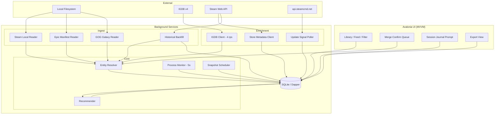

# Winnow — build specification

**Name:** Winnow · root namespace `Winnow`, binary `winnow`
**Target:** Cross-platform desktop application, local-first, no server
**Audience:** Implementing engineer or coding agent

This document owns the architecture, the module boundaries, the behaviour of every external
service, entity resolution, the schema, the derived buckets and session detection. Sequencing
and milestone state are in `ROADMAP.md`; visual values are in `design-system.md`.

---

## 0. How to read this document

This is a build specification, not a proposal. Sections 1 to 3 are context. Section 4 encodes
API and filesystem behaviour that has been verified against live systems, and several of its
constraints contradict what you will find in older blog posts and Stack Overflow answers.
Read section 4 before writing any ingest code.

Items marked **[VERIFY]** have not been confirmed. Confirm them empirically before building
on them; do not treat them as established. Two remain, both in §9.

---

## 1. Problem and scope

Large PC game libraries (1,000+ titles) decay into three piles: games that are old or
otherwise unplayable, games that have been played to completion, and **games the owner
intends to play but has forgotten exist**. The third pile is the target. Existing tools browse
and filter well but cannot surface "I haven't touched this since it got a major update" or
"I bounced off this after 40 minutes two years ago", because the underlying data is either not
exposed by storefront APIs or not retained by anyone.

### Goals

- Unified library across Steam, Epic and GOG with correct deduplication
- Playtime and last-played tracking, including the longitudinal history storefronts discard
- Update-aware staleness detection
- Per-platform achievement tracking with a unified read surface
- User-authored lists and collections
- Local recommendation over the user's own database, with every recommendation explained
- First-class data export

### Out of scope

- PlayStation and Xbox integration (§4.6)
- Any hosted service, user accounts, or multi-user features. Winnow has no accounts; it links
  the user's. Signing in to Epic or Steam authenticates the user to *their* service and stores
  the token locally. That is third-party linking, not account creation.
- Co-op and friend library matching, which would require a server
- A 3D "games on a shelf" browsing view (§10)
- Mobile

---

## 2. Framework: Avalonia

This application is a **background daemon with a UI attached**. It sits in the tray
enumerating processes every few seconds, all day, and the user interacts with it briefly and
occasionally. Avalonia was chosen over Electron on that profile. Do not reopen the choice; the
reasoning and its accepted costs are in `docs/decisions.md`.

---

## 3. Tech stack

| Layer | Choice | Notes |
|---|---|---|
| Runtime | .NET 10 | |
| UI | Avalonia 11+ with XAML | |
| MVVM | `CommunityToolkit.Mvvm` | Source generators; AOT-friendlier than reflection-based MVVM |
| Database | SQLite via `Microsoft.Data.Sqlite` | Local-first |
| Data access | **Dapper**. No EF Core | Keep the SQL legible |
| Migrations | **DbUp** | Embedded resources, checked into the repository |
| VDF / ACF parsing | **ValveKeyValue** (xPaw) | Never hand-roll a parser |
| Steam client protocol | SteamKit2 | Only if the Web API proves insufficient; not needed today |
| HTTP | `HttpClient` + **Polly** | Retry, circuit-breaker and rate-limit policies |
| HTML parsing | AngleSharp | The saved-page importer in §5.4 |
| JSON | `System.Text.Json` | Source-generated contexts |
| Logging | Serilog, rolling file sink | Ingest failures must be diagnosable |
| Scheduling | In-process `PeriodicTimer` | No external queue |
| Metadata | IGDB v4 API | Twitch client-credentials auth |
| Packaging / updates | Inno Setup on Windows; Debian and portable archives on Linux | Installed Windows updates use the existing installer; §5.5 |

**Deliberately excluded:** Postgres, any vector store, any server framework, any LLM
dependency. Do not add them speculatively.

Publish trimmed self-contained. Treat NativeAOT as an optimisation to attempt later, not a
day-one constraint; Avalonia supports it but requires discipline around XAML compilation and
reflection.

---

## 4. Hard constraints

### 4.1 Steam local filesystem

Reading local files is the **primary** playtime source, not the Web API. This eliminates the
`rtime_last_played` restriction described in §4.2 entirely for the signed-in user.

| Data | Path |
|---|---|
| Library root list | `<steam>/steamapps/libraryfolders.vdf` |
| Per-app install metadata | `<steam>/steamapps/appmanifest_<appid>.acf` |
| Playtime and last-played | `<steam>/userdata/<steam3id>/config/localconfig.vdf` |
| Collections | `<steam>/userdata/<steam3id>/config/cloudstorage/cloud-storage-namespace-1.json` |

Steam install roots:

- Windows: `%ProgramFiles(x86)%\Steam`, plus registry `HKCU\Software\Valve\Steam\SteamPath`
- Linux: `~/.steam/steam`, `~/.local/share/Steam`, and Flatpak `~/.var/app/com.valvesoftware.Steam/`
- macOS: `~/Library/Application Support/Steam`

**Parse with ValveKeyValue.** Both text and binary KeyValues appear in Steam's config tree,
and hand-rolled parsers break on the binary variants. Parse keys case-insensitively: the
`appmanifest` field documented as `LastUpdated` is `lastupdated` on disk.

**`localconfig.vdf` per-app keys**, exact casing:

- `Playtime` — minutes, total
- `LastPlayed` — Unix epoch seconds
- `Playtime2wks` — minutes in the trailing fortnight. Not `playtime2wks`, not
  `playtime_two_weeks`

Reading these correctly requires four further behaviours:

- **`LastPlayed` carries a sentinel.** `"86400"` (1970-01-02) appears on many old entries.
  Treat any value below a sanity floor of 315532800 (1980) as unknown, never as a real date.
- **Key order inside an app block is not stable.** Never parse positionally.
- **App blocks may contain no playtime keys at all.** Skip blocks lacking `Playtime`.
- **`UserLocalConfigStore/apptickets` is also a map keyed by appid.** Match the playtime map
  by path, not by shape, or it will false-match.

**Multiple accounts.** `userdata/` may hold several `steam3id` directories. Enumerate all of
them and attribute playtime per account; `CandidateOwnership` carries the `steam3id`.

**Collections JSON.** The path changed in 2025; older guides pointing at `sharedconfig.vdf` or
a Chromium LevelDB store in `htmlcache` are dead. The top level is an **array of
`[key, entry]` pairs**, not an object map. Entries carry tombstones (`is_deleted`) that must
be honoured, and the id alphabet includes `+`, `/` and `*`. Ingest static membership (`added`
minus `removed`); record `filterSpec` without evaluating it.

**Steam is an eventually-consistent writer.** The client does not flush config changes to disk
immediately, and reads may be stale by an unbounded amount.

**Never write to any Steam file.** Steam Cloud may also overwrite local edits with a newer
server-side version. Winnow is read-only against all Steam files.

**Local parser limits.** Steam VDF and Epic/GOG local JSON readers use
`StorefrontParserLimits`: 64 MiB per file and 64 nesting levels by default. Reader constructors
accept overrides; depth cannot exceed 256. Byte limits apply to the actual bytes read, including
files that grow during a read. Epic's base64 catalog is bounded before decoding. JSON uses
`JsonDocumentOptions.MaxDepth`; VDF uses a quote/comment-aware depth preflight before
ValveKeyValue, which still owns syntax and value parsing. VDF includes are refused so another
file cannot bypass these limits. Rejected input yields no data. These are Winnow's operating
limits, not vendor format limits; they do not govern Galaxy's SQLite snapshot or saved HTML
account-page imports.

Steam manifest install directories must resolve beneath the library's `steamapps/common`
directory. Rooted paths and parent traversal are rejected. Each library root has its own
validation and enumeration failure boundary; a bad root logs a warning and leaves other roots
readable. When a root or manifest cannot be read, missing manifests do not establish an
uninstall: playtime-only candidates carry unknown install state.

While Winnow is open, Steam installation refresh polls the manifest inventory every two
seconds. Two matching complete inventories trigger local sync and a library reload. Only a
complete scan can clear installation flags and paths for absent app ids; ownership and history
remain, including for never-played manifest-only games and after restart. An offline root or
malformed manifest preserves the stored state until the inventory is readable again.

### 4.2 Steam Web API

Used for enrichment, entitlement backfill and friends data. The key is user-supplied and
stored locally.

- `IPlayerService/GetOwnedGames` — pass `include_appinfo=1`, `include_played_free_games=1` and
  `skip_unvetted_apps=false`. Without the last, apps flagged "Profile Features Limited" are
  silently omitted.
- `rtime_last_played` is returned **only when the API key belongs to the queried account**.
  With a third party's key you get appid and `playtime_forever` only. Do not architect around
  the Web API for the local user's own playtime; that is what §4.1 is for.
- `GetPlayerSummaries` accepts up to 100 SteamIDs per call and returns `gameid` /
  `gameextrainfo` when a user is in-game. Not used: local detection is better.
- `IPlayerService/ClientGetLastPlayedTimes` returns `first_playtime` per app in one call
  against the existing key. It converts every ownership from a point into a span, which is the
  bounced-versus-retired discrimination the feed turns on.
- `ISaleFeatureService/GetUserYearInReview` returns per-game per-month playtime seconds and
  session counts for 2022 onward. Both endpoints accept the stored Web API key.
- Steam throttles profile endpoints, returning HTTP 429 with `Retry-After`. Implement
  exponential backoff and 429 handling from the first commit. Polly policies applied at the
  `HttpClient` level, never per call site.
- Nominal budget is 100,000 calls/day. Cache aggressively.

### 4.3 Steam store metadata

- **User-defined store tags come from `IStoreBrowseService/GetItems`.** Plain `IStoreService`
  has no tag method. `GetItems` is **keyless** and batches 100+ appids per call. Tag *names*
  need a second call, `IStoreService/GetTagList`.
- Store `(tagid, weight, rank)`. Keep the rank: weight is only comparable within one app.
- **Store the Steam tag vocabulary and the IGDB genre/theme vocabulary separately.** Do not
  blend them.
- **Store page HTML scraping is not recommended in any form.**
- `store.steampowered.com/api/appdetails` is limited to roughly **200 requests per 5 minutes
  per IP** and accepts **one appid per request**; batching was removed in 2015. It is a
  background job and must never sit in a user-facing path. Cache its responses for at least
  24 hours and set a descriptive `User-Agent`.
- Valve rate-limits traffic that resembles scraping. If throttled persistently, the documented
  remedy is contacting `webapi@valvesoftware.com`.

### 4.4 IGDB

- Auth is Twitch client-credentials:
  `POST https://id.twitch.tv/oauth2/token?client_id=…&client_secret=…&grant_type=client_credentials`.
  Send `Client-ID` and `Authorization: Bearer <token>` on every request. Tokens are long-lived
  (~60 days); cache and refresh rather than re-minting per request.
- Rate limit is **4 requests/second** per credential. Enforce it with a shared Polly
  rate-limit policy, never an ad-hoc `Task.Delay`.
- Queries use Apicalypse: POST body as `text/plain`, not query parameters.
  `fields name,cover.*; where id = 123;`
- **`external_games` / `external.steam` maps Steam appids directly to IGDB ids.** This is the
  high-precision join and the backbone of entity resolution. It also resolves GOG ids. It does
  **not** resolve Epic catalog ids: IGDB stores Epic *offer* and *page* ids instead, and a
  catalog-id lookup returns nothing.
- **`game_versions` exposes release editions** (Skyrim, Special Edition, Anniversary). This is
  the abstraction the Release layer needs. Do not reinvent it.
- A title search is the `search "…"` clause on the same `games` endpoint. It rides its own
  query body and its own cache namespace rather than widening the shared metadata query, so a
  400 costs the search alone. The term is user-typed free text, sanitized into the quoted
  clause rather than rejected. Copyright, registered-trademark, trademark and service-mark
  decoration is removed before the query and cache key are built; the stored title is unchanged.
- The IGDB response cache carries a payload version per namespace: game payloads at **4**
  (name, summary, first release date, cover, genres, themes, game modes, player perspectives,
  platforms, publisher, `game_type`, `parent_game`, `version_parent`, `version_title`,
  `screenshots`, `artworks`, `rating`, `rating_count`, `aggregated_rating`,
  `aggregated_rating_count`), age-rating payloads at **1**, search payloads at **1**, and
  external-id mapping payloads at **1**. Every client-written payload, including a miss,
  carries its namespace's `version` in a JSON envelope. Unversioned misses are rechecked.
  Change a
  cached shape and bump its version in the same commit, or the cache serves rows with the new
  field silently empty for the rest of the 30-day TTL. A payload whose version does not match
  is refetched. Compatible older game and external-id mapping payloads remain available
  when credentials are absent or refetch fails; they never become current merely by being read.
- The shared `games` query now carries `screenshots` and `artworks` as separate image arrays,
  each row carrying an `image_id`. Only `image_id` is requested: it is the durable handle, and
  the size token in the CDN path decides the rendition, so a stored URL would carry a size that
  has to be rewritten on read. `rating`/`rating_count` are IGDB's own users;
  `aggregated_rating`/`aggregated_rating_count` are its aggregation of external critics.
  `total_rating`/`total_rating_count` exist and are deliberately not requested — a blended
  figure cannot be attributed to anyone, and the rule is that a score is shown with its source
  and its count or not at all.

### 4.5 Update detection

#### Lifecycle evidence for Derelict

Lifecycle collection is separate from patch badges and includes never-opened games. IGDB
remains the identity source. Its expanded `game_status.status` and `game_modes.name` fields
use a separate `igdb-lifecycle-v1` cache with a seven-day TTL; the main catalog payload is
unchanged. The query uses the current work's IGDB ID, never a fuzzy title match.
See the [IGDB game and game-status reference](https://api-docs.igdb.com/#game).

Steam contributes keyless
[current player counts](https://partner.steamgames.com/doc/webapi/ISteamUserStats#GetNumberOfCurrentPlayers),
[dated reviews](https://partner.steamgames.com/doc/store/getreviews), and
[official announcements](https://partner.steamgames.com/doc/webapi/ISteamNews).
The lifecycle client shares the store client's rate limiter and retry handlers and caches
successful responses for 24 hours. A cached response retains its original observation time.
Failed requests do not become observations or refresh the evidence clock.
Persisted review evidence keeps timestamps, window and completeness rather than review
prose or author profiles. Store evidence records the app ID, presence and original fetch time.

Reviews request `filter=recent`, all languages, purchase types and review types, with a
100-review page. Count reviews created within 30 days only when the page reaches an older
review or contains fewer than 100 entries. A full page still inside the window is incomplete
and cannot establish low activity. The API's summary count is lifetime activity.
Announcements request the latest `steam_community_announcements` item; a separate request
adds `tags=patchnotes`. Their publication dates describe Steam activity, not every developer
channel or the date a build was uploaded. Empty feeds remain unknown; a 403 is cached as an
absent feed. Store presence is positive evidence only: regional misses and failed lookups
never establish delisting.

Each pass attempts at most 50 due releases, oldest attempts first, with a persisted daily
schedule. Initial collection runs in the background enrichment pipeline; an hourly scheduler
continues it. New observations refresh the library and feed. PCGamingWiki and Wikidata are
not initial dependencies. No SteamDB scraping or exact build-upload history is used.

#### Patch badges

Two independent signals, combined.

Each due eligible title polls news and build history independently, including absent,
unchanged or failed news. Successful raw signals are kept when the other source fails.
Every completed attempt advances the persisted schedule; failed sources retry on the
next day, with oldest attempts first so a capped batch cannot starve other titles.

1. **Build push:** appinfo `depots.branches.public.timeupdated`, a Unix timestamp, from
   `GET https://api.steamcmd.net/v1/info/{appid}` — free, unauthenticated, and verified live.
   Do not bundle local SteamCMD as a fallback: it costs 250 MB and has an open non-TTY output
   bug. *Caveat:* this fires on any depot push, including DRM wrapper bumps, localisation
   files and one-line hotfixes. Alone it is far too noisy to mean "major update".
2. **Announcements:** `ISteamNews/GetNewsForApp` with **`tags=patchnotes`**. On a
   representative app that filter yields 34 items against 527 unfiltered and 74 for the feeds
   filter. `GetNewsForApp` needs no API key. **A 403 means "no feed for this appid", not
   throttling: cache it and do not back off.**

**Only flag a major update when both signals fire within ±7 days of each other.** Store both
raw signals in `update_events` so the heuristic can be retuned without re-fetching, and store
the news item's `url` on the event row; the badge is clickable.

**Never-opened games are ineligible for the badge, so do not poll them.**

### 4.6 Excluded platforms

PSN and Xbox are **out of scope and must not be added**. Neither has a consumer API, PSN
requires the user to extract an `npsso` cookie by hand every two months, and PSNAWP's own
documentation warns that use may result in PSN account bans. Signing in to Epic is not a
precedent for these; the reasoning is in `docs/decisions.md`.

### 4.7 Steam account pages, sign-in, and what may be stored

Steam exposes transaction history at `store.steampowered.com/account/store_transactions` and
a lifetime total at `help.steampowered.com/en/accountdata/AccountSpend`. Neither has an API or
an export.

License acquisition data comes from `store.steampowered.com/account/licenses`, linked as
Licenses on the account-data dashboard. A signed-in check on 2026-09-06 found that
`help.steampowered.com/en/accountdata/ExternalLicenses` renders the dashboard rather than
a separate data page. Do not depend on an `ExternalLicenses` page or inferred export file;
the observed route and its limits are recorded in `docs/spikes/steam-gdpr-export.md` §2.

**Winnow must never hold or exfiltrate the user's browser session, and must never impersonate
their browser.** Within that, two routes to the account pages are permitted and are equal
peers: the user saves the pages from their own browser and Winnow parses local files, or
Winnow opens a sign-in WebView and harvests the rendered HTML while the user is present.
Eight conditions bind, and all eight are binding:

1. **User-present sign-in, ephemeral off-the-record browser.** The user types their password
   into Steam's own page inside an in-memory, off-the-record WebView profile. Winnow never
   sees the password, Steam Guard works normally, and the profile is torn down afterwards.
2. **Exactly two secrets at rest.** The minted access token and the refresh token, and nothing
   else, written as one DPAPI-encrypted blob. No cookie jar, no `steamLoginSecure`, no
   `sessionid`, no persisted browser profile, no page content. **A host that cannot encrypt
   refuses to store rather than degrading to plaintext.** Refusing costs the user a sign-in
   they repeat after a restart; a plaintext fallback fails silently and permanently. The same
   standard binds every secret Winnow keeps: the Steam Web API key, the optional Epic OAuth
   client secret, the IGDB client secret and the cached Twitch access token are stored
   DPAPI-encrypted under their module's versioned entropy, are migrated out of any plaintext
   row a pre-protection install left,
   and refuse on a host that cannot encrypt rather than saving a readable row. The one
   distinction: refusing never destroys what a user typed (the legacy rows are left as they
   were), while machine-minted rows — the token — are emptied, because a mint is free and a
   bearer credential in the clear is not.
   Reads retry plaintext cleanup after an interrupted migration, and discard incomplete
   legacy Twitch token rows. Migration changes logical settings rows, not historical backups
   or residual disk bytes.
3. **A closed list of three unattended request kinds.** With nobody watching, Winnow may issue
   only the `finalizelogin` call, the `transfer_info` POSTs that call returns, and one token
   mint. No authenticated HTML page is ever fetched without the user present.
4. **Reading is bounded by what, not by how much.** With the user present: the two named
   account pages in full, plus three named fields read from any non-login store document by
   one script fixed at build time. It is not a general query interface.
5. **Purchase history needs its own permission.** Capturing purchase history during a sign-in
   requires an explicit, separate prompt. Declining leaves the sign-in fully functional for
   account identity and playtime backfill.
6. **Peers, on both axes.** The Web API key and the WebView sign-in are peer connection
   methods, neither a fallback for the other. The manual and embedded routes to the account
   pages are likewise peers, presented in the UI as equal options with a transparent
   explanation of what each does.
7. **One parser, one importer, one credential seam.** Sign-in is a credential source, not a
   second Steam integration.
8. **Legibility.** A session that cannot renew must say so before it dies. Silent degradation
   to no-remote-data is a defect, not a graceful fallback. The UI surfaces a failing renewal
   promptly, offers one-click re-sign-in, and explains that adding an API key makes scheduled
   syncs unconditionally reliable.

The minted token lives about a day. The refresh token lasts roughly 207 days when the user
chose remember-me, and is spent against `/jwt/finalizelogin`. A bad token returns a hard 401,
where a bad API key returns a silent 200 with an empty envelope.

**Purchase price is an opt-in, clearly-labelled estimate, not a core feature**, because the
data underdetermines it: bundles appear as a single line item for N games, and third-party
keys from Humble, Fanatical and the rest never appear in Steam's spending data at all, which
is exactly the population with large libraries and unplayed piles.

#### Rules governing the account-stats figures

Every figure on the account-stats screen is computed from the captured pages, never from the
account's lifetime. The rules that follow govern what may be shown and what must be withheld.

- When a capture holds more than one currency, or transactions with no currency symbol,
  money totals are withheld and only counts are shown. Amounts are stored exactly as the page
  displayed them; nothing is converted or added across currencies.
- Wallet top-ups are not spend. Money reaches Steam either as a direct payment or as a
  top-up that later pays for products, and counting both would count the same money twice.
  Wallet credit is reported as its own fact and never as part of spend. What a redeemed code
  cost is not on the page.
- A bundle's total price is a real fact; the per-game split is not. Dividing by item count
  and weighting by market price are both defensible and both wrong, so no per-game price is
  computed or shown.
- Only rows that rendered a discount carry a list price, and most purchases carry none. The
  discount figure is the difference on those rows and is never a total-savings figure.
- The biggest transaction is the largest single transaction by price, not the most ever paid
  for one game; a bundle is one transaction covering several items.
- A refund and the purchase it reverses are two different rows, and a capture may hold either
  or both. The two figures are reported side by side and are never added together; reversal
  rows are never subtracted twice.
- Licence counts count packages, not games — a package can be a bundle, a DLC or a
  cosmetic — so a licence count is not a library size. The breakdown uses the licences page's
  own acquisition vocabulary, and unrecognised methods are counted, never guessed.
- The year comes from the date the page displayed, at day resolution. Rows the parser could
  not date are listed separately and never guessed into a year.
- A gift's recipient is recorded as having existed, never identified: no name, persona or
  profile link is read from the page.
- Steam's licences paginator advertises a total larger than the rows it renders; the
  difference is Steam's own counting, not missed licences.
- Either account page can be imported on its own; each carries different facts and both
  together give a fuller result. The sign-in route walks every page of both lists
  automatically; a hand-saved file holds only the page that was on screen.

### 4.8 Epic and GOG local files

The authenticated Epic library cache is stored in the selected data directory's
`metadata_cache`, under a separate provider namespace and an account-specific key.
A restart reuses a fresh answer for `EpicWebOptions.CacheTtl` (six hours by default);
stale answers refetch through the existing authenticated client. The ingest module
keeps its cache interface free of a Data reference; the App supplies SQLite storage.

**Epic:**

- `%PROGRAMDATA%\Epic\EpicGamesLauncher\Data\Manifests\*.item` is **authoritative for
  installed titles**.
- `catcache.bin` is **authoritative for the owned library**.
- `LauncherInstalled.dat` is **dead. Do not use it.**
- Do not hardcode the manifest path; read `HKCU\SOFTWARE\Epic Games\EOS` →
  `ModSdkMetadataDir`.
- Epic has **no per-game playtime and no last-played on disk**.

While Winnow is open, an Epic refresh polls top-level `.item` manifests every two
seconds. Two consecutive identical, readable snapshots trigger a scan through the shared
resolver gate and a library reload, including actions in an already-open Details panel.
The reload retains the selected or flipped card when it is still visible and updates the
Details action state in place, preserving unsaved editor drafts.
Completion requires an explicit `bIsIncompleteInstall: false`; missing or malformed flags
never imply installation, and `Pending` files are ignored. Locked or malformed manifests
defer the refresh until a later stable read. Normal completion appears within two to four
seconds plus local scan time; this follows the launcher's written state, not download progress.
The service is disabled with local sync for sample-data and `--no-sync` runs.
Both local and remote ownership passes reread Steam and Epic candidates after acquiring that gate,
so a queued pass or a slow network backfill cannot restore the install state from an older
startup scan. Network requests and GOG scans remain outside the gate.

**GOG:**

Every successful scheduled local scan reloads the library, including changes only to install
state. Failures and cancellation do not trigger a reload. GOG installation changes become
visible on the existing 15-minute local scan interval; Steam and Epic use the faster manifest
refresh described above.

- `galaxy-2.0.db` is a WAL database. `immutable=1` silently returns stale data, and `mode=ro`
  writes `-wal` and `-shm` files into the store's directory. **Copy the file first, then read
  the copy.**
- Galaxy's library contains **other stores' releases marked owned**. Filter
  `substr(releaseKey,1,4)='gog_'` or the Steam library is double-counted.
- GOG **does** carry playtime in minutes and last-played in UTC, including for uninstalled
  games.
- Local GOG titles carry the installer's locale, so a Polish install of GWENT reports a Polish
  title. `GamePieces.title` from Galaxy is canonical.

**Built-in storefront client credentials.** Epic's launcher client id and secret ship with
Winnow, at the lowest priority in the credential chain, so a user-supplied pair always wins.
The reasoning is in `docs/decisions.md`.

**Anonymous storefront links and GOG changelogs** live in `Winnow.Enrich.Stores`.
Epic's `GET https://store-content.ak.epicgames.com/api/content/productmapping` maps namespaces
to slugs in one library-wide response. GOG's
`GET https://api.gog.com/products/{productId}?expand=changelog` supplies `links.product_card`
and HTML `changelog` in one response per owned product. Neither request sends credentials.
Background startup sync runs this pass after the existing metadata passes; library load reads
only cached rows. Responses use the `storefront-v1` namespace in `metadata_cache`, with a
24-hour lifetime including negative results. A 404 clears a stale result; a 403 retains a prior
result and suppresses another attempt for 24 hours. Transport, timeout and malformed-response
failures retain stale data. Missing slugs produce no store link. GOG changelogs are parsed to
plain text, without executing scripts or loading remote resources.

These services publish no verified request budget. Winnow chooses a conservative shared
one-request-per-second budget, enforced by a singleton Polly limiter at the typed HttpClient
level. Every retry spends a permit. HTTP 408, 429, 5xx and transport failures receive at most
two retries with exponential backoff and jitter, starting at one second; `Retry-After` is
honoured up to 30 seconds. HTTP 403 and 404 are not retried. Each request is bounded by the
90-second HttpClient timeout and a 2 MiB response buffer. These are Winnow's operating choices,
not claimed vendor limits. Endpoint measurements are in `docs/spikes/store-actions-per-launcher.md`.

The bulk Epic map is incomplete even for active products. For owned namespaces it omits,
issue an anonymous GET to `https://store.epicgames.com/graphql` with the URL-encoded query
`query { Catalog { catalogNs(namespace:"<namespace>") { mappings(pageType:"productHome") { pageSlug pageType } } } }`.
Only persisted, validated namespace identifiers enter that query; titles never form slugs.
Cache each answer under `epic-namespace:<namespace>` in the same cache provider, lifetime and
HTTP policy as the bulk response. Accept one distinct safe `productHome` slug; offer mappings
and ambiguous answers yield no link. A null namespace or null/empty mappings is a cached
negative result. GraphQL errors or malformed envelopes retain a prior answer. The bulk map
keeps precedence when it later includes the namespace.

---

## 5. Architecture

Background services run as `IHostedService` implementations under the generic host, and the
Avalonia UI resolves view models from the same DI container. **The UI never calls an ingest or
enrichment component directly; it reads the database and raises commands.**



### 5.1 Module boundaries

Library loading reads buckets, works, ownerships, releases, external IDs and list membership
with one multi-result SQLite command in a deferred read transaction. Bucket consolidation
uses the same rules as standalone bucket reads. Library and startup Review, Display and
Library settings loads perform repository work on a worker thread, then publish view-model
state on the UI thread. Facets, identity maps, pins and storefront caches remain fixed-count
bulk reads. This does not change the pre-window appearance bootstrap or unrelated edit commands.

| Module | Responsibility | Must not |
|---|---|---|
| `Winnow.Core` | Domain records, repository interfaces, the ingest contract | Perform IO, or reference anything outside the BCL |
| `Winnow.Data` | Schema, migrations, repositories, the bucket queries | Store a derived value as a source of truth |
| `Winnow.Ingest.*` | Read one source, emit normalised `CandidateOwnership` | Write to `works` or `releases`; write to any store-owned file |
| `Winnow.Resolve` | Map candidates to Work and Release, enqueue ambiguous merges | Auto-merge on anything but a hard external-id join |
| `Winnow.Enrich.*` | Fetch and cache external metadata | Block any user-facing path |
| `Winnow.Covers[.Igdb]` | Fetch and cache cover art; first source that answers wins | Block first paint |
| `Winnow.Monitor` | Detect game start and stop, emit sessions | Assume any specific launcher is present |
| `Winnow.Recommend` | Score and explain | Perform IO beyond repositories; reference anything but `Winnow.Core`; make identity decisions |
| `Winnow.Auth.WebView` | Host the embedded sign-in | Reference anything but Avalonia and `Winnow.Core` |
| `Winnow.App` | UI and composition root. Assembly name `Winnow` | Call an ingest reader or an enrichment client. Cover leases are how art reaches a tile and are not covered by this |

**Library sync is split by network dependence.** `LocalLibrarySyncService : ILocalLibrarySync`
runs the three local scans and reaches no network; `RemoteOwnershipSyncService :
IRemoteOwnershipSync` handles entitlement backfill on a 6-hour timer. Both live in
`Winnow.App.Services` rather than `Winnow.Core.Ingest`, because `LibrarySyncReport` carries a
`ResolveResult` and Core cannot reference Resolve. **No enrichment or remote client may be
reachable from the first-paint path.**

#### Controller input

Desktop and fullscreen are separate UI paths. Each owns its views, presentation view models, focus
graph, navigation history, dialogs and text-entry layout. Fullscreen must not navigate the
desktop visual tree or reuse desktop control templates merely to avoid maintaining a second
surface. Share domain records, repositories, application services, validation and action
semantics for launch, install, lists, journal, settings and recommendation explanations.
Share palette and font identities; keep layout, spacing and type scales surface-specific.
The fullscreen host reuses the input-source/filter code and dispatches to explicit focus rows
owned by each page. It creates independent library, feed, list and dormancy state over the
shared repositories and action services. It never scales or navigates the desktop tree.
Fullscreen pages may supply a backdrop for the shell to mount behind its safe area and
header. Detaching that layer releases its artwork lease; the detail page still owns its
content and focus rows. Browse page capacity is presentation state and reflows around the
selected release identity when the available columns change.
Adaptive cover capacity is recalculated once queued text scaling and layout have settled;
reading transient unscaled geometry can make a long Home hero alternate capacities and
continuously rebuild.

Fullscreen IGDB landscapes use an `igdb-backdrop` cache key and the documented
`t_1080p_2x` rendition, separate from desktop screenshot assets. Decode buckets extend to
1920, 2560 and 3840 pixels, bounded by source dimensions and the shared memory budget.
Resizing requests the appropriate display-sized lease. Desktop covers and screenshot
renditions remain unchanged; both presentations share lease and eviction behavior.

Controller input lives in `Winnow.App.Services`, independent of ingest and process monitoring.
The window polls a read-only source at 33 ms while open. Windows loads XInput from the system
directory; Linux reads nonblocking joydev events using kernel-reported button and axis maps.
Discovery retries every two seconds. Battery readings are optional and queried every thirty
seconds on Windows; Linux joydev does not report battery state. The input filter suppresses
held buttons on reconnect or activation and repeats navigation after 400 ms, then every 110 ms.
Only the active, visible window dispatches actions. Closing disposes the native source.

Fullscreen Activity reads ownerships, sessions, notes and update events from repositories,
filtered through its own visible library tile source. The current repository contracts require
per-ownership session/note reads and per-release update reads; those reads run off the UI thread.
This is not a constant-query bulk history operation. Session-note edits write through
`ISessionRepository`, and account summaries reuse the currency-safe `AccountStatsViewModel`
with independent presentation state. Manual-game and identity tools construct their own
`LibrarySettingsViewModel` and `MergeQueueViewModel` from DI; editor state and focus do not
leak into desktop tools. Shared settings remain common application state. Both surfaces use
the shared `ThemeService` and `appearance.theme`; the former `fullscreen.theme` preference is
ignored. Fullscreen keeps separate `fullscreen.*` sizing, margins, motion and dormancy
preferences and renders the shared theme with opaque local resource overrides.
The optional ultrawide setting expands the TV reference canvas width to the viewport aspect
ratio while retaining its reference height and uniform scaling. Controller prompts use a
bundled CC0 vector subset; ambient page art uses bundled original SVG path geometry.
`IWebViewInputSupport` lets the app supply controller chrome before a native browser is
attached. Steam sign-in, Epic consent/sign-in and the patch-notes reader opt into it through
DI. Desktop calls retain their existing presentation. TV browser windows poll their own
read-only controller source while active and dispose it on close or content replacement.
Input goes through ordered WebView2 DevTools keyboard and text-insertion methods; this bridge
does not inspect the DOM, read field values or change the existing origin gates and capture
policies. The local composer is always masked and cleared on insertion, cancellation or
navigation. It occupies layout space beside the native HWND, rather than overlaying it.
Programmatic controller input obeys the host's input-disabled state during token capture.
Provider-specific CAPTCHA, third-party sign-in and phone approval remain external validation
boundaries. The Windows-only WebView2 availability rules remain unchanged.

### 5.2 Session detection

**Process watching** is the shipped mechanism and needs no setup. A launch-option wrapper
(`winnow-wrap %command%`, the mechanism `mangohud` and `gamemoderun` use) is specified below
but not built.

Two tiers. **Polling is for discovery only, never for exit detection.**

*Tier 1 — discovery, polled at 5s.* Enumerate pids and image names, and nothing else. On Windows
that is one `NtQuerySystemInformation(SystemProcessInformation)` snapshot walked into a reusable
pinned buffer. `Process.GetProcesses()` reads the same snapshot but materialises a `Process`, a
`ProcessInfo` and a `ThreadInfo` for every thread of every process on the machine, which was
1.3 MB of garbage per poll on the author's 702-process machine. Elsewhere the enumeration stays
`Process.GetProcesses()`: Linux needs one bounded `/proc/<pid>/environ` read per process for the
Proton marker anyway. Map executables to releases using `installdir` from `appmanifest_*.acf`
cross-referenced with `libraryfolders.vdf` paths, plus Epic and GOG install locations.

**Filter on `Process.ProcessName` against the known-executables set before resolving any full
path.** Resolving `MainModule.FileName` is substantially more expensive than the enumeration
itself on Windows and throws for processes the app cannot open. Resolving paths for the two or
three name matches is free; resolving them for every running process is where the real cost of
this loop would be.

*Tier 2 — exit, event-driven, no polling.* On discovery, retain the `Process` object, set
`EnableRaisingEvents = true` and subscribe to `Exited`. The OS delivers the callback
immediately, and retaining the handle pins the PID against reuse, closing a race a polling
implementation would have to defend against explicitly. On Linux, `pidfd_open()` plus epoll
gives the same guarantee on kernel 5.3+; otherwise a single `stat()` on `/proc/<pid>` per
*tracked* game is one syscall, not an enumeration.

*Timestamps do not depend on the poll interval.* Read `Process.StartTime` for the true
wall-clock start; on Linux it derives from field 22 of `/proc/<pid>/stat` plus boot time. A
game discovered 5s late is still recorded with its correct start time and duration. The
interval governs when the app notices, not what it records, so **do not drop it below 5s
expecting better data.**

Known noise sources, all of which must be handled:

- Launchers spawn child processes that outlive or precede the game
- Some games relaunch through a second executable; the first exits immediately
- Proton and Wine wrap everything in a process tree. Match on the tree, not a single PID
- Debounce: ignore sessions under 60s by default, configurable

**Session indexing follows the platform.** Windows indexes `.exe` files; Linux and
macOS index files with Unix execute permission. Linux discovery also recognises the
kernel's 15-byte process-name alias. Native processes match their installed path.
On Linux, the watcher reads only `STEAM_COMPAT_DATA_PATH` from a bounded `/proc/<pid>/environ`
read and joins its final numeric app ID to an unambiguous installed Steam ownership.
This attributes a Wine loader outside the game directory without guessing by title;
missing, unreadable and ambiguous matches contribute no Proton-specific attribution.
Only that variable is retained, and existing exact-path matching remains authoritative.

The separate Linux session smoke tests use real native processes and a synthetic
Proton environment. Windows runs skip them explicitly. Passing those tests establishes
process discovery and attribution on Linux, not a full launcher or game compatibility
matrix; the PRE-BETA-HARDENING task records execution evidence.

**Journal prompt:** on session end, if enabled, show a small unintrusive window offering a
free-text note and optional rating. It must be fully disableable in settings and must default
to a state the user explicitly opted into. An unexpected popup after every game exit is an
uninstall trigger.

### 5.3 Entity resolution

The hardest part of this project. Get it wrong and the dataset is untrustworthy.

**Four layers. Do not collapse them:**

- **Work** — "Skyrim" as a concept
- **Release** — Skyrim, Special Edition, Anniversary. These are genuinely different games with
  different achievement sets and mod ecosystems. Merging them is a bug
- **Ownership** — (release, store, acquired_at, price_paid, license_type)
- **PlayRecord** — (ownership, playtime, last_played, source)

**Matching:**

1. **Hard join, auto-merge.** IGDB `external_games` by Steam appid or GOG id. For Epic, use
   GOG's own cross-store identity graph via `gamesdb.gog.com`, which resolves Epic titles to
   the same `game_id` as their Steam counterparts. Merge without asking.
2. **Soft match, queue, never auto.** Normalised title plus release year within ±1, publisher
   match, cover perceptual hash. Produce a confidence score and write to `merge_candidates`
   with `status='pending'`.
3. **User confirmation** clears the queue in a dedicated UI. Batch it: present all pending
   candidates at once, not one modal at a time.

> **Non-negotiable: never auto-merge on fuzzy title similarity.** Fuzzy matching will
> confidently merge *Prey (2006)* with *Prey (2017)*. A single wrong merge that silently
> absorbs a user's playtime destroys trust in every number the app displays. Precision over
> recall, always, with a human in the loop.

A user naming an exact IGDB id on the details modal is a hard join under step 1. The
collision — `works.igdb_id` is UNIQUE — is confirmed in place on the modal with the other game
named and shown, and the link is written without entering the `merge_candidates` queue. The
queue is where soft matches are cleared; a hard external-id join is not a soft match.

**`Winnow.Enrich.GamesDb` is metadata-only and writes no identity.** It routes Epic titles to
a Steam appid so they can be enriched, and deliberately writes no `external_ids` row and no
merge candidate. `external_ids` is keyed `(provider, provider_id)` globally, so putting a Steam
appid on an Epic release would collide with the Steam release that already owns it. gamesdb
also resolves *games*, not editions, so an Epic "Gold Edition" can land on the base game's
record: right for the Work columns enrichment writes, wrong for a Release.

### 5.4 Historical backfill

Steam Replay completion markers are written only after an account passes confirmation and
its import finishes. Markers left by older builds on unconfirmed accounts are reset to pending
before confirmation, allowing later matching credentials to recover historical years even if
an anchor request fails. Confirmed completed years stay skipped; the current year remains eligible.

Winnow backfills history rather than waiting months for snapshots to accumulate. Three
mechanisms, all in §4.2 and §4.7:

1. `ClientGetLastPlayedTimes` for `first_playtime` per app.
2. `GetUserYearInReview` for 2022 onward, backfilling `playtime_snapshots` with a real
   longitudinal series on install day.
3. A saved-page importer for the account licenses and purchase-history pages only, populating
   `acquired_at`, `license_type` and `price_paid_cents`.

**There is no Steam GDPR export archive.** Valve's Privacy Dashboard is a set of login-gated
live pages; its playtime page carries cumulative totals only, the same shape Winnow already
ingests. Do not build a general importer walking the ~100 dashboard pages.

**A parser written against saved HTML treats markup as hostile and versioned: fail soft
per-page, never abort the import.** Play records and snapshots are idempotent on their full
fact, so a historical backfill can insert out-of-order points safely and re-running an import
is a no-op.

---

### 5.5 Application updates

`ApplicationUpdater` is a hosted App service shared by desktop and fullscreen through
`IApplicationUpdater`. It owns persisted automatic-check and beta preferences, serialized
checks/downloads, cancellation, and the staged-install state. View models observe snapshots
and raise commands; they do not call GitHub or launch installers themselves.

Checks use the public GitHub Releases API for `safwyls/winnow`, with bounded pagination,
timeouts, semantic version ordering, and exclusion of drafts, development builds and CI
builds. Stable is the default channel. Beta opt-in includes prereleases; changing channels
invalidates staging and never downgrades. Automatic checks begin after startup and repeat
every six hours. Manual checks distinguish network or verification failures from no upgrade.

The downloader accepts the exact platform asset name and official repository URL, bounds
the size, restricts redirects to GitHub release-storage HTTPS hosts, and verifies the API's
SHA-256 digest. A verified installer is staged separately from the running application.
GitHub's HTTPS API is the trust source; packages are not publisher-signed.

Installed Windows uses `WindowsUpdateInstaller`: the registered Inno installation must match
the running executable. On explicit restart, an external helper verifies and locks the
payload, waits for process exit after normal host shutdown, checks for locked binaries,
then runs Setup without force-closing apps or rebooting Windows. It relaunches with the
selected data directory. Failure logs describe manual recovery; there is no automatic
rollback to a binary that may predate database migrations. Portable and Linux distributions
use the release-check and browser-download path pending TASK-159; package-manager-owned
files are never overwritten by the updater. `docs/releases.md` owns the support matrix,
release workflow, and recovery instructions.

---

## 6. Data model

SQLite. Migrations are embedded resources, checked into the repository, applied on startup by
DbUp, and **append-only: never edit a shipped migration.**

Timestamp parameters use `DateTime` with an explicit kind. Winnow.Data rejects
`DateTimeKind.Unspecified` before executing a write, converts Local values to UTC, and stores
UTC text as `yyyy-MM-dd HH:mm:ss.FFFFFFF`, retaining fractional seconds when present.
Callers must resolve a source timestamp's timezone before
persistence; the data layer never guesses it. Nullable timestamps remain null, and stored
timestamp text is read as UTC. `DateTimeOffset` resolve-state timestamps retain their explicit
UTC round-trip format.

`Migrations/hashes.json` records SHA-256 for each SQL script, normalizing CRLF to LF.
CI verifies file membership and content, and checks existing entries against the previous
revision so changing a script and its hash together still fails. New migrations append entries.

Facet replacement, list reordering and feed surfacing batches are atomic repository calls.
Each opens a local transaction when called alone, or a savepoint inside the caller's unit
of work. A failed batch rolls back its own writes even when the caller catches the failure;
a successful batch never commits the caller's transaction. Facet vocabulary creation and
assignment replacement belong to the same batch.

```sql
-- Canonical identity
works(id, igdb_id UNIQUE, name, sort_name, first_release_year, summary, cover_url, background_url)
releases(id, work_id FK, igdb_version_id, name, platform, edition_note)
external_ids(release_id FK, provider, provider_id, PRIMARY KEY(provider, provider_id))
  -- provider ∈ {steam, gog, epic, igdb}

-- Ownership and play
ownerships(id, release_id FK, store, account_ref, acquired_at,
           license_type, price_paid_cents, price_source, install_path, installed BOOL)
  -- store ∈ {steam, gog, epic, manual}
play_records(ownership_id FK, playtime_minutes, last_played_at, source, observed_at)
playtime_snapshots(id, ownership_id FK, playtime_minutes, observed_at)  -- longitudinal
sessions(id, ownership_id FK, started_at, ended_at, duration_s, detection_method)
session_notes(session_id FK, note TEXT, rating INT)
manual_entries(ownership_id PK FK ownerships ON DELETE CASCADE,
              executable_path, platform_label, added_at, updated_at)

-- Achievements: per-release, never merged across platforms
achievements(release_id FK, provider_key, name, description, hidden, global_pct)
achievement_unlocks(release_id FK, provider_key, unlocked_at)

-- Update tracking
update_events(id, release_id FK, kind, build_id, occurred_at, title, url, raw_json)
  -- kind ∈ {build_push, announcement}

-- User organisation
lists(id, name, description, is_smart, filter_json)
list_items(list_id FK, release_id FK, position)
hidden_games(id, work_id FK works ON DELETE CASCADE, hidden_at, unhidden_at)
  -- partial unique: ux_hidden_games_live ON hidden_games(work_id) WHERE unhidden_at IS NULL
work_field_sources(work_id FK works ON DELETE CASCADE, field, source, set_at,
                   PRIMARY KEY(work_id, field))
  -- partial index: ix_work_field_sources_user ON (work_id, field) WHERE source = 'user'

-- Maturity evidence
work_maturity(work_id FK works ON DELETE CASCADE, source, ratings, descriptors,
              observed_at, PRIMARY KEY(work_id, source))

-- Lifecycle source observations
lifecycle_observations(id, release_id FK releases ON DELETE CASCADE, source, source_id,
                       observed_at, signals_json, raw_json)
  -- dated source answers; nullable signals mean unknown; classification is never stored

-- Reception and media
work_images(work_id FK works ON DELETE CASCADE, source, kind, image_ids, observed_at,
            PRIMARY KEY(work_id, source, kind))
  -- kind ∈ {screenshot, artwork}; image_ids is IGDB image_id values, comma-joined, in IGDB's order
work_ratings(work_id FK works ON DELETE CASCADE, source, score, rating_count, label, observed_at,
             PRIMARY KEY(work_id, source))
  -- source ∈ {igdb_users, igdb_critics, steam}

-- Resolution
merge_candidates(id, left_release_id, right_release_id, score, signals_json, status)
  -- status ∈ {pending, confirmed, rejected}

-- Caching / config
metadata_cache(provider, provider_id, payload_json, fetched_at, PRIMARY KEY(provider, provider_id))
settings(key, value)
```

The three rating sources in `work_ratings` are stored apart and never blended; a source with
no figure gets no row. `label` is Steam's own words ("Very Positive"), stored verbatim rather
than re-derived from the percentage. `work_ratings.score` is not a derived value: it is a
figure a third party published, recorded as observed against the work and the source that
published it, and nothing in Winnow computes it. It sits beside `merge_candidates.score` on
the enforcement test's short list of recorded observations.

### 6.1 Derived buckets

**Computed as queries, never stored columns.** They change as thresholds are tuned.

| Bucket | Rule |
|---|---|
| Never played | Zero minutes AND no last-played date |
| Bounced | `bounced_floor <= playtime_minutes < retired_floor` |
| Stale but patched | `last_played_at < update_event.occurred_at` by > N months, on a game that was actually opened |
| Retired | `playtime_minutes >= retired_floor`; excluded from surfacing |
| Active | Residual: nonzero playtime under `bounced_floor`, or a last-played date beside zero (unknown) minutes |
| Derelict | Dated lifecycle evidence classifies every visible owned release as cancelled, offline, delisted, abandoned or dead |

**Never played means never opened.** Zero minutes *and* no last-played date, nothing else. A
game with real playtime under the refund line was opened and played.

Derelict is derived from `lifecycle_observations`, preserving each source answer and its
timestamp so the rules can be recomputed. Classification returns a status, confidence and
reason. Explicit cancellation, offline status and delisting precede inferred abandonment,
dead and inactive states; active and unknown are the remainder. Inactive is not Derelict.
Confidence is a heuristic estimate, not a calibrated probability. Thresholds and evidence
gates are documented in `docs/recommendation-engine.md`.

A release is classified independently. A same-game group enters Derelict only when every
visible release qualifies; evidence about one store copy cannot condemn an unknown or
active sibling. Hidden games and account scope are applied before grouping, as for the
other buckets. Derelict games appear in their own feed shelf and are excluded from ordinary
play recommendations. Delisted and abandoned games may still run; this classification does
not disable launch actions. When a group has a copy without Derelict evidence, ordinary
recommendations and the default launch/install route prefer that copy. If every copy
qualifies, manual launch remains available.

`bounced_floor` defaults to **120 minutes**, Steam's refund window. At or above it the money
is spent for good, and the label `Started` names the band between that line and `retired_floor`.

`BucketThresholds` rejects nonpositive minute floors, stale-month windows and correlation-day
windows. The retired floor must strictly exceed the bounced floor. Constructor calls and
record-copy updates enforce these invariants before the values can reach a query. Use a new
threshold instance when changing both floors would pass through an invalid intermediate range.

**Precedence**, in the order the query tests: derelict, never-played, retired, stale-but-patched,
bounced, active. Retired outranks stale so a 200-hour game is never resurfaced. Stale outranks
bounced, because Bounced spans everything between the refund line and the retired floor and
would otherwise swallow "Stale but patched" whole. `active` is consequently a residue rather
than a rail bucket.

`retired_floor` cannot be a flat number in the long run: 2h in a roguelike is a real trial, 2h
in a CRPG is the tutorial. Both floors are **query parameters, not columns**, so retuning
either never touches stored data. See §9.

**Bucket queries carry tests against seeded fixture data** covering zero playtime, each
boundary threshold, and update-after-last-played windows.

### 6.2 Achievements display rule

Never compute a blended cross-platform completion percentage. 100% on one platform and 30% on
another are **two facts, not one average**. Render per-release rows nested under the Work. The
unified view is a query, not a stored merge.

---

### 6.3 Account scoping

A Steam library may be shared by several accounts on one machine, and the user can narrow the
library to one of them. Two rules govern what that filter does.

**Err visible.** The filter hides a game only when at least one non-seed `ownership_accounts`
row exists and none of them names the selected account. A game with no per-account evidence
stays visible. Hiding a game the user owns is worse than showing one they do not.

**Seed rows are not evidence of absence.** Migration 0015's seed rows are stamped
`source = 'ownerships.account_ref'` and excluded from absence evidence, because they inherit
the single-winner ambiguity the table replaces. The first real sync supplies authoritative
rows and the exclusion stops mattering.

The filter is Steam-scoped: Epic and GOG entries pass it, as do any Steam appids no reader has
attributed. `playtime_snapshots` has no per-account form, so the recommender's episode signal
and the details modal's snapshot history both read the ownership-level series and can diverge
from a filtered tile for a game two accounts play.

### 6.4 Hidden games, maturity evidence, hand-added entries, user-pinned IGDB mappings and per-field sources

Five tables added by migrations 0023-0027. Each is designed so that an ingest pass cannot
write, delete or overwrite it.

**Hidden games.** `hidden_games` records a persisted, reversible "never show me this game"
at the work grain, because the grid draws one tile per resolved work. Append-and-stamp:
unhiding stamps `unhidden_at` rather than deleting, so the row is the history and re-hiding
is a fresh insert. The exclusion is applied in exactly one place, the derived-bucket query,
which tests three work ids per row: the row's own work, its live `same_game` parent and its
`variant_of` parent. Hiding a game takes its whole link group with it, and stops its demo
appearing when the parent disappears. Because the filter is in the bucket query, the grid,
the list view, the feed, the rail counts, the filter chips and the recommender all agree
without any of them learning that hiding exists. The table survives re-ingest structurally:
no ingest path writes `hidden_games`, the resolver joins only on an exact
`(provider, provider_id)` external id, and no runtime path deletes a `works` row.

**Maturity evidence.** `work_maturity` stores rating and descriptor tokens verbatim, one
row per (work, source), so IGDB and the Steam store each keep their own reading. `ratings`
and `descriptors` are comma-joined tokens, the same treatment `works.epic_categories` gets.
There is deliberately no stored verdict: whether a work is explicit is decided at read time
by `MaturityRules.IsExplicit`, exactly as `NonGameEntries` decides non-game-ness over rows
the bucket query returns. Explicit when any token reaches `AdultsOnly` on the `MaturityTier` scale
(`Winnow.Core.Queries`): the rating codes `esrb:ao` and `acb:x18`, and the descriptor
`adult_only_sexual_content`. The broad 18+ board ratings — `pegi:18`, `usk:18`, `cero:z`,
`acb:r18`, `classind:18`, `grac:18` — sit at `Restricted18`, one tier below, and are not
explicit: IGDB returns every board for a work, so a game rated PEGI 18 for violence was
hidden under the old rule and is not now. The full scale is `Unrated`, `Everyone`,
`Preteen`, `Teen`, `Mature`, `Restricted18`, `AdultsOnly`, ascending, anchored on the
minimum age each board states. `Unrated` is inside every cap and is never explicit.
`MaturityRules.ExplicitTier` is `AdultsOnly`, pinned by
`ExplicitContentTests.The_explicit_set_is_exactly_the_adults_only_signals`. The tier scale
is the input TASK-103's rating-cap filter consumes, which is why the tiers are kept rather
than reduced to a boolean. Retuning the vocabulary was a code change, not a migration —
tokens are stored verbatim and the verdict is taken at read time, exactly the payoff
0024's no-stored-verdict design was built for. Migration 0024's header comment still
enumerates the old eight-code list; migrations are append-only, so `MaturityTiers` and
`MaturityRules` in `Winnow.Core.Queries` are the authority on the current vocabulary.
**A work with no maturity row is never explicit.**
Absence of data is not a rating; hiding a game because nobody has looked it up yet is the
failure to avoid. **The same rule governs `NonGameEntries`: a row whose type no store has
stated is not a non-game entry and stays visible either way.** There is no CHECK on
`source` on purpose: migration 0021 had to rebuild
`identity_links` to widen a CHECK, and a closed list in DDL pays that cost on every new
source. The preference is `BucketThresholds.ShowExplicitContent`, settings key
`library.show_explicit_content`, default false. The filter drops the whole resolved game,
not one entry, and takes the game's variants with it.

**Hand-added entries.** A hand-added game is an ordinary work + release + ownership whose
`ownerships.store` is `manual` and whose `manual_entries` row exists. That row's presence is
the origin marker — one mechanism, not two, and a table no ingest path writes. The guarantee
that an ingest pass never deletes or overwrites a hand-added entry rests on facts that were
already true: `OwnershipRepository.UpsertAsync` conflicts on `(release_id, store)` and no
reader emits the store `manual`; the work is created with `name_is_provisional = 0`, and the
resolver's name promotion fires only while that flag is set while the enrichment patch is
fill-only; and nothing in the runtime deletes a `works`, `releases` or `ownerships` row.
Session monitoring needs no change: `GameExecutableIndexBuilder` reads
`ownerships.installed` and `install_path`, so naming an executable stores its directory and
sets `installed = 1`. Deleting a hand-added entry removes the ownership, then the release
only when no other ownership hangs off it, then the work only when it has no releases left.

**User-pinned IGDB mappings.** `work_igdb_pins` (migration 0026) records a user-chosen
work-to-IGDB mapping in the same append-and-stamp shape: pinning inserts a row, clearing
stamps `cleared_at`, and re-pinning stamps the old row before inserting a fresh one. A
partial unique index allows at most one live pin per work. The pin removes the work from the
enrichment target query rather than merely refusing the write, so the automatic pass never
even asks IGDB about it. Clearing the pin returns the work to automatic resolution; the
stamps stay, and the pass fills what is empty and not user-owned.

The pin answers which game this is; per-field sources (below) answer where each value came
from. Different questions, and they must not be conflated. Both of the pin's guards survive,
and the reason is now sharper: the automatic pass resolves identity from the store id via
IGDB's `external_games`, so on a pinned work everything it would write is metadata about a
game the user has already said this is not. Per-field sources cannot replace that guard,
because they do not answer that question. Pinning is also the "take it all from this record"
gesture: it stamps every field it rewrites as `igdb`, including fields the user previously
owned, because the user in the same act is saying take it all from this record. The name is
stamped only when the pin actually wrote one, since `works.name` is NOT NULL and the pin
COALESCEs over blank. A manual edit on a pinned work sets that one field to `user` and leaves
the pin live: changing the summary does not un-say which game it is.

**Per-field sources.** `work_field_sources` (migration 0027) records, for each user-visible
metadata field on a work, the source that last wrote it. One row per (work, field), replaced
in place: the row answers "where is this value from", and there is exactly one value, so
exactly one answer. Unlike `hidden_games`, `work_igdb_pins` and the other append-and-stamp
tables, keeping old answers around would be a second answer to the same question.
Fields tracked: `name`, `first_release_year`, `summary`, `cover_url`, `publisher`,
`background_url`. Sources: `user`, `igdb`, `steam`, `epic`, `gog`. Both vocabularies live
in `Winnow.Core.Queries` (`WorkFields`, `FieldSources`), stored verbatim, with no CHECK on
`source` or `field` — the same reason migration 0021's `identity_links` rebuild gave and
the maturity paragraph above already records for `work_maturity`.

There is no backfill. Nothing can retroactively know whether a value written before 0027
came from IGDB or the Steam store. Absence of a row means no writer has claimed the field
and it is on automatic — the honest reading of every value that predates the table — and
the first write of any kind stamps it.

Enrichment's rule is a sentence: it writes a field whose source is a service it can speak
for, and leaves a field the user owns. `GetEnrichmentTargetsAsync` LEFT JOINs a
`user_owned` CTE so a user-owned field is never missing and never a reason to spend a
request — a work whose only empty column the user deliberately emptied stops being a target
instead of being refilled forever. `ApplyEnrichmentAsync` replaces the incoming value with
NULL for each field the user owns, so the existing COALESCE leaves the stored value alone;
that COALESCE means "already answered, leave it", and the first service to answer keeps the
field. The write stamps every field it actually filled with the source that supplied it.

**Read-side precedence.** `work_field_sources` answers who last wrote a value; it is not a
read-time precedence layer. There is nothing for it to outrank: each field has one value in
one column, and the read is that column. A work's displayed name is `works.name` on every
surface — the grid tile and the list row, the details modal headline, the feed card, search
and the title sort, the Merges queue, the hidden-games list and the hand-added list. Two
queries COALESCE `releases.name` over `works.name` into a `Title` column, and neither is a
display read: the bucket query in `LibraryQueryRepository`, which never leaves `BucketRow`
and feeds `DemoConsolidation`; and the enrichment target query in `WorkRepository`, which
feeds the demo-like prefilter. Both want the storefront's own words so that a user rename
cannot unfold a demo. Setting a field by hand therefore needs no read-side precedence rule
and needed no migration.

Only user-visible metadata is tracked. The classification columns — `steam_app_type`,
`epic_categories`, `steam_store_type`, `steam_parent_app_id`, `igdb_game_type`,
`igdb_parent_id`, `igdb_version_parent_id` — carry no source row: they are facts about a
store entry rather than fields the editor exposes, and they are exactly the columns the
pin also leaves untouched. `works.igdb_id` carries no source row either, because it is
identity.

Cover art and background art are fields like any other; either can be set from a local file
or a URL. `UserArtStore` (`Winnow.Covers`) imports the bytes into
`<CoverCacheOptions.CacheDirectory>/user/<token>.img`, inside the data directory so
`--data-dir` is honoured. The field then holds `winnow://user-art/<token>`, where the token
is the first 32 hex characters of the SHA-256 of the bytes, so importing the same picture
twice writes one file. `UserArtCoverSource` is an ordinary `ICoverSource` over a `user`
provider, so user art reaches a tile through the same pipeline, disk cache and leases as a
Steam capsule. `ArtKeys.Resolve` (`Winnow.Covers.Igdb`) is the one place a stored art URL
becomes a `CoverKey`. The file the user picks is read-only input and is never written.

Cover HTTP responses are streamed with a 16 MiB encoded-byte ceiling, including when the
server omits or understates Content-Length. Before allocating pixels, decoding rejects
dimensions above 8192 on either axis or 32 Mi pixels total. Negative cache entries carry
the source-set identity; capability refresh runs before suppressing a miss so configuring
IGDB can reopen it in the same session. Existing positive disk art remains reusable.

**List membership resolution.** `lists` and `list_items` already existed. Membership stays
stored per release — adding a game to a list is an explicit act on the entry the user
picked — and is now resolved per read: a list contains a game when any release of any work
in that game's live `same_game` group is a member. `kind` is `same_game` only, so an
expansion's membership is its own. Membership survives a link because the link model never
deletes or repoints a `list_items` row, and the read follows the resolved game.

## 7. Export

A launch feature, not an afterthought. Every incumbent in this space is a roach motel.

- JSON: full fidelity, versioned schema, round-trippable through an import path
- CSV: flattened, one row per ownership, for spreadsheet users
- No account and no network required
- A schema version in every export; write the importer against the version field from day one

The acquisition CSV in Settings → Library is the first implemented export. It writes one
row per ownership, including hidden entries, with `schema_version` (1), `ownership_id`,
`release_id`, `title`, `store`, `acquired_at`, `license_type`, `price_paid_cents` and
`price_source`. Dates are UTC, missing facts are empty cells, and a known zero price stays
zero. Prices carry no currency because the source schema does not record one. CSV uses UTF-8,
quoted values and CRLF records, preserving commas, quotes and newlines in titles. Full JSON
export and import remain deferred.

---

## 8. Sources of silence and failure

Diagnostics persist at `<data-dir>/logs/diagnostic*.log` from host setup onward. Serilog retains
five files, rolling at 1 MiB; events are capped at 8 KiB, so managed logs stay below
5 × (1 MiB + 8 KiB). Writes flush per event. The formatter suppresses string and identity
properties and scopes, scrubs path/account/credential patterns in templates, and records
exception types and method frames without messages or source filenames. Counts and timings
remain. Log templates must remain static; put user and service values in named properties.
Bootstrap data-location resolution precedes file logging.

**A source's silence is not an answer.** A field a source cannot provide arrives `null`, never
`false` or `0`. Feed every reader a fixture with the field absent and assert the candidate
carries `null`.

**Enrichment fails soft.** A metadata client that cannot answer leaves the record as it is and
logs; it never blocks a user-facing path and never writes a placeholder that reads as a fact.

**Coverage is surfaced honestly.** Where Winnow can only partly answer, say how partly, rather
than silently dropping the rest.

---

## 9. Open questions

Two remain. Resolve them empirically; do not proceed on assumptions from training data or
blog posts, because several constraints above exist specifically because the widely-circulated
answers are out of date.

- **The exact Steam 429 figures.** Third-party reports put `Retry-After` at 60 to 120 seconds.
  The backoff rule in §4.2 binds regardless; only the numbers are unconfirmed.
- **A licensable HowLongToBeat data source** (§6.1). If one exists, normalise `retired_floor`
  against main-story time. If not, make the thresholds per-genre-configurable and default
  conservatively.

---

## 10. The shelf view

A 3D "games on a shelf" browsing view was specified and then cut. It was the sole argument for
Electron over Avalonia. **If the shelf is ever reinstated, it does not on its own justify
revisiting the framework choice**: Avalonia has no first-class 3D, so a reinstated shelf would
mean Silk.NET/OpenTK by hand, SkiaSharp 2.5D, or an embedded WebView, all of which are worse
than accepting that this is a data tool with a good list view.

Cover thumbnails in the library view remain in scope and come from IGDB covers and Steam's
`library_600x900` portrait capsule.
